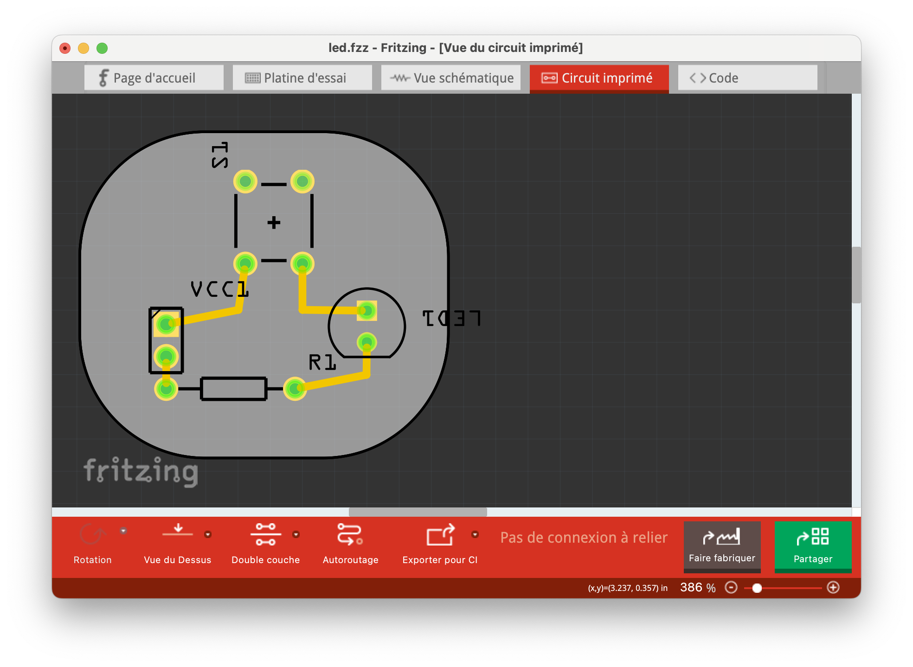
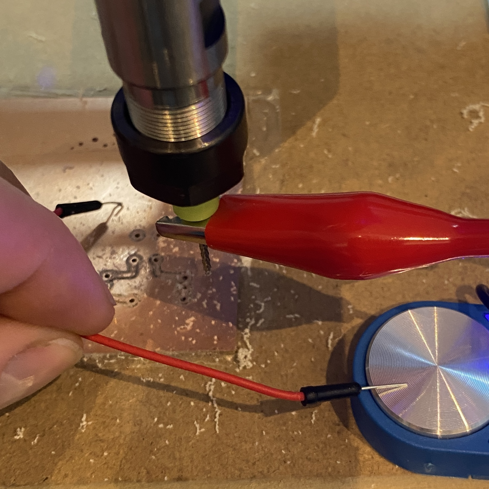
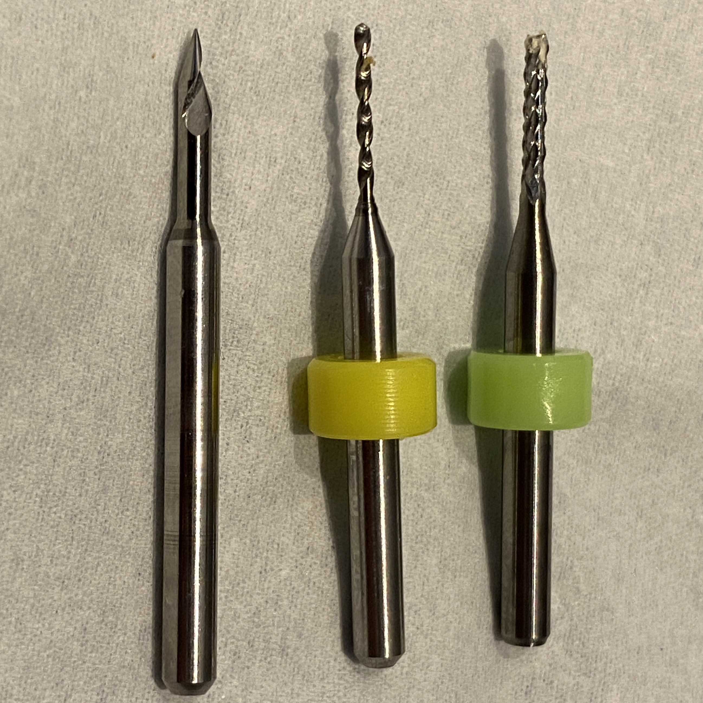
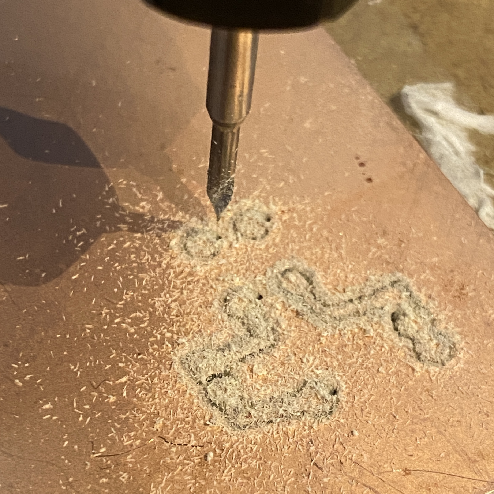
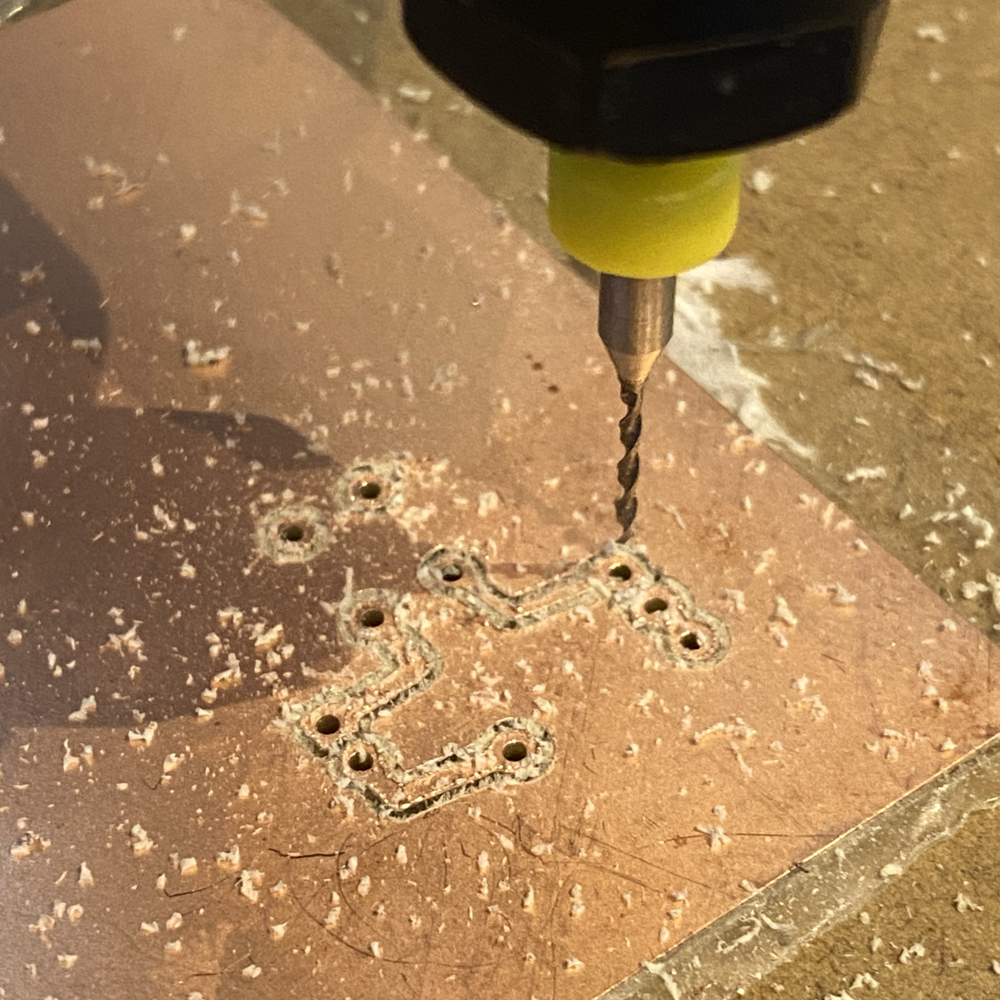
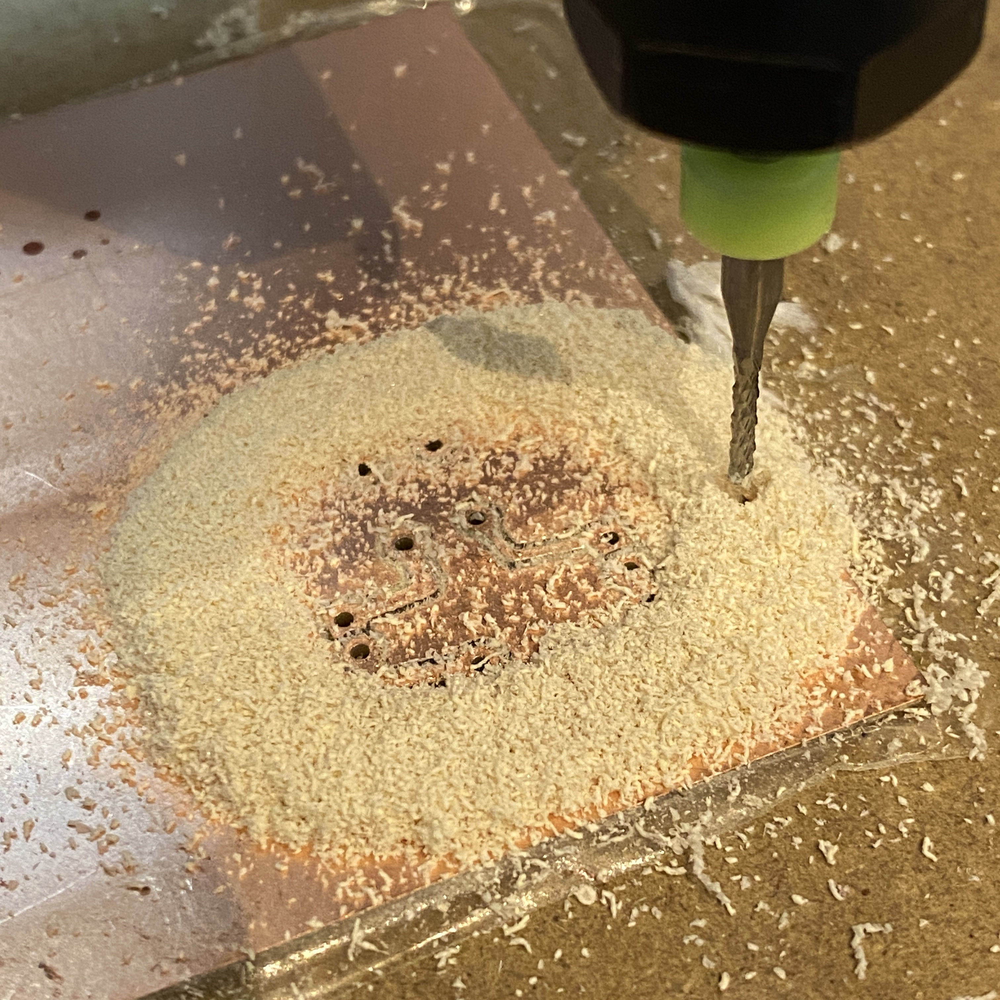
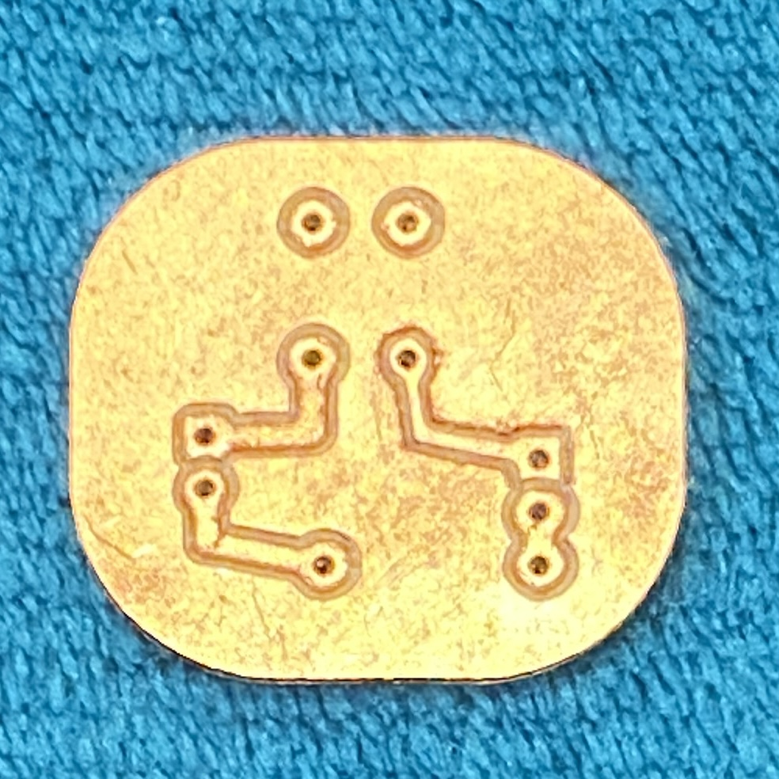
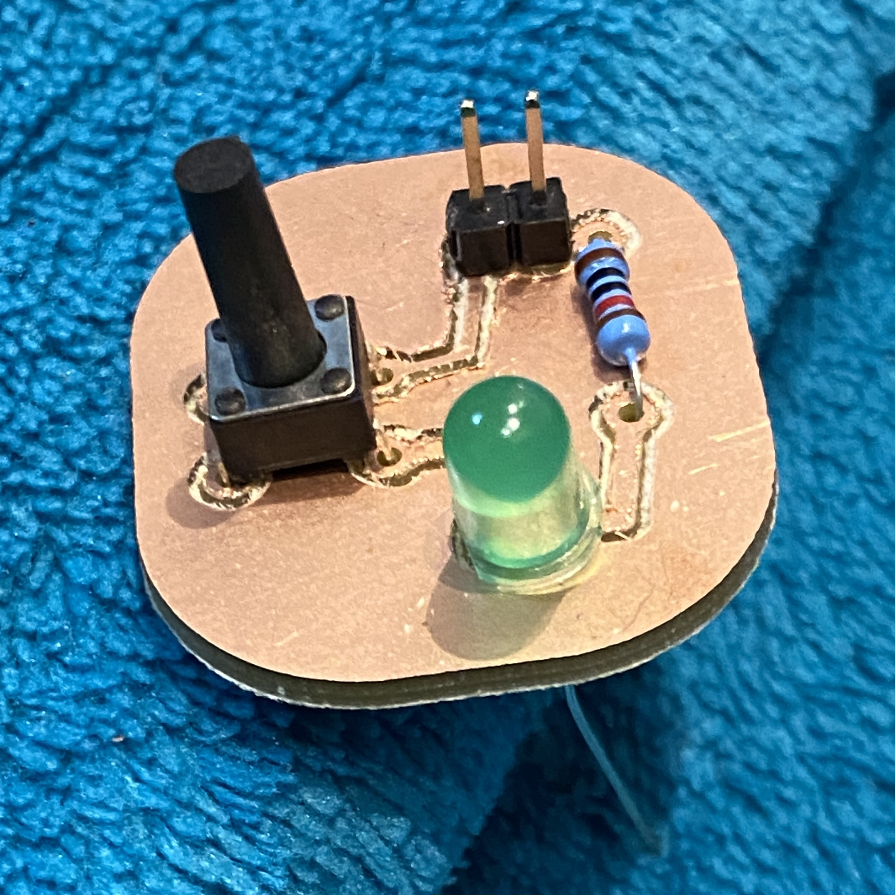
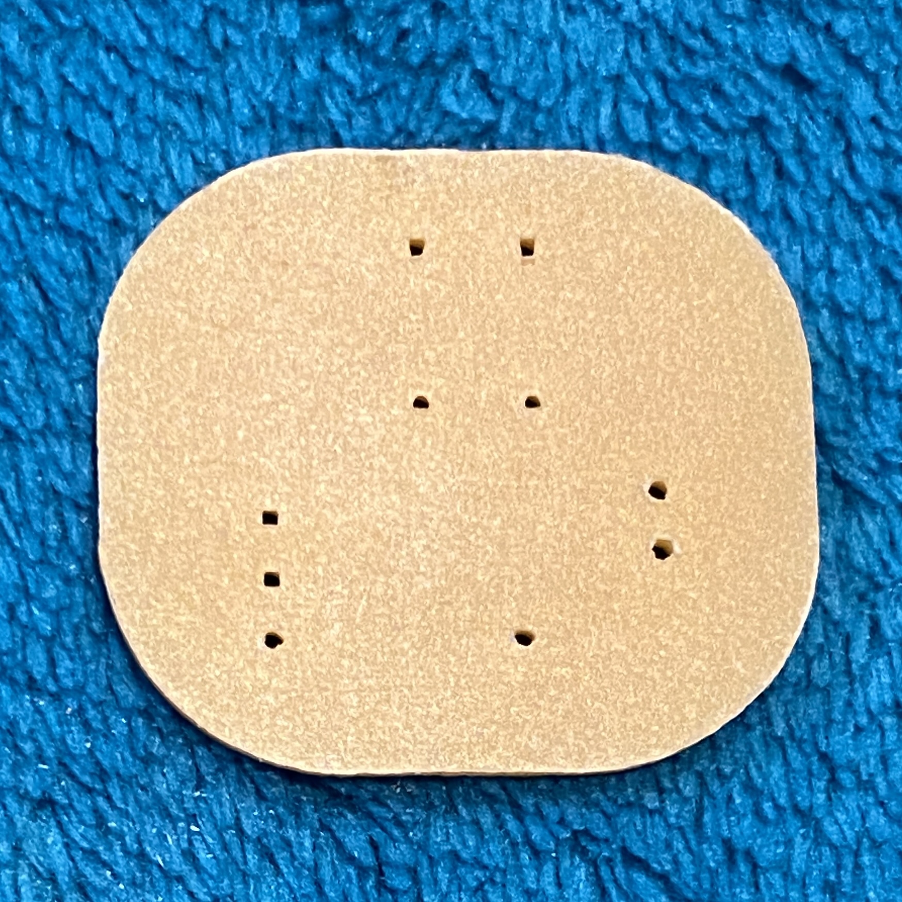

# How to mill a PCB

## Example

{ width="400" }

Export the Gerber files

## Use pcb2gcode

Create a file named **millproject**

```
# This is an example config file for pcb2gcode.
# Rename this file "millproject" and place it in the same directory as your
# gerber files to save typing
# <option>=false is implicit, it is present just for clearness

# You may want to uncomment and change those in local project files (or you
# can specify them directly as command line arguments)
#front=led_copperTop.gtl
back=led_copperTop.gtl
outline=led_contour.gm1
drill=led_drill.txt
#preamble=preamble.ngc
#preamble-text=preamble_text.txt
#postamble=postamble.ngc

# Common options
metric=true
metricoutput=true
#mirror-absolute=false
#optimise=true
zchange=2.0000
#zero-start=true
zsafe=2.0000

# Mill options
#extra-passes=0
mill-feed=60
mill-speed=20000
offset=0.400
#offset=20  # Uncomment (and comment the previous line) for voronoi regions
zwork=-0.700

# Drill options
drill-feed=200
#drill-side=auto
drill-speed=20000
#milldrill=false
nog81=true
#onedrill=false
zdrill=-2.0

# Outline options
#bridges=0.5000
#bridgesnum=2
cut-feed=60
#cut-side=auto
cut-infeed=20.0000
cut-speed=20000
cutter-diameter=1.5000
#fill-outline=true
#zbridges=-0.6000
zcut=-2.000

# Autoleveller options
#al-back=false
#al-front=false
#al-probefeed=100
#al-x=15.0000
#al-y=15.0000
#software=LinuxCNC
```
Run **pcb2gcode** in the same folder (https://github.com/pcb2gcode/pcb2gcode)
```
pcb2gcode
```

## Clean Up G-code Files

As write in https://www.baldengineer.com/kicad-to-x-carve-pcb-workflow.html clean up gcode files (see section 5)

### Milling
**back.ngc** file:

- remove G64 line
- remove M0 lines
- Remove M2 line at the end of the file

### Drill
**drill.ngc** file:

- Remove M6 lines
- Remove M0 line
- Remove M2 line at the end of the file

### Outline
**outline** file:

- remove G64 line
- remove M0 lines
- Remove M2 line at the end of the file

## Zero!
At each step, set the Z origine (with **probe**)

{ width="300" }

## On Mac OSX :

- Use CAMotics app. to preview gcode files
- Use Universal GCode Sender to mill the PCB

## Mill

```
La gravure se déroule en 3 étapes :
- Gravure avec la pointe javelot 1 dent 30° EVOMAX.
  Vitesse de rotation : 20.000 tr/min ou plus.
  Avance : 300 mm/min
- Perçage avec un forêt de 0.8mm et / ou 1mm
- Détourage du circuit avec la fraise "coupe diamant" :
  Vitesse de rotation : 20.000 tr/min ou plus
  Avance : 250 mm/min (avance plus importante possible sur machine rigide)
  Fraisage : en avalant
```

{ width="300" }

## Results


{ width="200" }
{ width="200" }
{ width="200" }

{ width="200" }
{ width="200" }
{ width="200" }

# Memo!
## Mill

Genmitsu 10Pcs Nano Blue Coat Engraving Bits, 20 Degree 0.1mm Tip 1/8" Shank Conical V-Bit

{ width="400" }

```
Pack pour la gravure de circuits imprimés par CNC
Gravez vos circuits imprimés avec votre fraiseuse numérique.
Gravure à l'anglaise.
Ce pack contient tous les outils nécessaires pour réussir la gravure de vos PCB !
Diamètre de queue des outils du pack : 3.175 mm.
Le pack contient :
- 1 pointe javelot 1 dent à 30° 0.1mm série EVOMAX, outil idéal pour la gravure des circuits imprimés !
- 2 forêts de 0.8 mm.
- 1 forêt de 1.00 mm.
- 1 fraise "coupe diamant" carbure 1.50 mm.

La gravure se déroule en 3 étapes :
- Gravure avec la pointe javelot 1 dent 30° EVOMAX.
Vitesse de rotation : 20.000 tr/min ou plus.
Avance : 300 mm/min
- Perçage avec un forêt de 0.8mm et / ou 1mm
- Détourage du circuit avec la fraise "coupe diamant" :
Vitesse de rotation : 20.000 tr/min ou plus
Avance : 250 mm/min (avance plus importante possible sur machine rigide)
Fraisage : en avalant
```

{ width="200" }
{ width="200" }
{ width="200" }

Epaisseur PCB : Épaisseur: env. 1,5 mm.
Coppe 0.035mm