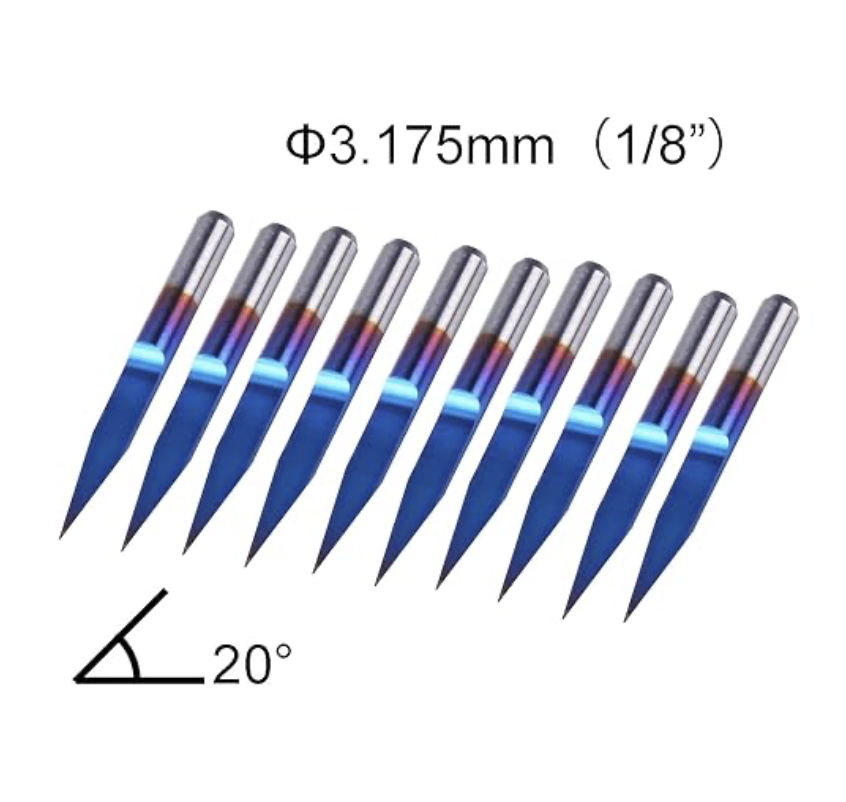
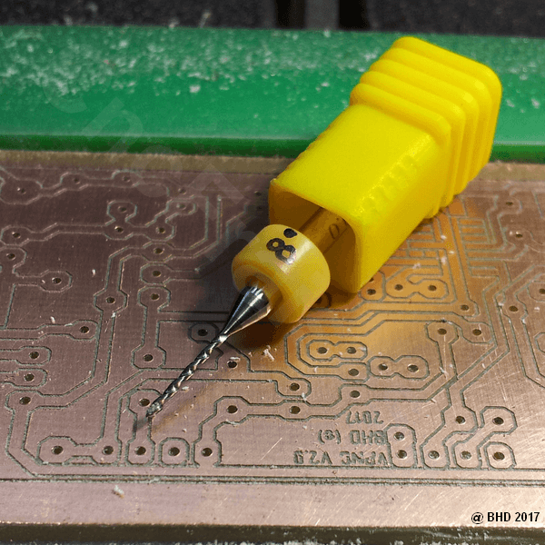
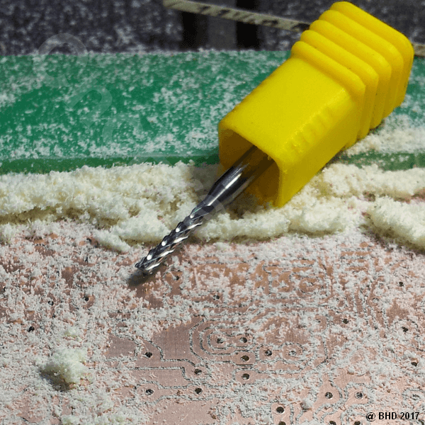
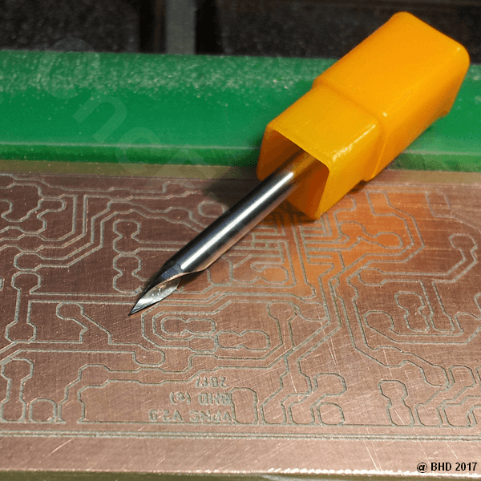

# CNC
## Mill

Genmitsu 10Pcs Nano Blue Coat Engraving Bits, 20 Degree 0.1mm Tip 1/8" Shank Conical V-Bit

{ width="400" }

```
Pack pour la gravure de circuits imprimés par CNC
Gravez vos circuits imprimés avec votre fraiseuse numérique.
Gravure à l'anglaise.
Ce pack contient tous les outils nécessaires pour réussir la gravure de vos PCB !
Diamètre de queue des outils du pack : 3.175 mm.
Le pack contient :
- 1 pointe javelot 1 dent à 30° 0.1mm série EVOMAX, outil idéal pour la gravure des circuits imprimés !
- 2 forêts de 0.8 mm.
- 1 forêt de 1.00 mm.
- 1 fraise "coupe diamant" carbure 1.50 mm.

La gravure se déroule en 3 étapes :
- Gravure avec la pointe javelot 1 dent 30° EVOMAX.
Vitesse de rotation : 20.000 tr/min ou plus.
Avance : 300 mm/min
- Perçage avec un forêt de 0.8mm et / ou 1mm
- Détourage du circuit avec la fraise "coupe diamant" :
Vitesse de rotation : 20.000 tr/min ou plus
Avance : 250 mm/min (avance plus importante possible sur machine rigide)
Fraisage : en avalant
```

{ width="200" }
{ width="200" }
{ width="200" }

Epaisseur PCB : Épaisseur: env. 1,5 mm.
Coppe 0.035mm

G1 X3.684 Y6.184 Z15 F300
M03 S6000

M03 S0


-----
G1 X0 Y0 Z15 F300

M03 S20000
----

https://github.com/pcb2gcode/pcb2gcode
https://ncviewer.com
CAMotics
