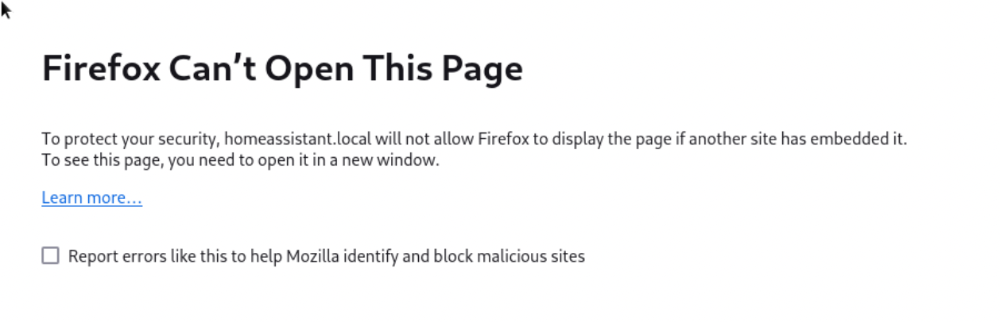

# How to Display Multiple Web Pages in Full Screen on a Wall-Mounted Screen?

Imagine you have a wall-mounted screen that needs to display multiple web pages in full screen, with an automatic change every 30 seconds. This can be useful in various contexts: monitoring dashboards, displaying webcam feeds, or showing dynamic information pages. Here is a step-by-step guide to achieve this with a simple and adaptable solution.

## Create a Dedicated Web Page with iframes and JavaScript

To manage the rotating display of web pages, we will create a specific HTML page. This page will contain **iframes** to display different URLs and **JavaScript** to automate the page changes every 30 seconds.

### Step 1: Create an HTML File

Create a file named `display.html` and open it in your favorite text editor. Copy the following code into it:

```html
<!DOCTYPE html>
<html lang="en">
<head>
    <meta charset="UTF-8">
    <title>Rotating Display</title>
    <style>
        body, html {
            margin: 0;
            padding: 0;
            overflow: hidden;
            height: 100%;
            width: 100%;
        }
        iframe {
            border: none;
            width: 100%;
            height: 100%;
        }
    </style>
</head>
<body>
    <iframe id="displayFrame" src=""></iframe>

    <script>
        const urls = [
            "https://www.example1.com",
            "https://www.example2.com",
            "https://www.example3.com"
        ];
        let currentIndex = 0;

        function changePage() {
            document.getElementById('displayFrame').src = urls[currentIndex];
            currentIndex = (currentIndex + 1) % urls.length;
        }

        setInterval(changePage, 30000); // Change every 30 seconds
        window.onload = changePage; // Display the first page on load
    </script>
</body>
</html>
```

### Code Explanation

1. **Basic Structure**: The page uses an iframe to display the web pages.
2. **List of URLs**: You can replace the example URLs with the ones you want to display.
3. **Automation**: JavaScript uses `setInterval` to change the displayed page every 30 seconds.
4. **Full Screen**: The iframe occupies the entire available space thanks to the CSS styles.

Once the file is created, open it in a browser to test the display.

---

## The Issue with iframes Not Working

While this solution works in many cases, some web pages may fail to display in an iframe. This is due to security restrictions imposed by websites through HTTP headers like `X-Frame-Options` or `Content-Security-Policy`. These restrictions prevent certain pages from being embedded in iframes to protect against potential attacks.

{ width="500"  align=right}

A common example of this issue is integrating pages from a **Home Assistant** instance. By default, Home Assistant prevents its pages from being displayed in an iframe for security reasons.

### Solution for Home Assistant

If you want to display Home Assistant pages in your iframe, you need to modify Home Assistant's configuration to disable this restriction. Here’s how to do it:

1. **Edit the `configuration.yaml` File**

   Add or modify the following section in Home Assistant's `configuration.yaml` file:

   ```yaml
   http:
     use_x_frame_options: false
   ```

2. **Restart Home Assistant**

   After making the changes, restart Home Assistant to apply them.

### Important Note

Disabling the `X-Frame-Options` header may expose your Home Assistant instance to security risks if it is publicly accessible. It is recommended to use this option only in a controlled and secure environment.

---

## Run Firefox at Boot

You need to create a script, for example, `start_firefox.sh`, containing  `firefox -kiosk display.html`

```sh title="start_firefox.sh"
firefox -kiosk display.html
```


Create the file vi $HOME/.config/autostart/jmh-firefox.desktop (it is possible that 'autostart' doesn't exist) and add:

$HOME/.config/autostart/jmh-firefox.desktop
```ini
[Desktop Entry]
Name=Script-start-firefox
GenericName=A descriptive name
Comment=Some description about your script
Exec=/home/hasen/Desktop/Papge/start_firefox.sh
Terminal=false
Type=Application
X-GNOME-Autostart-enabled=true
```

!!! info "Quit kiosk mode"
    Alt+F4 (or Mac : fn + Cmd + F4)
