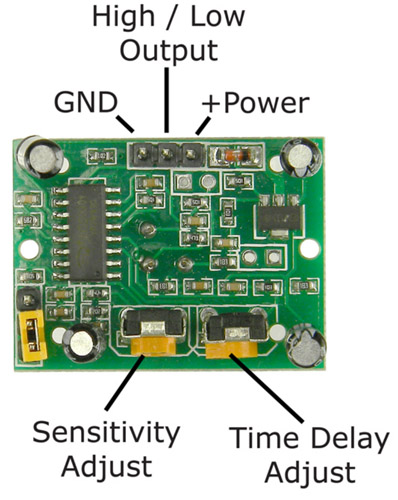

# Control screen

## Raspberry setup

### VNC config
Just go to menu /Preference / Raspberr pi Configuration / Interface to activate VNC
Use "VNC viewer" app. to view the screen

### Start chromium in kiosk mode
Launch Chromium at boot in full screen (kiosk mode)

[See Philippe Garry blog ](http://blog.philippegarry.com/2016/03/29/faire-de-son-pi-une-borne-raspberry-pi-kiosk-mode-jessie-version/)

```sh
cd ~/.config/autostart/
vi ~/.config/autostart/autoChromium.desktop
```
Within the file "autoChromium.desktop" add the following text to the bottom of the file.
```
[Desktop Entry]
Type=Application
Exec=/usr/bin/chromium-browser --noerrdialogs --disable-session-crashed-bubble --disable-infobars --kiosk http://www.google.com
Hidden=false
X-GNOME-Autostart-enabled=true
Name[en_US]=AutoChromium
Name=AutoChromium
Comment=Start Chromium when GNOME starts
```
```
reboot
```


!!! info "Quit kiosk mode"
    Alt+F4 (or Mac : fn + Cmd + F4)

Add to homeassistant configure.yaml file :
``` yaml
homeassistant:
    auth_providers:
        - type: trusted_networks
            trusted_networks:
                - 10.0.4.130
                - 10.0.4.142
            trusted_users:
                10.0.4.130: 4c40eb4c2c7e4a22b1857658af4735b8
                10.0.4.142: 4c40eb4c2c7e4a22b1857658af4735b8
           allow_bypass_login: true
        - type: homeassistant
```

### How to mount Raspberry on Mac OS

See [Pi My Life Up](https://pimylifeup.com/raspberry-pi-afp/)

``` sh
sudo apt update
sudo apt upgrade
sudo apt install netatalk
sudo vi /etc/netatalk/afp.conf
```
copy below
```
[Homes]
    basedir regex = /home
```
Restart
``` sh
sudo systemctl restart netatalk
```

Write this IP down as we will need it for connecting to the shared drive.

``` sh
sudo hostname -I
```

### Setup PIR sensor
#### Wire
{ width="280" }
{ width="200" }

#### Files

Create file : /home/pi/Desktop/Cuisine/pir.py

``` py
import sys
import time
import RPi.GPIO as io
import subprocess

io.setmode(io.BOARD)
SHUTOFF_DELAY = 120 # seconds
PIR_PIN=11

# Attention, apres une detection, le PIR renvoyer 1 pendant une 15aine de seconde

def main():
    print ("Detection started.")
    print ("Wait", SHUTOFF_DELAY, "sec before all is OK")
    io.setup(PIR_PIN, io.IN)
    turned_off = False
    last_motion_time = time.time()
    while True:
        if io.input(PIR_PIN):
            last_motion_time = time.time()
            sys.stdout.flush()
            if turned_off:
                turned_off = False
                turn_on()
                print ("ON")
        else:
            if not turned_off and time.time() > (last_motion_time + SHUTOFF_DELAY):
                turned_off = True
                turn_off()
                print ("OFF")
            if not turned_off and time.time() > (last_motion_time + 1):
                time.sleep(.1)

def turn_on():
    subprocess.call("sh /home/pi/Desktop/Cuisine/monitor_on.sh", shell=True)

def turn_off():
    subprocess.call("sh /home/pi/Desktop/Cuisine/monitor_off.sh", shell=True)

if __name__ == '__main__':
    try:
        main()
    except KeyboardInterrupt:
        io.cleanup()
```

Create file : /home/pi/Desktop/Cuisine/monitor_on.sh
``` sh
vcgencmd display_power 1 > /dev/null
```
Create file : /home/pi/Desktop/Cuisine/monitor_off.sh
``` sh
vcgencmd display_power O > /dev/null
```
!!! warning
    If "vcgencmd" and "tvservice" doesn't work on your **Raspberry pi 4** like this:
    ``` sh
    pi@raspberrypi:~ $ vcgencmd display_power 0
    display_power=1

    pi@raspberrypi:~ $ tvservice -l
    tvservice is not supported when using the vc4-kms-v3d driver.
    Similar features are available with standard linux tools
    such as modetest from libdrm-tests.
    ```
    then you can modify the "/boot/config.txt" file by replacing vc4-kms-v3d with vc4-**f**kms-v3d like this
    ``` hl_lines="2"
    # Enable DRM VC4 V3D driver
    dtoverlay=vc4-fkms-v3d
    max_framebuffers=2
    ```
    Thank's a lot to [Fuzz The Pi Guy](https://www.youtube.com/watch?v=o3nZ9-FFQRQ)

Edit the file /etc/rc.local using the editor of your choice. You must edit it with root permissions:

``` sh
sudo vi /etc/rc.local
```
Add

``` sh
sudo python /home/pi/sample.py &
```
