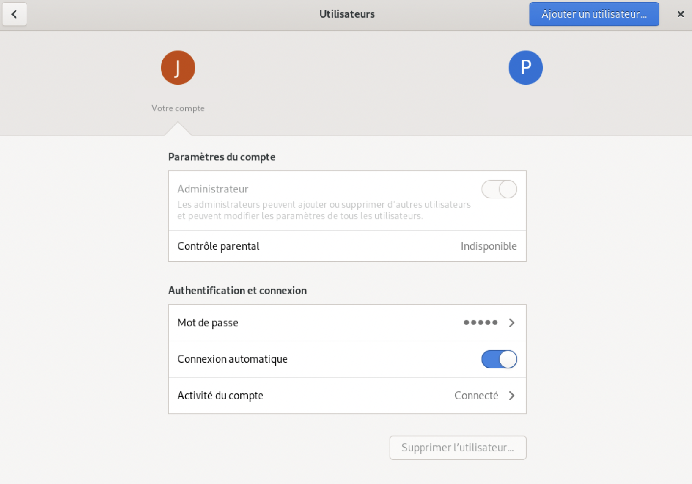
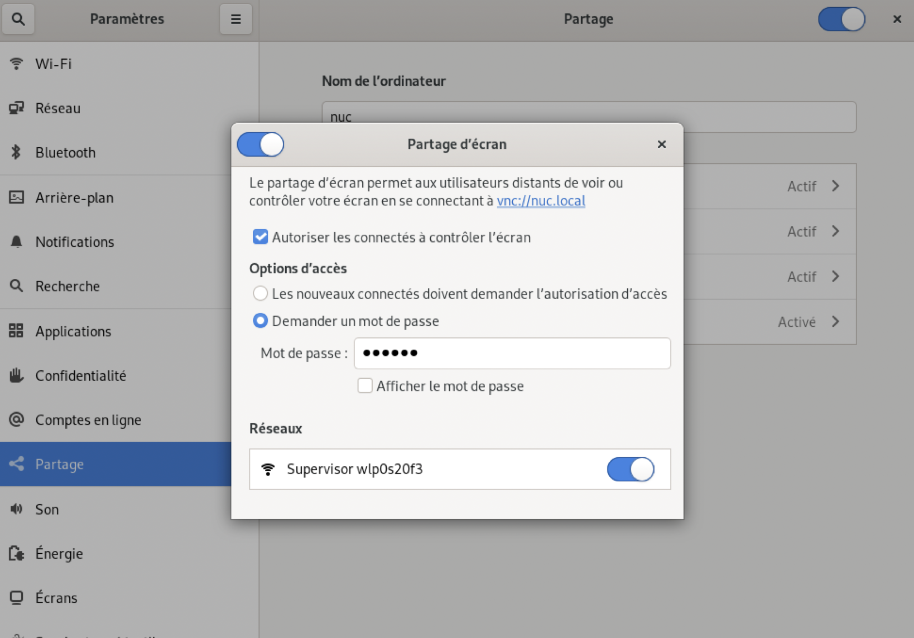
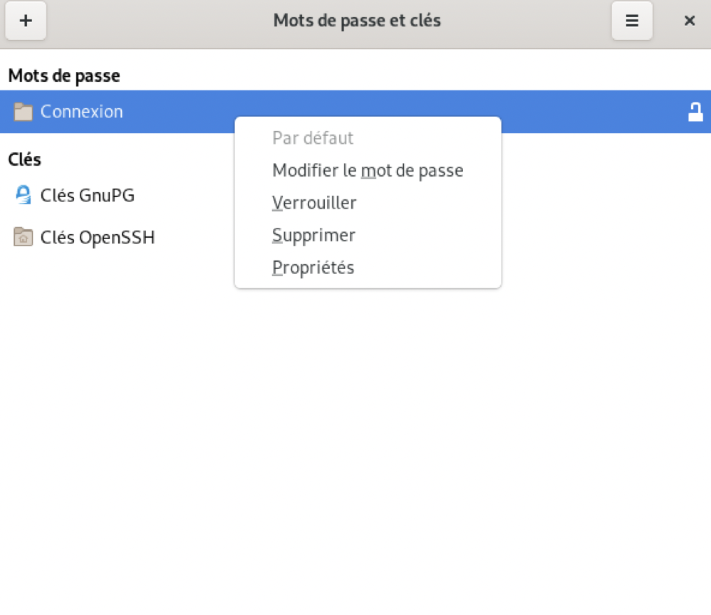
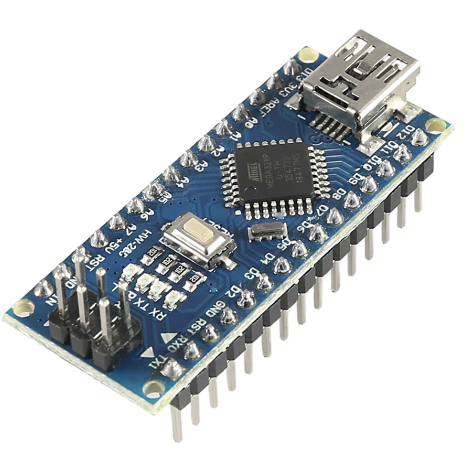
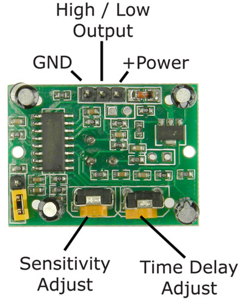
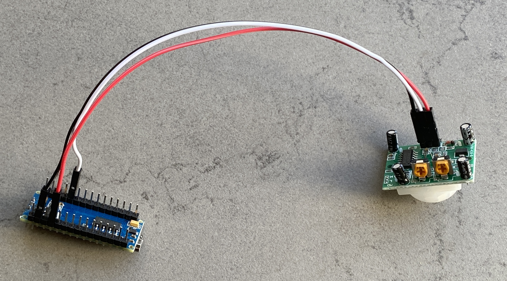
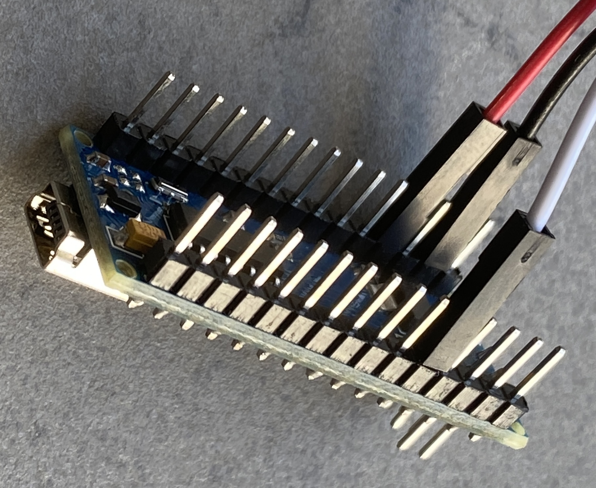
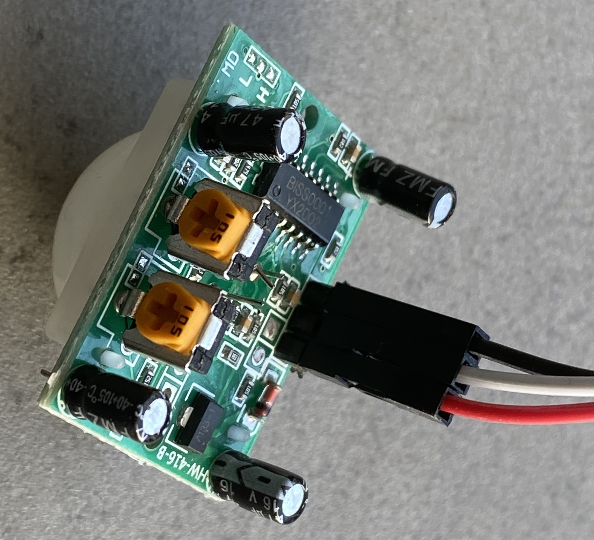

# Installation of a NUC as a home assistant server with a control screen

{ width="300" align=right }

Intel NUC NUC10i5FNKN UCFF Noir i5-10210U 1,6 GHz

Install a **Debian OS**

## Add a special user
Create a new user that will be used only for viewing the control screen.

## How to mount disk on a Mac
Install Netatalk

```bash
sudo apt-get install netatalk
vi /etc/netatalk/afp.conf
```
``` bash title="/etc/netatalk/afp.conf"
[Homes]
    basedir regex = /home
```
```
/etc/init.d/netatalk restart
```

## Auto login
Go to the **user** preferences of **Gnome** window manager and **check "automatic connection"**

{ width="300" }

## VNC
To share the screen, go to preferences panel and Share sub-panal and set the passwd. (right clic on default connection)

{ width="400" }

You can't connect directly to the server as it is waiting for a password you have just entered
The keyring containing this password is normally unlocked when logging into the account in desktop mode.
When you are in auto login mode, the keyring is not unlocked. So you can't connect derectly to the VNC server
because it wan't the password.

The only solution I found is to remove the keyring password. It's really rotten, a big security hole.
To do that, go to the keyring and clic right on the default connection. Change the password with an empty string.
See the video from [Techno Focus](https://www.youtube.com/watch?v=w1ZEEc-ZY4w)

{ width="300" }


## Remove screen saver
``` bash
sudo systemctl mask sleep.target suspend.target hibernate.target hybrid-sleep.target
```
``` bash title="Output"
Created symlink /etc/systemd/system/sleep.target → /dev/null.
Created symlink /etc/systemd/system/suspend.target → /dev/null.
Created symlink /etc/systemd/system/hibernate.target → /dev/null.
Created symlink /etc/systemd/system/hybrid-sleep.target → /dev/null.
```

## Create your web pages
In my case, I put all my HTML files in `~/Bureau/` in particular `ìndex.html`

## Start Firefox in kiosk mode at boot
### Create Shell script
In the directory `~/Bureau/` add the file `start_firefox.sh` with code:

``` bash title="~/Bureau/start_firefox.sh"
#!/bin/bash

# You have to put this little break, otherwise the first page of Firefox on all black. Maybe a bug?
sleep 3
# I have install full version of firefox
/opt/firefox/./firefox --kiosk index.html
```
than

``` bash
chmod a+x start_firefox.sh
```
### Run the shell script at boot

Create the file `vi $HOME/.config/autostart/jmh-firefox.desktop`
(it is possible that 'autostart' doesn't exist) and add:

``` yaml title="$HOME/.config/autostart/jmh-firefox.desktop"
[Desktop Entry]
Name=Script-jmh-start-firefox
GenericName=A descriptive name
Comment=Some description about your script
Exec=/home/hasen/Bureau//home/hasen/Bureau/
Terminal=false
Type=Application
X-GNOME-Autostart-enabled=true
```
!!! info
    You can press ALT+F4 or CTRL+T keys together to close Firefox running in Kiosk Mode.


## PIR detection
Arduino mini + PIR sensor HC-SR501

{ width="190" }
{ width="190" }
{ width="140" }
### Wire


{ width="300" }
{ width="200" }
{ width="180" }

### Time Delay Adjustment
{ width="180" }
{ width="190" }
{ width="180" }

Delay is (from left to right) 10s, 1000s (1'30'') and 2100s (3'30'')


### Find USB port
``` bash title="Find USB port - method #1"
sudo python3 -m serial.tools.list_port
```
or
``` bash title="Find USB port - method #2"
ls -l /dev/*USB*
```
``` bash  title="output"
crw-rw---- 1 root dialout 188, 0 18 févr. 11:22 /dev/ttyUSB0
```

or
``` bash title="Find USB port - method #3"
sudo lsusb
```
``` bash  title="output"
Bus 004 Device 001: ID 1d6b:0003 Linux Foundation 3.0 root hub
Bus 003 Device 001: ID 1d6b:0002 Linux Foundation 2.0 root hub
Bus 002 Device 001: ID 1d6b:0003 Linux Foundation 3.0 root hub
Bus 001 Device 003: ID 1a86:7523 QinHeng Electronics CH340 serial converter
Bus 001 Device 002: ID 8087:0026 Intel Corp.
Bus 001 Device 001: ID 1d6b:0002 Linux Foundation 2.0 root hub
```

### Arduino mini code


#### Setup Arduino IDE
{ width="400" }


``` C title='PIR motion sensor'
#define sensor 2

void setup()
{
  Serial.begin(9600);
  pinMode(sensor, INPUT);
  digitalWrite(sensor,LOW);
}

void loop()
{
  if(digitalRead(sensor)) {
    Serial.println("MovementDetected");
    delay(500); // Wait 1/2 second to limit the traffic on the USB port
  } else {
    int t = millis();
    Serial.println("NoMovement");
    delay(1000); // Wait 1 second to limit the traffic on the USB port
  }
}
```

### Listen to USB port
``` bash title="Listen to port USB0"
sudo cat /dev/ttyUSB0
```
``` bash title="output"
MovementDetected
MovementDetected
MovementDetected
MovementDetected
MovementDetected
```
### Motion Detection to switch ON/OFF the display
#### Python3 Installation

!!! Warning
    We install Python**3** not Python

``` bash title="Install Python3-Serial package"
sudo apt-get install python3-serial
```
#### Python Serial package install
```
sudo apt-get install python3-serial
```

#### Create the Motion Detection Python script
``` python title="PIR_sensor.py"
import serial, sys
import time
import os

port = "/dev/ttyUSB0"
baudrate = 9600
ser = serial.Serial(port,baudrate,timeout=0.001)
status="off"
lineString=""
while True:
    time.sleep(0.1)
    if(ser.in_waiting > 0): # something arrived on USB port
        lineString = ser.readline()
        lineString = lineString.decode('Ascii') # Convert into a readable string
        print(lineString)
    if('MovementDetected' in lineString):
        if(status == "on"):
            print("Deja  ON")
        else:
            print("Mis a ON")
            status = "on"
            os.system('sleep 1 && xset dpms force on')
    elif('NoMovement' in lineString):
        if(status == "off"):
            print("Deja  OFF")
        else:
            print("Mis a OFF")
            status = "off"
            os.system('sleep 1 && xset dpms force off')
    else:
        print("-Error : unknow USB data ->" + lineString)

```

#### Run the Python Script at Boot

Create the file `vi ~/.config/autostart/jmh-pir.desktop` in the homedir
(it is possible that 'autostart' doesn't exist) and add:

``` yaml title="$HOME/.config/autostart/jmh-pir.desktop"
[Desktop Entry]
Name=Motion Detection
GenericName=If motion is detected, switch ON the display, else switch OFF
Comment=If motion is detected, switch ON the display, else switch OFF
Exec=python3 /home/hasen/Bureau//home/hasen/Bureau/pir.py
Terminal=false
Type=Application
X-GNOME-Autostart-enabled=true
```

!!! warning
    /dev/ttyUSB0 is only accessible by root. If the default user is not root, use the commande
    `sudo usermod -a -G dialout $USER` to add $USER in the dialout group and logout/login.


## Disabled authentification on home assistant
!!! info
In my case, all my HTML files are local, so this section is not useful.

By default, when you want to display a homeassistant page, you have to authenticate yourself.
So, add in ``` configure.yaml```:

``` yaml title=" configure.yaml"
homeassistant:
auth_providers:
- type: trusted_networks
trusted_networks:
- 10.0.4.130
trusted_users:
10.0.4.130: 4c40eb4c2c7e4a22b1857658af4735b8 # User id
allow_bypass_login: true
- type: homeassistant
```

## Remove " Computer will suspend very soon because of inactivity" message

{ width="300" }

see [STUDIOS 75](http://www.studios-75.fr/base-de-connaissances/informatique/systeme/linux/debian/desactiver-la-mise-en-veille-de-debian-en-ligne-de-commande/)
```
vi /etc/gdm3/greeter.dconf-defaults
```
Go to the section:
```
# Automatic suspend
# =================
```

Uncomment the following line if you are on mains (remove the # in front):
```
sleep-inactive-ac-type et indiquer la valeur "nothing" ou "blank".
```
Uncomment the following lines if you are on Battery:
```
sleep-inactive-battery-timeout=0//    (The default setting is 1200)
sleep-inactive-battery-type='blank'
```
Save the file and restart the gdm service (or restart your system).


