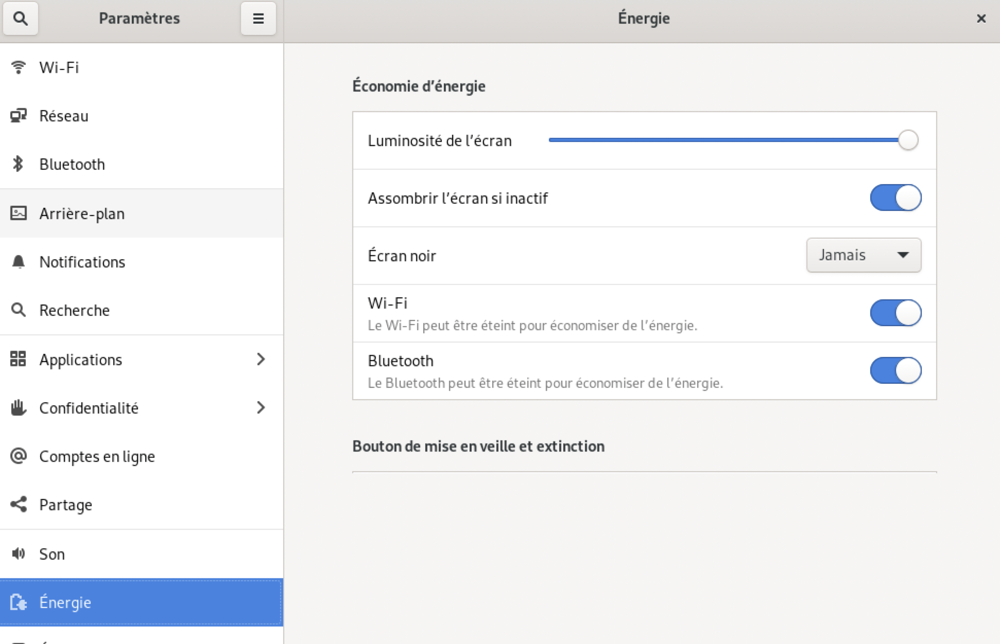
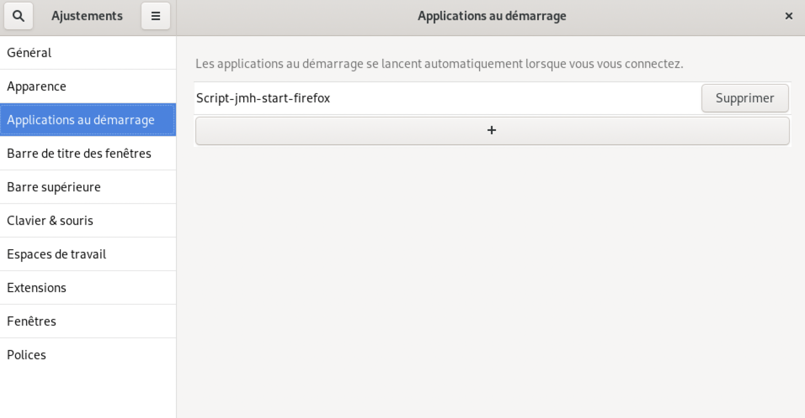
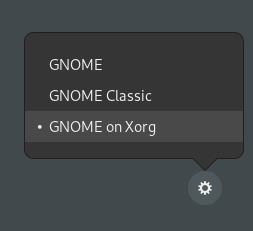

# Installation of a NUC as a home assistant server with a control screen

Install a Debian OS

## Add a special user
Create a new user that will be used only for viewing the control screen.

## How to mount disk on a Mac
Install Netatalk

```bash
sudo apt-get install netatalk
vi /etc/netatalk/afp.conf
```
``` bash title="/etc/netatalk/afp.conf"
[Homes]
    basedir regex = /home
```
```
/etc/init.d/netatalk restart
```

## VNC
In my case, I have a problem of connection with VNC Viewer. The log file ```~/.vnc/nuc\:1.log```(where "nuc" is the name of my server) contain:
``` bash title="~/.vnc/nuc\:1.log"
12/02/23 14:50:35 Xvnc version TightVNC-1.3.10
12/02/23 14:50:35 Copyright (C) 2000-2009 TightVNC Group
12/02/23 14:50:35 Copyright (C) 1999 AT&T Laboratories Cambridge
12/02/23 14:50:35 All Rights Reserved.
12/02/23 14:50:35 See http://www.tightvnc.com/ for information on TightVNC
12/02/23 14:50:35 Desktop name 'X' (nuc:1)
12/02/23 14:50:35 Protocol versions supported: 3.3, 3.7, 3.8, 3.7t, 3.8t
12/02/23 14:50:35 Listening for VNC connections on TCP port 5901
xrdb: No such file or directory
xrdb: can't open file '/home/hasen/.Xresources'
```

So, I install ```XRDP``` See [CrownCloud - Wiki page](https://wiki.crowncloud.net/?How_to_Configure_XRDP_Desktop_Environment_on_Debian_11)
```bash
sudo apt install xrdp
sudo systemctl status xrdp
sudo adduser xrdp ssl-cert
systemctl restart xrdp
```
## Remove screen saver
{ width="500" }
``` bash
sudo systemctl mask sleep.target suspend.target hibernate.target hybrid-sleep.target
```
Output:
```bash
Created symlink /etc/systemd/system/sleep.target → /dev/null.
Created symlink /etc/systemd/system/suspend.target → /dev/null.
Created symlink /etc/systemd/system/hibernate.target → /dev/null.
Created symlink /etc/systemd/system/hybrid-sleep.target → /dev/null.
```

## Auto login
Go to the **user** preferences of **Gnome** window manager and **check "automatic connection"**

## Create your web pages
In my case, I put all my HTML files in ```~/Bureau/``` in particular ```ìndex.html```

## Start Firefox in kiosk mode at boot
### Shell script to start at boot
In the directory ```~/Bureau/``` add the file ```start_firefox.sh``` with code:

```sh title="~/Bureau/start_firefox.sh"
#!/bin/bash

# You have to put this little break, otherwise the first page of Firefox on all black. Maybe a bug?
sleep 3
# I have install full version of firefox
/opt/firefox/./firefox --kiosk index.html
```
than
```
chmod a+x start_firefox.sh
```
### Run the shell script at boot
You can use gnome-tweaks or do manualy:
#### gnome-tweaks
see [ATA Learning page](https://adamtheautomator.com/tweaktools/)

{ width="500" }

#### Manual solution
Edit the file ```vi ~/.config/autostart/jmh-firefox.desktop```
(it is possible that 'autostart' doesn't exist.) and add:
``` yaml title="~/.config/autostart/jmh-firefox.desktop"
[Desktop Entry]
Name=Script-jmh-start-firefox
GenericName=A descriptive name
Comment=Some description about your script
Exec=/home/hasen/Bureau//home/hasen/Bureau/
Terminal=false
Type=Application
X-GNOME-Autostart-enabled=true
```
!!! info
    You can press ALT+F4 or CTRL+T keys together to close Firefox running in Kiosk Mode.

## Disabled authentification on home assistant
!!! info
    In my case, all my HTML files are local, so this section is not useful.

By default, when you want to display a homeassistant page, you have to authenticate yourself.
So, add in ``` configure.yaml```:

``` yaml title=" configure.yaml"
homeassistant:
    auth_providers:
        - type: trusted_networks
            trusted_networks:
                - 10.0.4.130
            trusted_users:
                10.0.4.130: 4c40eb4c2c7e4a22b1857658af4735b8 # User id
            allow_bypass_login: true
        - type: homeassistant
```

## Switching off the display
Gnome on Xorg

{ width="280" }

## Switch off screen
```sleep 1 && xset dpms force off```


fdgdfsgdfg
fdgdfgfgd
gfdgdfsg