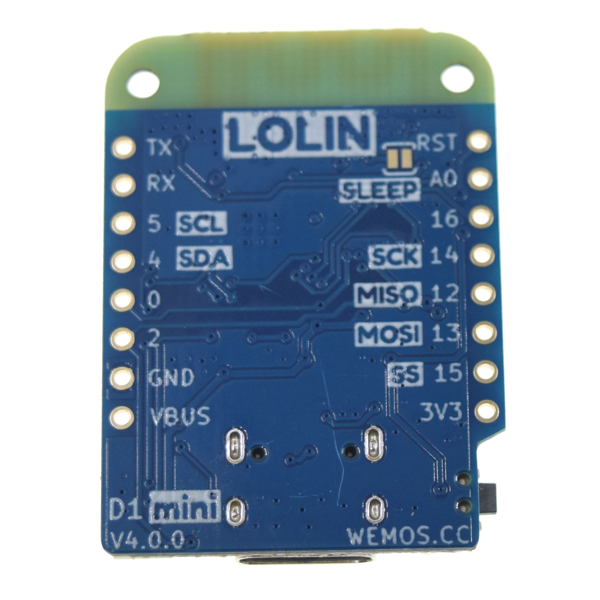
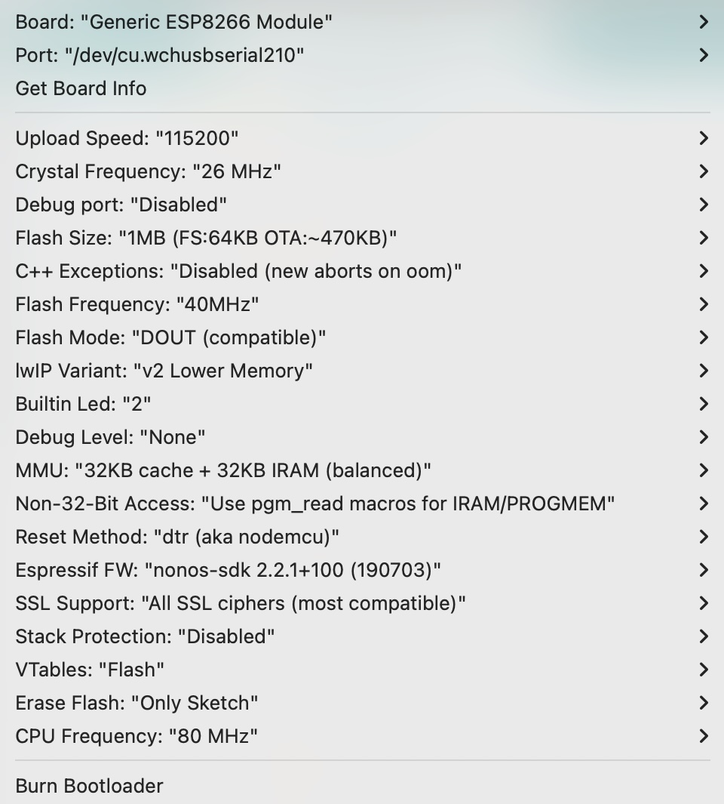
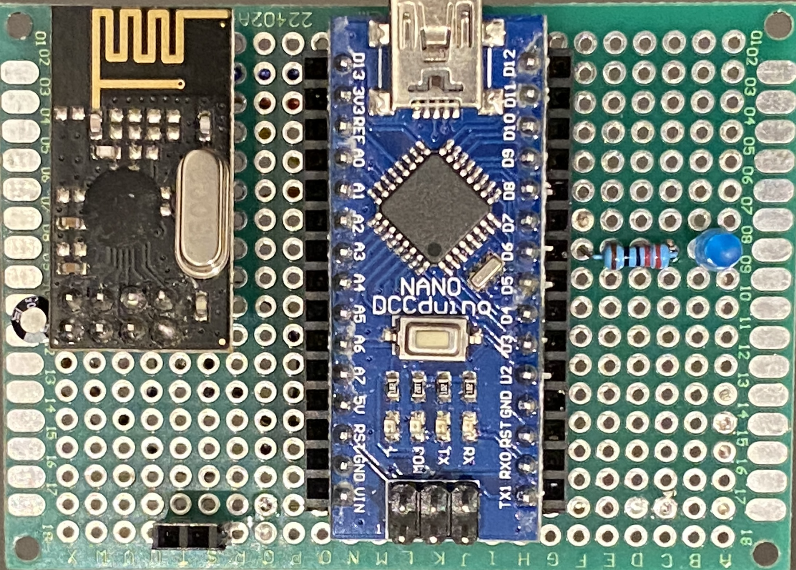
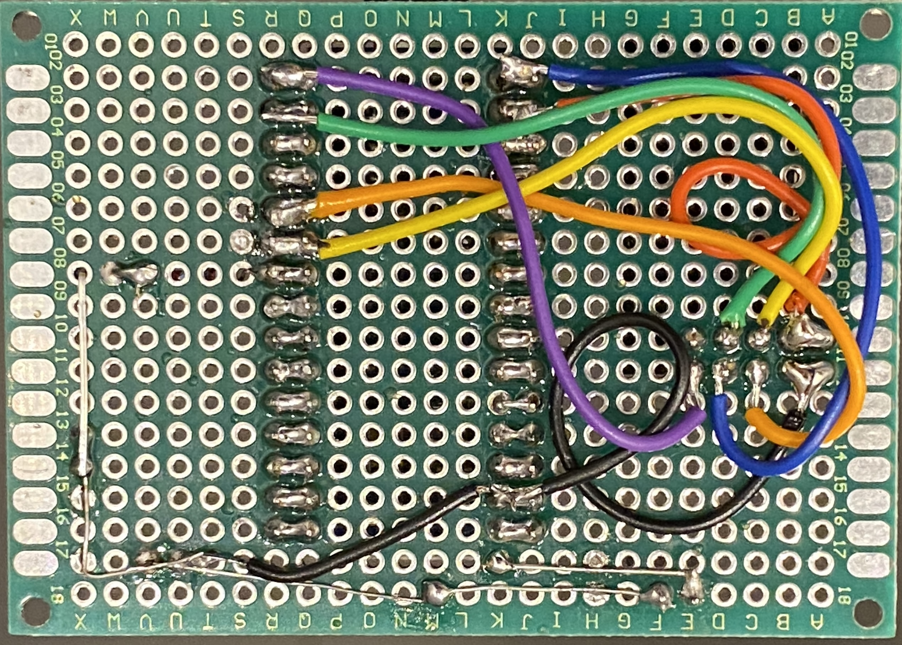
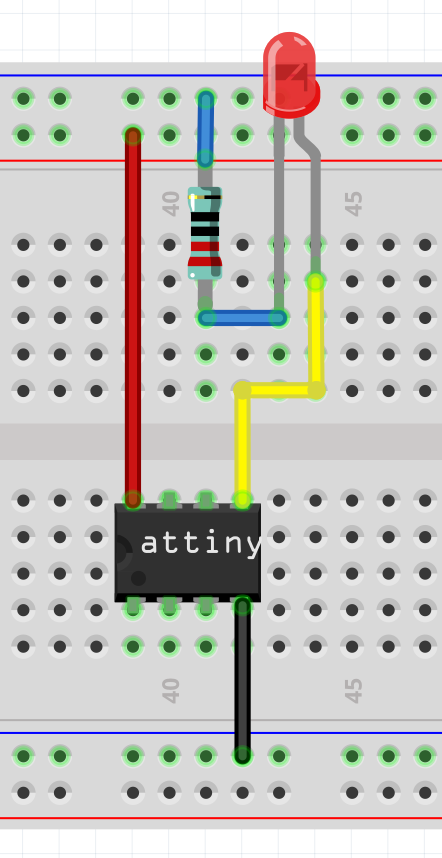
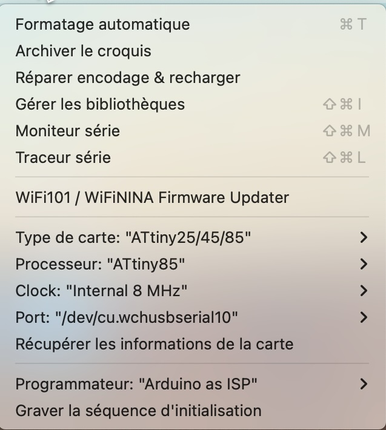
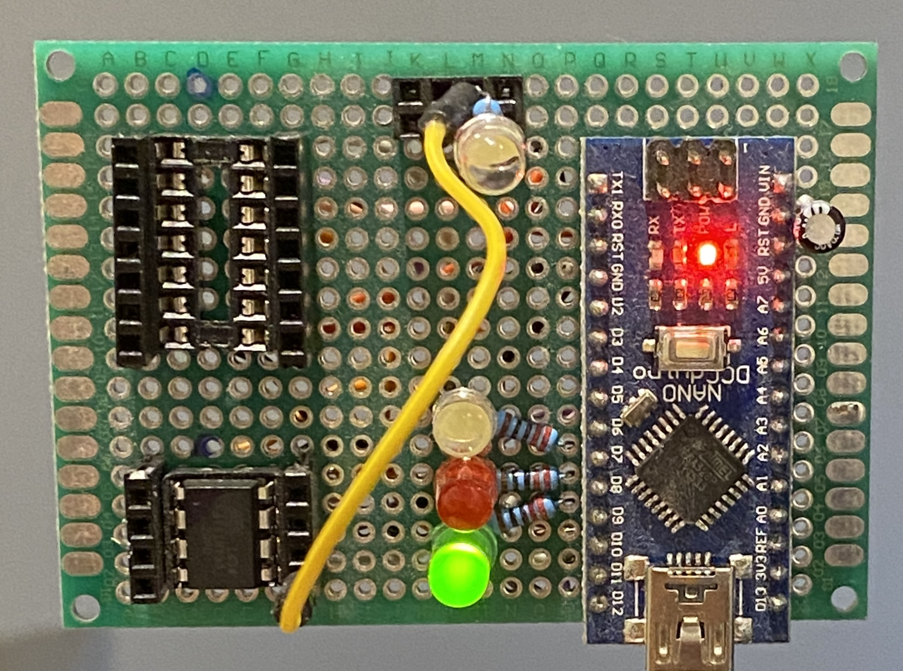

# Wifi - web server

### D1 mini V4.0.0
Official doc : [https://www.wemos.cc/en/latest/d1/d1_mini.html](https://www.wemos.cc/en/latest/d1/d1_mini.html)

{ width="200" }
{ width="200" }

### IDE Arduino config.
{ width="300" }

### Simple code
This code comes from the site [https://siytek.com/wemos-d1-mini-web-server/](https://siytek.com/wemos-d1-mini-web-server/)

```C
#include <ESP8266WiFi.h>
#include <ESP8266WebServer.h>

// Set WiFi credentials
#define WIFI_SSID "YOUR_SSID"
#define WIFI_PASS "YOUR_PASSWORD"

    // Create a new web server
    ESP8266WebServer webserver(80);

// Handle Root
void rootPage() {
  webserver.send(200, "text/plain", "It work's!!!");
}

// Handle 404
void notfoundPage(){
  webserver.send(404, "text/plain", "404: Not found");
}

void setup()
{
  // Setup serial port
  Serial.begin(115200);
  Serial.println();

  //Begin WiFi
  WiFi.begin(WIFI_SSID, WIFI_PASS);
  while (WiFi.status() != WL_CONNECTED) { delay(100); }

  // WiFi Connected
  Serial.print("Connected! IP address: ");
  Serial.println(WiFi.localIP());

  // Start Web Server
  webserver.on("/", rootPage);
  webserver.onNotFound(notfoundPage);
  webserver.begin();

}

// Listen for HTTP requests
void loop(void){
  webserver.handleClient();
}
```
### Use REST API
Install [https://www.arduino.cc/reference/en/libraries/arest/](https://www.arduino.cc/reference/en/libraries/arest/)
To use ESP8266 (here D1 mini), add a specific module (see below the excerpt from the documentation)
!!! info 
    **For ESP8266 (here D1 mini) add a new module:**

    *For WiFi using the ESP8266 chip*

    To use the library with the ESP8266 WiFi chip you will need to install the required module from the Boards Manager of the Arduino IDE. These are the steps to install the ESP8266 package inside the Arduino IDE:

    Start the Arduino IDE and open the Preferences window
    Enter http://arduino.esp8266.com/stable/package_esp8266com_index.json into the Additional Board Manager URLs field. You can add multiple URLs, separating them with commas.
    Open the Boards Manager from Tools > Board menu and install the esp8266 package (and after that don't forget to select your ESP8266 board from Tools > Board menu).

# Nano NRF24

Don't Work because there only one bidirectionnal node (nomber 0).

## Source
https://passionelectronique.fr/tutorial-nrf24l01/

### Wire
{ width="400" }
{ width="400" }

"Concernant les broches CE et CSN, il y a bien d’autres endroit où vous pourriez les brancher. Je pense notamment aux broches D9 et D10, par exemple. Mais avant de faire quel que changement que ce soit, réfléchissez bien à l’usage que vous ferez des autres pins. Par exemple, si vous utilisez un servomoteur piloté via ondes radios avec un nRF24L01+, sachez que la librairie « servo.h » qui permet de les piloter ne permet pas de les brancher sur n’importe quelles broches. Et justement, ceux-ci ne peuvent être « attachés » qu’aux bornes 9 et 10 d’un arduino uno, ou arduino nano. Comme quoi, il faut toujours lister tous ses besoins, avant d’attribuer telle ou telle pin d’entrée ou sortie à tel ou tel périphérique !"

### Reciever
``` C
/*
  01/11/2023
  Code inspired by :
  Fichier:      HelloWorldNRF24L01-Recepteur
  Description:  Réception d'un message "Hello World" depuis un autre arduino nano, via un NRF24L01
  Auteur:       Passion-Électronique
  Librairie utilisée : https://github.com/nRF24/RF24
*/

#include <SPI.h>
#include <RF24.h>

#define pinCSN  7             // On associe la broche "CSN" du NRF24L01 à la sortie digitale D7 de l'arduino
#define pinCE   8             // On associe la broche "CE" du NRF24L01 à la sortie digitale D8 de l'arduino
#define tunnel  "PIPE1"       // On définit le "nom de tunnel" (5 caractères) à travers lequel on va recevoir les données de l'émetteur

RF24 radio(pinCE, pinCSN);    // Instanciation du NRF24L01

    const byte adresse[6] = tunnel;       // Mise au format "byte array" du nom du tunnel
char message[32];                     // Avec cette librairie, on est "limité" à 32 caractères par message

    #define LED_YELLOW_PIN 5
#define LED_GREEN_PIN 6

void setup() {
  Serial.begin(9600);
  Serial.println("Récepteur NRF24L01");
  Serial.println("");

  pinMode(LED_GREEN_PIN, OUTPUT);
  pinMode(LED_YELLOW_PIN, OUTPUT);

  for (int i=0; i < 4; i++) {
    digitalWrite(LED_GREEN_PIN, HIGH);
    delay(100);
    digitalWrite(LED_GREEN_PIN, LOW);

    digitalWrite(LED_YELLOW_PIN, HIGH);
    delay(100);
    digitalWrite(LED_YELLOW_PIN, LOW);
    Serial.println(i);
  }
    digitalWrite(LED_GREEN_PIN, HIGH);

  // Partie NRF24
    radio.begin();                      // Initialisation du module NRF24
  radio.openReadingPipe(0, adresse);  // Ouverture du tunnel en LECTURE, avec le "nom" qu'on lui a donné
    radio.setPALevel(RF24_PA_MIN);      // Sélection d'un niveau "MINIMAL" pour communiquer (pas besoin d'une forte puissance, pour nos essais)
  radio.startListening();             // Démarrage de l'écoute du NRF24 (signifiant qu'on va recevoir, et non émettre quoi que ce soit, ici)
    }

    void loop() {
  // On vérifie à chaque boucle si un message est arrivé
      if (radio.available()) {
  radio.read(&message, sizeof(message));                        // Si un message vient d'arriver, on le charge dans la variable "message"
        Serial.print("<< Recied: ");
  Serial.println(message);     // … et on l'affiche sur le port série !

        // Led blink
        digitalWrite(LED_YELLOW_PIN, HIGH);
  delay(2);
  digitalWrite(LED_YELLOW_PIN, LOW);
  }
}

```
### Transmitter
``` C
/*
  01/11/2023
  Code inspired by :
  Fichier:      HelloWorldNRF24L01-Emetteur
  Description:  Emission d'un "Hello World" via un NRF24L01
  Auteur:       Passion-Électronique
  Librairie utilisée : https://github.com/nRF24/RF24
*/

#include <SPI.h>
#include <RF24.h>

#define pinCSN  7             // On associe la broche "CSN" du NRF24L01 à la sortie digitale D7 de l'arduino
#define pinCE   8           // On associe la broche "CE" du NRF24L01 à la sortie digitale D8 de l'arduino
#define tunnel  "PIPE1"       // On définit un "nom de tunnel" (5 caractères), pour pouvoir communiquer d'un NRF24 à l'autre

RF24 radio(pinCE, pinCSN);    // Instanciation du NRF24L01

const byte adresse[6] = tunnel;               // Mise au format "byte array" du nom du tunnel
const char message[] = "Hello World !!!";     // Message à transmettre à l'autre NRF24 (32 caractères maxi, avec cette librairie)

#define LED_GREEN_PIN 5
#define LED_YELLOW_PIN 6

void setup() {
  Serial.begin(9600);

  Serial.println("Emeteur NRF24L01");

  pinMode(LED_GREEN_PIN, OUTPUT);
  pinMode(LED_YELLOW_PIN, OUTPUT);

 for (int i=0; i < 2; i++) {
    digitalWrite(LED_GREEN_PIN, HIGH);
   delay(100);
   digitalWrite(LED_GREEN_PIN, LOW);

    digitalWrite(LED_YELLOW_PIN, HIGH);
   delay(100);
   digitalWrite(LED_YELLOW_PIN, LOW);
    Serial.println(i);
  }
  digitalWrite(LED_GREEN_PIN, HIGH);

  radio.begin();                      // Initialisation du module NRF24
  radio.openWritingPipe(adresse);     // Ouverture du tunnel en ÉCRITURE, avec le "nom" qu'on lui a donné
  radio.setPALevel(RF24_PA_MIN);      // Sélection d'un niveau "MINIMAL" pour communiquer (pas besoin d'une forte puissance, pour nos essais)
  radio.stopListening();              // Arrêt de l'écoute du NRF24 (signifiant qu'on va émettre, et non recevoir, ici)
  }

void loop() {
  radio.write(&message, sizeof(message));     // Envoi de notre message
  Serial.print(">> Send: ");
  Serial.println(message);
  delay(5000);

  // Led blink
  digitalWrite(LED_YELLOW_PIN, HIGH);
  delay(1);
  digitalWrite(LED_YELLOW_PIN, LOW);
}
```


# Gravitrax ATtiniy 85

DON'T WORK!

## Arduino IDE
Use Processer: ATmaga328P (Old bootloader)

## Wire
{ width="150" }

``` yaml
const int LED_VERTE = 0;

void setup() {
  pinMode(LED_VERTE, OUTPUT);
}

void loop() {
  //feu vert, 5 sec
  digitalWrite(LED_VERTE, LOW);
  delay(100);
  digitalWrite(LED_VERTE, HIGH);
  delay(100);

}
```
## Upload programme

[https://phmarduino.wordpress.com/2015/12/11/programmer-un-attiny-85/](https://phmarduino.wordpress.com/2015/12/11/programmer-un-attiny-85/)

{ width="200" }

{ width="150" }

https://github.com/sui77/rc-switch

https://web.archive.org/web/20151007014308/https://code.google.com/p/rc-switch/wiki/HowTo_Send

https://mechatrofice.com/arduino/rf-remote-controller-using-arduino-and-ask-module