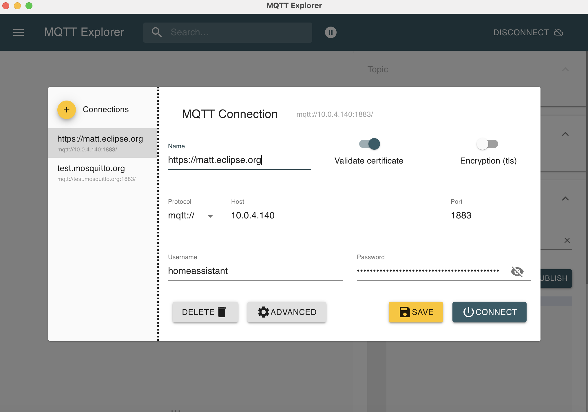

# MQTT with NRF24

In this page, I suppose:

1. 10 sensors send their data (temperature, humidity and brightness) via their NRF24 antennas
2. One NRF24 is plugged into the USB port of a Raspberry and receives the values
3. The values are then sent to Home Asssitant via MQTT.

## Read data from serial port

Find Serial port
```
python -m serial.tools.list_ports
/dev/ttyAMA0
/dev/ttyUSB0
2 ports found
```
The message that arrives on USB port is similar to: `#! b'23;3;172;460;235\n`

We read the input on the USB port with the following code:

``` python title="my_serial.py"
import serial
#Serial takes these two parameters: serial device and baudrate
ser = serial.Serial('/dev/ttyUSB0', 9600)

while True:
    data = ser.readline()
    d=data.decode()
    dd = d.rstrip("\n")
    ddd=dd.split(';')

    count = ddd[0]
    id = ddd[1]
    temp = str(float(ddd[2]) / 10)
    lumi = str(float(ddd[3]) / 10)
    humi = ddd[4]

    print(f"\ncount `{count}`")
    print(f"id `{id}`")
    print(f"Temp `{temp}°C`")
    print(f"Lumi `{lumi}`")
    print(f"Humi `{humi}`")
```

## MQTT Submit

First, install MQTT library

``` shell
pip install paho-mqtt
```
###Example :
We want to submit json:
`#!{"Temperature":11.44751815947774,"Humidite":85.19176787958504"}` on topic `#! NRF24/Cuisine`


``` python
# python 3.6

# See https://www.emqx.com/en/blog/how-to-use-mqtt-in-python

import random
import time

from paho.mqtt import client as mqtt_client

broker = 'homeassistant.local'
port = 1883
client_id = f'NRF24_sensor_2.4_GHz'
username = 'homeassistant'
password = 'weiyai1eFeidaeLithoom6go0OhThooz1IePhaiPh0thae5haephei5siele8aM2'

def connect_mqtt():
    def on_connect(client, userdata, flags, rc):
        if rc == 0:
            print("Connected to MQTT Broker!")
        else:
            print("Failed to connect, return code %d\n", rc)

    client = mqtt_client.Client(client_id)
    client.username_pw_set(username, password)
    client.on_connect = on_connect
    client.connect(broker, port)
    return client


def publish(client):
    while True:
        time.sleep(1)
        # {"Temperature":11.44751815947774,"Humidite":85.19176787958504"}"

        ## Cuisine
        topic = "NRF24/Cuisine"
        temp = random.uniform(10.0, 20.0)
        humi = random.uniform(80.0, 99.0)
        msg = '{"temperature": ' + str(temp) + ',"humidite": ' + str(humi) + '}'
        result = client.publish(topic, msg)
        # result: [0, 1]
        status = result[0]
        if status == 0:
            print(f"Send `{msg}` to topic `{topic}`")
        else:
            print(f"Failed to send message to topic {topic}")

def run():
    client = connect_mqtt()
    client.loop_start()
    publish(client)

if __name__ == '__main__':
    run()
```

See the result with MQTT Explorer
{ width="500" }

{ width="500" }


``` python
# python 3.6

# See https://www.emqx.com/en/blog/how-to-use-mqtt-in-python

import random
import time

from paho.mqtt import client as mqtt_client


broker = 'homeassistant.local'
port = 1883
# generate client ID with pub prefix randomly
client_id = f'RaspCuisine'
username = 'homeassistant'
password = 'weiyai1eFeidaeLithoom6go0OhThooz1IePhaiPh0thae5haephei5siele8aM2'

def connect_mqtt():
def on_connect(client, userdata, flags, rc):
if rc == 0:
print("Connected to MQTT Broker!")
else:
print("Failed to connect, return code %d\n", rc)

client = mqtt_client.Client(client_id)
client.username_pw_set(username, password)
client.on_connect = on_connect
client.connect(broker, port)
return client


def publish(client):
while True:
time.sleep(1)
# {"Temperature":11.44751815947774,"Humidite":85.19176787958504"}"

## Cuisine
topic = "NRF24/Cuisine"
temp = random.uniform(10.0, 20.0)
humi = random.uniform(80.0, 99.0)
msg = '{"temperature": ' + str(temp) + ',"humidite": ' + str(humi) + '}'
result = client.publish(topic, msg)
# result: [0, 1]
status = result[0]
if status == 0:
print(f"Send `{msg}` to topic `{topic}`")
else:
print(f"Failed to send message to topic {topic}")

def run():
client = connect_mqtt()
client.loop_start()
publish(client)

if __name__ == '__main__':
run()
```

Finaly:
``` python
# python 3.6


import random
import time
import serial
ser = serial.Serial('/dev/ttyUSB0', 9600)

from paho.mqtt import client as mqtt_client

broker = 'homeassistant.local'
port = 1883
# generate client ID with pub prefix randomly
client_id = f'RaspCuisine'
username = 'homeassistant'
password = 'weiyai1eFeidaeLithoom6go0OhThooz1IePhaiPh0thae5haephei5siele8aM2'

def connect_mqtt():
    def on_connect(client, userdata, flags, rc):
        if rc == 0:
            print("Connected to MQTT Broker!")
        else:
            print("Failed to connect, return code %d\n", rc)

    client = mqtt_client.Client(client_id)
    client.username_pw_set(username, password)
    client.on_connect = on_connect
    client.connect(broker, port)
    return client


def publish(client):
    while True:
        # Wait for a new line on the serial port
        # b'23;3;172;460;235\n'
        data = ser.readline()
        d=data.decode()
        dd = d.rstrip("\n")
        ddd=dd.split(';')

        # Decrypt received string
        count = ddd[0]
        id = ddd[1]
        temp = str(float(ddd[2]) / 10)
        lumi = ddd[3]
        humi = str(float(ddd[4]) / 10)
        print(f"\ncount `{count}`")
        print(f"id `{id}`")
        print(f"Temp `{temp}°C`")
        print(f"Lumi `{lumi}`")
        print(f"Humi `{humi}`")

        topic = "NRF24/Unknow Sensor"
        # Submit the values to the correct topic
        if (id == "13"): # Cuisine
            topic = "NRF24/Cuisine_NRF24"
        elif (id == "2"): # Bureau
            topic = "NRF24/Bureau_NRF24"
        elif (id == "3"): # Chambre parents
            topic = "NRF24/Chambre_parent_NRF24"
        elif (id == "4"): # Chambre parents
            topic = "NRF24/Garage_NRF24"
        elif (id == "5"): # Exterieur devant maison
            topic = "NRF24/Exterieur_NRF24"
        elif (id == "11"): # Salle de bain
            topic = "NRF24/Salle_de_bain_NRF24"
        elif (id == "12"): # Vide sanitaire
            topic = "NRF24/Vide_sanitaire_NRF24"
        elif (id == "19"): # Chambre Damien
            topic = "NRF24/Chambre_Damien_NRF24"
        elif (id == "22"): # Chambre Amélie
            topic = "NRF24/Chambre_Amelie_NRF24"
        else:
            print("Unknow id")

        msg = '{"temperature": ' + temp + ',"humidite": ' + humi + '}'
        print (msg)
        result = client.publish(topic, msg)
        # result: [0, 1]
        status = result[0]
        if status == 0:
            print(f"Send `{msg}` to topic `{topic}`")
        else:
            print(f"Failed to send message to topic {topic}")

def run():
    client = connect_mqtt()
    client.loop_start()
    publish(client)

if __name__ == '__main__':
    run()
```

Edit the file /etc/rc.local using the editor of your choice. You must edit it with root permissions:
```
sudo vi /etc/rc.local
```
Add
```
# Read NRF24
python /home/pi/Desktop/Cuisine/waitAndSubmitValues.py &
```