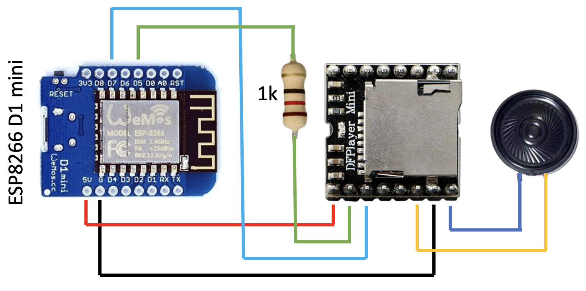

# DFPlayer Installation - ESP D1 Mini

{ width="200" }
{ width="200" }
{ width="200" }

{ width="400" }

``` yaml
substitutions:
  friendly_name: Sound

esphome:
  name: esp8266-d1-mini-205
  friendly_name: $friendly_name
  comment: 'Sound'

  on_boot:
      then:
        - dfplayer.set_volume: 15

esp8266:
  board: esp01_1m

# Enable web access
web_server:
  port: 80

# Enable logging
logger:

# WiFi sensors
sensor:
  # Sensor to measure the WiFi signal strength
  - platform: wifi_signal
    name: "Signal WiFi"
    update_interval: 60s
    filters:
      - lambda: return x * 2; # Converts from dBm to approximate percentage

  # Sensor to measure the uptime of the device
  - platform: uptime
    name: "Uptime"

# Text sensors for network information
text_sensor:
  # Sensor to display the device's IP address
  - platform: wifi_info
    ip_address:
      name: "IPAddress"

  # Sensor to display the SSID of the connected WiFi network
    ssid:
      name: "WiFi SSID"

  # Sensor to display the BSSID of the connected WiFi network
    bssid:
      name: "WiFi BSSID"

# System status sensor to indicate if the device is online or offline
binary_sensor:
  - platform: status
    name: "System Status"

# UART configuration for communication with DFPlayer
uart:
  rx_pin: GPIO13  # RX pin - D5
  tx_pin: GPIO14  # TX pin - D7
  baud_rate: 9600  # Recommended baud rate for DFPlayer

# DFPlayer configuration for audio playback functionality
dfplayer:
  id: lecteur_musique
  on_finished_playback:
    then:
      - logger.log: "Playback finished!" # Log message when playback finishes

# Volume control for DFPlayer using a number input
number:
  # Template number for controlling the volume of DFPlayer
  - platform: template
    name: "DFPlayer Volume"
    id: dfplayer_volume
    min_value: 0          # Minimum volume level
    max_value: 30         # Maximum volume level
    step: 1               # Step size for volume adjustment
    initial_value: 15     # Initial volume level when booting up
    optimistic: true       # Indicates that changes will be applied immediately without confirmation
    set_action:
      - dfplayer.set_volume:
          volume: !lambda "return x;" # Set the volume based on user input

# Enable Home Assistant API for integration with Home Assistant services
api:
  encryption:
    key: "XZap0RIQyPB3uwdZXxQRVnhjM9SfB9Ky5yLOVVXObnQ="

  actions:
    # Action to play the next track on DFPlayer
    - action: dfplayer_next
      then:
        - dfplayer.play_next:

    # Action to play the previous track on DFPlayer
    - action: dfplayer_previous
      then:
        - dfplayer.play_previous:

    # Action to play a specific track based on file number input
    - action: dfplayer_play
      variables:
        file: int                # Variable to hold the track number
      then:
        - dfplayer.play: !lambda 'return file;'

# Button configuration for user interactions with DFPlayer and system controls
button:
  # Button to restart the device
  - platform: restart
    name: "Restart"

  # Button to start playing the first track on DFPlayer
  - platform: template
    name: "Play"
    on_press:
      - dfplayer.play: 1  # Start playing the first track

  # Button to pause playback on DFPlayer
  - platform: template
    name: "Pause"
    on_press:
      - dfplayer.pause

  # Button to play the next track on DFPlayer
  - platform: template
    name: "Next"
    on_press:
      - dfplayer.play_next

  # Button to play the previous track on DFPlayer
  - platform: template
    name: "Previous"
    on_press:
      - dfplayer.play_previous

  # Button to increase the volume of DFPlayer
  - platform: template
    name: "Volume Up"
    on_press:
      - number.increment: dfplayer_volume

  # Button to decrease the volume of DFPlayer
  - platform: template
    name: "Volume Down"
    on_press:
      - number.decrement: dfplayer_volume

# OTA (Over-the-Air) update configuration
ota:
  - platform: esphome
    password: "103356932a9be5ea3641f7e064907750"

wifi:
  ssid: !secret wifi_ssid           # WiFi SSID from secrets.yaml file
  password: !secret wifi_password     # WiFi password from secrets.yaml file

# Enable fallback hotspot (captive portal) in case wifi connection fails
  # Enable fallback hotspot (captive portal) in case wifi connection fails
  ap:
    ssid: "Esp8266-D1-Mini-205"
    password: "vrjnYjHgHhA4"

captive_portal:
```
