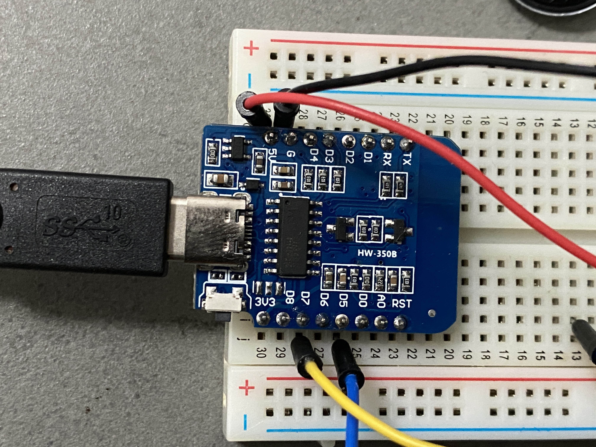
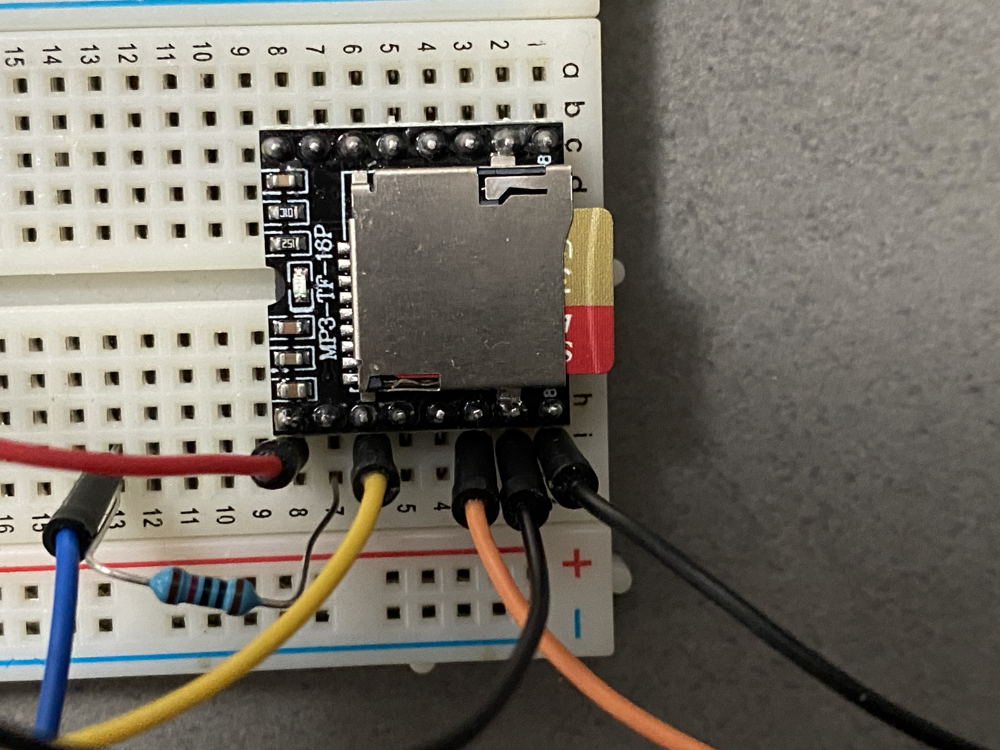
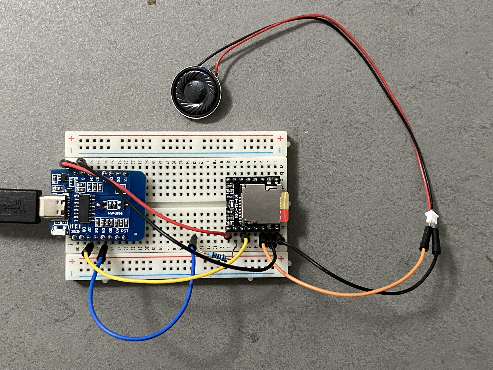

# DFPlayer Installation

{ width="200" }
{ width="200" }
{ width="200" }

``` yaml
substitutions:
  friendly_name: Sound

esphome:
  name: esp8266-d1-mini-205
  friendly_name: $friendly_name
  comment: 'Sound'

  on_boot:
      then:
        - dfplayer.set_volume: 50

esp8266:
  board: esp01_1m

# Enable web access
web_server:
  port: 80

# Enable logging
logger:

uart:
  rx_pin: GPIO13  # Pin de réception RX - D5
  tx_pin: GPIO14  # Pin de transmission TX - D7
  baud_rate: 9600  # Vitesse de transmission recommandée pour DFPlayer

dfplayer:
  id: lecteur_musique
  on_finished_playback:
    then:
      - logger.log: "Lecture terminée !"

number:
  - platform: template
    name: "DFPlayer Volume"
    id: dfplayer_volume
    min_value: 0
    max_value: 30
    step: 1
    initial_value: 15
    optimistic: true
    set_action:
      - dfplayer.set_volume:
          volume: !lambda "return x;"


# Enable Home Assistant API
api:
  encryption:
    key: "XZap0RIQyPB3uwdZXxQRVnhjM9SfB9Ky5yLOVVXObnQ="

  actions:
  - action: dfplayer_next
    then:
      - dfplayer.play_next:
  - action: dfplayer_previous
    then:
      - dfplayer.play_previous:
  - action: dfplayer_play
    variables:
      file: int
    then:
      - dfplayer.play: !lambda 'return file;'

i2c:
  sda: GPIO00
  scl: GPIO02

display:
  - platform: ssd1306_i2c
    model: "SSD1306 128x64"
    address: 0x3C
    lambda: |-
      it.printf(0, 0, id(my_font), "Hello, World!");

font:
  - file: "gfonts://Roboto"
    id: my_font
    size: 12

button:
  - platform: template
    name: "Lecture DFPlayer"
    on_press:
      - dfplayer.play: 1  # Démarrer la lecture de la première piste

  - platform: template
    name: "Pause DFPlayer"
    on_press:
      - dfplayer.pause

  - platform: template
    name: "Suivant DFPlayer"
    on_press:
      - dfplayer.play_next

  - platform: template
    name: "Précédent DFPlayer"
    on_press:
      - dfplayer.play_previous

  - platform: template
    name: "Volume Up"
    on_press:
      - number.increment: dfplayer_volume

  - platform: template
    name: "Volume Down"
    on_press:
      - number.decrement: dfplayer_volume

ota:
  - platform: esphome
    password: "103356932a9be5ea3641f7e064907750"

wifi:
  ssid: !secret wifi_ssid
  password: !secret wifi_password

  # Enable fallback hotspot (captive portal) in case wifi connection fails
  ap:
    ssid: "Esp8266-D1-Mini-205"
    password: "vrjnYjHgHhA4"

captive_portal:


```
