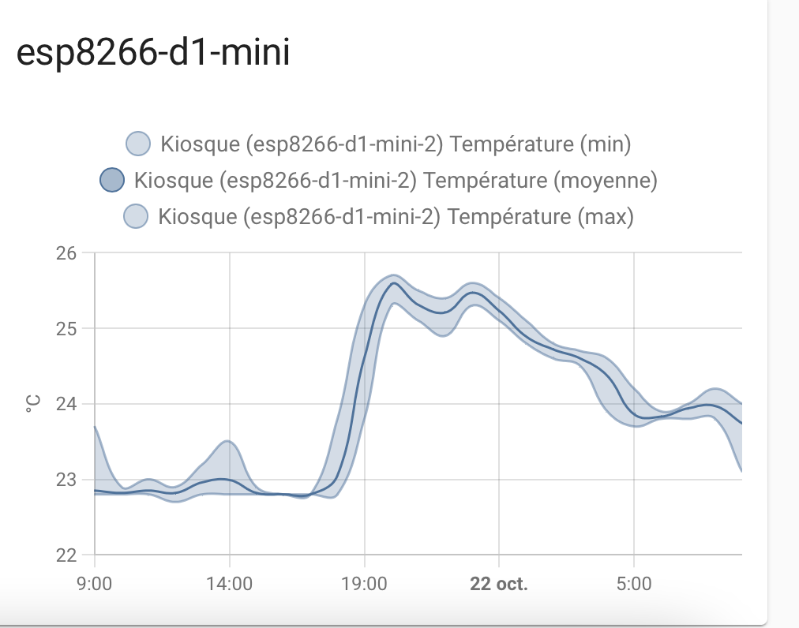

# Comparison of DHT22 accuracy depending on the processor used

## esp32
The precision of the ESP 32 processor is not great.The accuracy of the ESP32 processor is not great, there can be an error of more than 3°C.

{ width="300" }

{ width="500" }

## esp8266
ESP32 varies very little, around 0.3°C

{ width="300" }

{ width="500" }

## esp8266-d1-mini
ESP266-d1-mini varies very little, around 0.3°C

{ width="300" }

{ width="500" }

## esp-01S
ESP266-d1-mini varies very little, around 0.3°C

{ width="300" }

{ width="500" }

