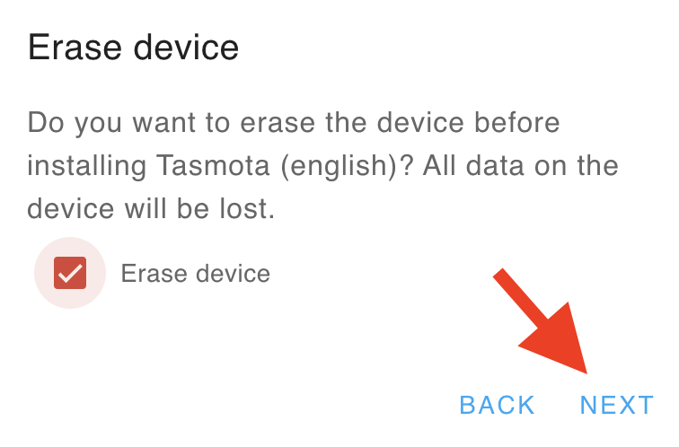

## Flash esp-D1-mini
Flash Tasmota using a **Chrome** based browser for ESP82XX and ESP32

- [https://tasmota.github.io/docs/Getting-Started/#needed-software)](https://tasmota.github.io/docs/Getting-Started/#needed-software)
- [https://tasmota.github.io/install/](https://tasmota.github.io/install/)

{ width="350" }
{ width="350" }
{ width="350" }
{ width="350" }
{ width="350" }
{ width="350" }
{ width="350" }
{ width="350" }
{ width="350" }

### GPIO on a ESP-D1-mini
{ width="500" }

### Configuration of Tasmota entitie
{ width="200" }
{ width="250" }

!!! Info
    To find the MQTT settings, you can go to the MQTT configure on Homeassitant
{ width="400" }
{ width="450" }
{ width="350" }

Change : Host, User, Passwd and topic parameters.

{ width="250" }
{ width="200" }
{ width="200" }

A new entity must be added to the list of MQTT entities (+1 in the number of entities)

{ width="350" }
{ width="400" }

Add the LED grid - WS2812

{ width="250" }
{ width="250" }
{ width="450" }
{ width="200" }

### Add led

{ width="200" }
{ width="200" }

{ width="400" }
{ width="200" }

### Add Photo resistance

{ width="200" }
{ width="550" }
{ width="350" }

### PIR HCS-SR505

See :[https://tasmota.github.io/docs/PIR-Motion-Sensors/#tasmota-settings](https://tasmota.github.io/docs/PIR-Motion-Sensors/#tasmota-settings)

{ width="200" }
{ width="200" }

``` YAML
SwitchMode1 1
SwitchTopic 0
Rule1 on Switch1#state=1 do publish stat/%topic%/PIR1 ON endon on Switch1#state=0 do Publish stat/%topic%/PIR1 OFF endon
Rule1 1
```
``` YAML title="configuration.yaml"
mqtt:
  binary_sensor:
      - unique_id: "20240119_1746"
        state_topic: "stat/tasmota_escalier_2F9DA0/PIR1"
        name: "Escalier PIR"
        device_class: motion
        availability_topic: "tele/tasmota_escalier_2F9DA0/LWT"
        qos: 1
        payload_on: "ON"
        payload_off: "OFF"
        payload_available: "Online"
        payload_not_available: "Offline"
```

{ width="700" }
{ width="350" }

