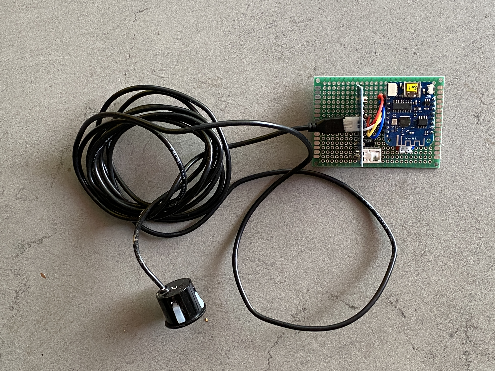
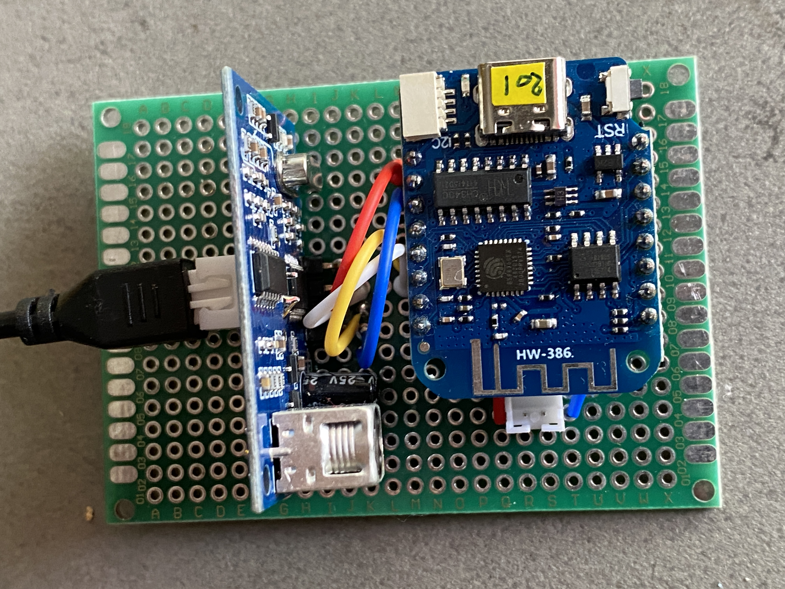
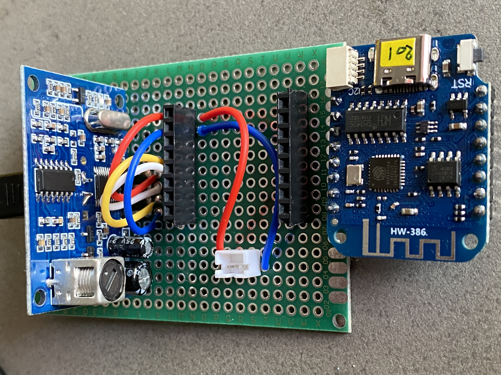
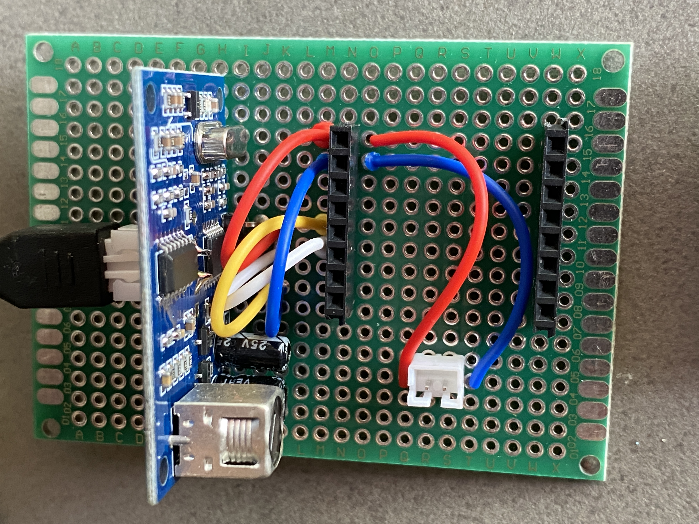
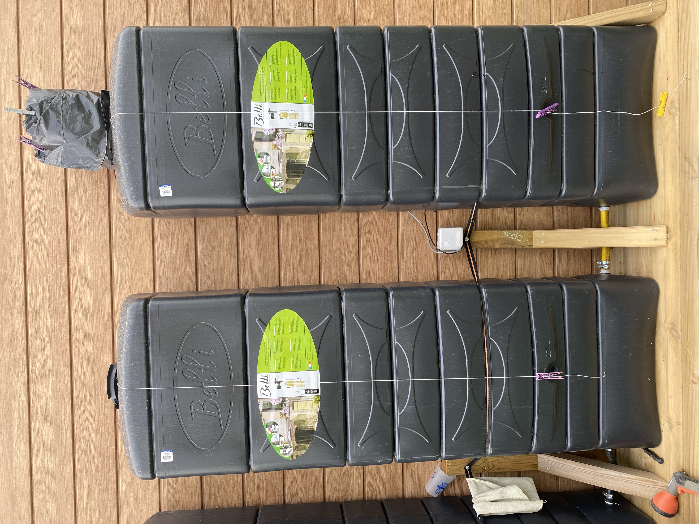

# Water tank monitoring (ESP01-D1-Mini + JSN SR04T ultrasonic sensor)


!!! danger
    IT DOESN'T WORK!

    The waves from the ultrasonic sensor bounce back into the water tank, the values ​​are random!

{ width="200" }
{ width="200" }
{ width="200" }
{ width="200" }
{ width="200" }

See [Markus Haack](https://markus-haack.com/watertank-esphome/) page. It's very easy.

``` json
esphome:
  name: esp8266-d1-mini-5
  platform: ESP8266
  board: d1_mini
  comment: 'Récupérateur pluie'
  friendly_name: Récupérateur pluie

# to access via web client
web_server:
  port: 80
  
# Enable logging
logger:

# Enable Home Assistant API
api:
  encryption:
    key: "GS+SsOzUZE+AO6auwnAstFXOuRdEWw+m2u1JUXD/4yk="

ota:
  password: "f0f2837dae99683a6763cd027e625b87"

wifi:
  ssid: !secret wifi_ssid
  password: !secret wifi_password

  # Enable fallback hotspot (captive portal) in case wifi connection fails
  ap:
    ssid: "Esp8266-D1-Mini-5"
    password: "pCwHEc4amTdt"

captive_portal:

sensor:
 # Wifi signal sensor.
 - platform: wifi_signal
   name: garden_watertank_wifi
   update_interval: 600s
   unit_of_measurement: '%'
   filters:
    - lambda: |-
       if (x <= -100) {
         return 0;
       } else {
         if (x >= -50) {
           return 100;
         } else {
           return 2 * (x + 100);
         }
       }

# Templates for calculated liter & percent
 - platform: template
   name: garden_watertank_liter
   id: garden_watertank_liter
   icon: 'mdi:water'
   unit_of_measurement: 'l'
   accuracy_decimals: 0

 - platform: template
   name: garden_watertank_percent
   id: garden_watertank_percent
   icon: 'mdi:water-percent'
   unit_of_measurement: '%'

# The actual distance sensor
# pulse_time - timeout : 40 - 4 : 180m / 60us - 6m : 210m / 100us - 6m : 220m / 100us - 5m : 230m
# [W][component:237]: Component ultrasonic.sensor took a long time for an operation (53 ms).
# [W][component:238]: Components should block for at most 30 ms.

 - platform: ultrasonic
   trigger_pin: D1
   echo_pin: D2
   name: garden_watertank_distance
   update_interval: 4s
   pulse_time: 100us
   timeout: 5m
  # Don't work
  # filters:
  #  - filter_out: nan
  #  - median:
  #     window_size: 7
  #     send_every: 4
  #     send_first_at: 3
  #  - calibrate_linear:
  #     - 0.23 -> 1.86
  #     - 2.41 -> 0.0
   on_value:
    then:
     - sensor.template.publish:
        id: garden_watertank_liter
        state: !lambda 'return x * 3141.592653589793238;'

     - sensor.template.publish:
        id: garden_watertank_percent
        state: !lambda 'return x * 53.979255216319471;'
```