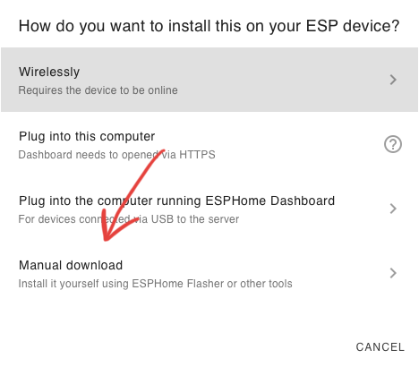
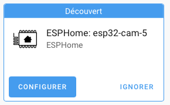

# ESP32-CAM Installation

{ width="200" }

{ width="100" }

{ width="300" }

{ width="300" }

{ width="200" }

{ width="300" }

Edit the code :
``` yaml
substitutions:
  friendly_name: C10 # For Camera 10

esphome:
  name: esp32-cam-10
  friendly_name: "$friendly_name"
  comment: "Chaîne hifi [86]"

esp32:
  board: esp32dev
  framework:
    type: arduino

# Enable logging
logger:

web_server:
  port: 80

# Enable Home Assistant API
api:
  encryption:
    key: "mHC1rZ/+/u---------KjERLis7Yw+Jz7CsP+II="

ota:
  - platform: esphome
    password: "dfdb90983--------3860b94f3"

wifi:
  ssid: !secret wifi_ssid
  password: !secret wifi_password

  # Enable fallback hotspot (captive portal) in case wifi connection fails
  ap:
    ssid: "Esp32-Cam-10 Fallback Hotspot"
    password: "k3c3uU9cotdz"

captive_portal:


# Configuration for Ai-Thinker Camera
# https://esphome.io/components/esp32_camera.html#configuration-for-ai-thinker-camera
esp32_camera:
  name: "$friendly_name"
  external_clock:
    pin: GPIO0
    frequency: 20MHz
  i2c_pins:
    sda: GPIO26
    scl: GPIO27
  data_pins: [GPIO5, GPIO18, GPIO19, GPIO21, GPIO36, GPIO39, GPIO34, GPIO35]
  vsync_pin: GPIO25
  href_pin: GPIO23
  pixel_clock_pin: GPIO22
  power_down_pin: GPIO32
  # Image settings
  max_framerate: 10 fps    # default: 10 fps, max 60
  idle_framerate: 0.1 fps # default: 0.1 fps - framerate for 'picture' in HA dashboard
  resolution: 1024x768     # default: 640x480 (VGA) - higher res requires more memory
  jpeg_quality: 10        # 10 (best) to 63 (worst)
  vertical_flip: False
  horizontal_mirror: False
  contrast: 0 # default: 0, variable -2 to 2
  brightness: 2 # default: 0, variable -2 to 2
  saturation: 0 # default: 0, variable -2 to 2

# Server video/pictures, https://esphome.io/components/esp32_camera_web_server.html
esp32_camera_web_server:
  - port: 8080
    mode: stream
  - port: 8081
    mode: snapshot

time:
  - platform: homeassistant
    id: homeassistant_time

switch:
  - platform: gpio
    name: "$friendly_name Flash"
    pin: 4
    #inverted: True
  - platform: restart
    name: "$friendly_name Restart"
    id: restart_switch

# Example configuration entry with 2 sensors and filter
sensor:
  - platform: wifi_signal # Reports the WiFi signal strength/RSSI in dB
    name: "$friendly_name WiFi Signal dB"
    id: wifi_signal_db
    update_interval: 60s
    entity_category: "diagnostic"

  - platform: copy # Reports the WiFi signal strength in %
    source_id: "wifi_signal_db"
    name: $friendly_name WiFi Signal Percent
    filters:
      - lambda: return min(max(2 * (x + 100.0), 0.0), 100.0);
    unit_of_measurement: "Signal %"
    entity_category: "diagnostic"
    device_class: ""

  - platform: uptime
    name: "$friendly_name Uptime"

text_sensor:
  - platform: version
    name: "$friendly_name ESPHome Version"
  - platform: wifi_info
    ssid:
      name: "$friendly_name WiFi"
      
```
Select **Manual download**

{ width="300" }

{ width="500" }

{ width="500" }

!!! WARNING
    If the ESP is not visible on the serial port, it may be due to the cable, you must try another one

    { width="300" }

!!! WARNING
    If an error appears, it means that the ESP is not in "write" mode. You must then press the "IO0" button THEN connect the ESP and flash it.

    { width="250" }


{ width="500" }

>Disconnect then reconnect the ESP

{ width="300" }

{ width="300" }

{ width="300" }

{ width="300" }

{ width="300" }

{ width="300" }

{ width="300" }

{ width="300" }
