# ESP8266 ESP-01S DHT22 

{ width="300" }
{ width="213" }

## Add to home assistant via ESPHome
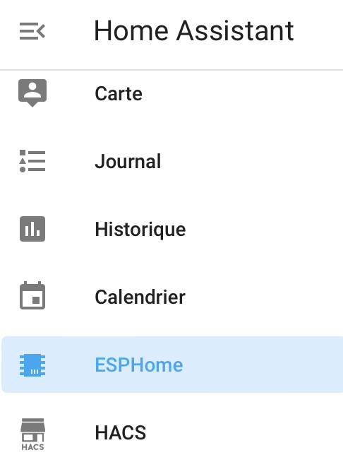{ width="213" }

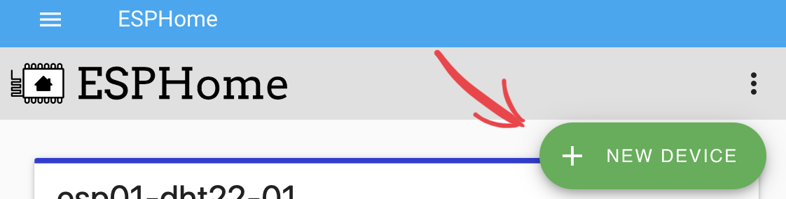{ width="300" }

{ width="213" }
{ width="300" }
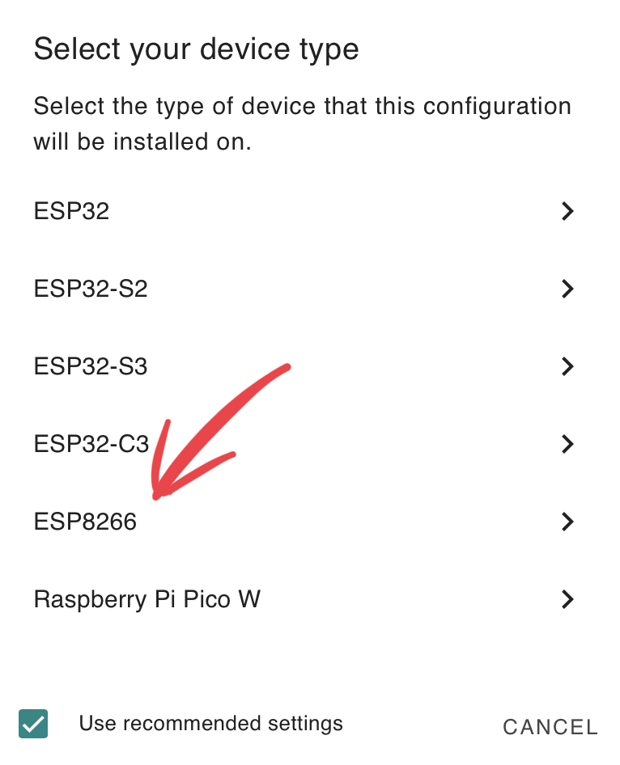{ width="213" }

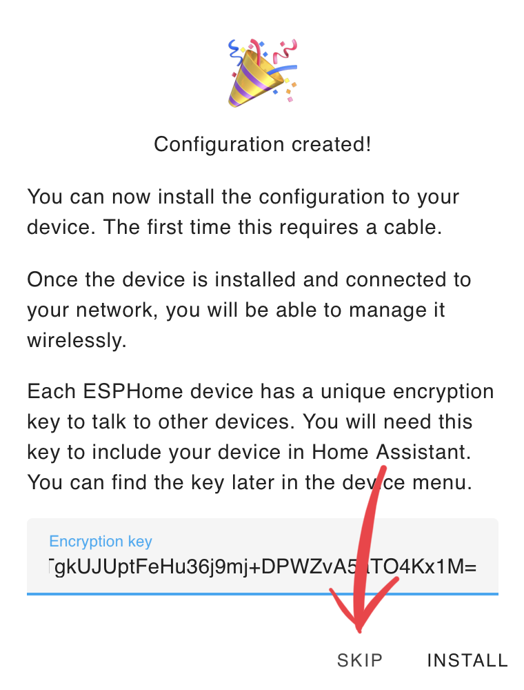{ width="213" }
{ width="300" }

``` yaml

esphome:
  name: esp01-dht22-06
  comment: entree

esp8266:
  board: esp01_1m

# to access via web client
web_server:
  port: 80

# Enable logging
logger:

# Enable Home Assistant API
api:

ota:
  password: "fe5bdec0ad718dcdc24d7cbcb96ee0ae"

wifi:
  ssid: !secret wifi_ssid
  password: !secret wifi_password

  # Enable fallback hotspot (captive portal) in case wifi connection fails
  ap:
    ssid: "Esp01-Dht22-06 Fallback Hotspot"
    password: "FmsCHnjpuR5g"

captive_portal:
sensor:
  - platform: dht
    # model: DHT22 don't work with the ESP-01S
    model: AM2302
    pin: GPIO02
    temperature:
      name: "entree-temperature-DHT22"
      filters:
        - offset: 0.0
    humidity:
      name: "entree-humidite-DHT22"
      filters:
        - offset: 0.0
    update_interval: 600s

```

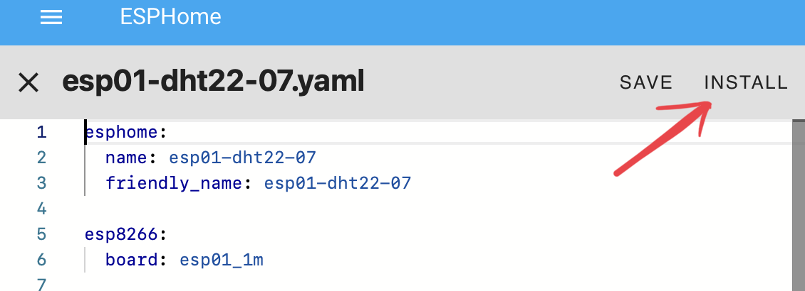{ width="320" }

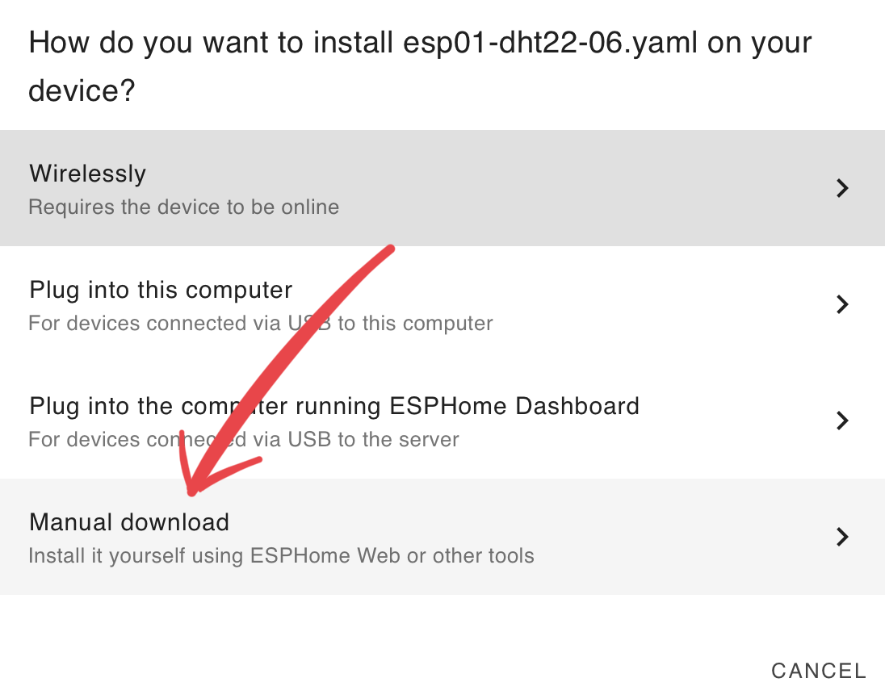{ width="320" }

{ width="320" }

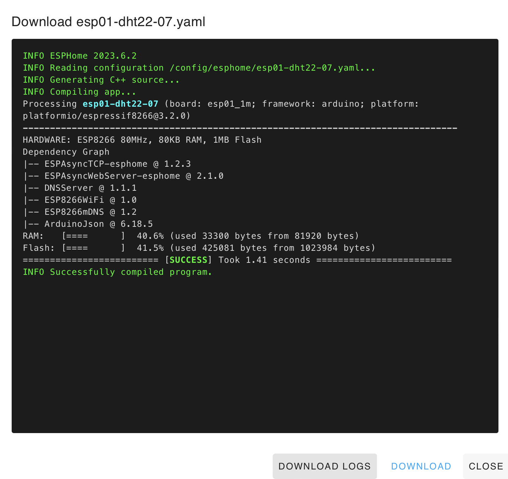{ width="320" }

Use ESPHome-flasher to flash ESP01S entity

{ width="320" }

## Test the device

UNPLUG it!!!

Try http://esp01-dht22-06.local

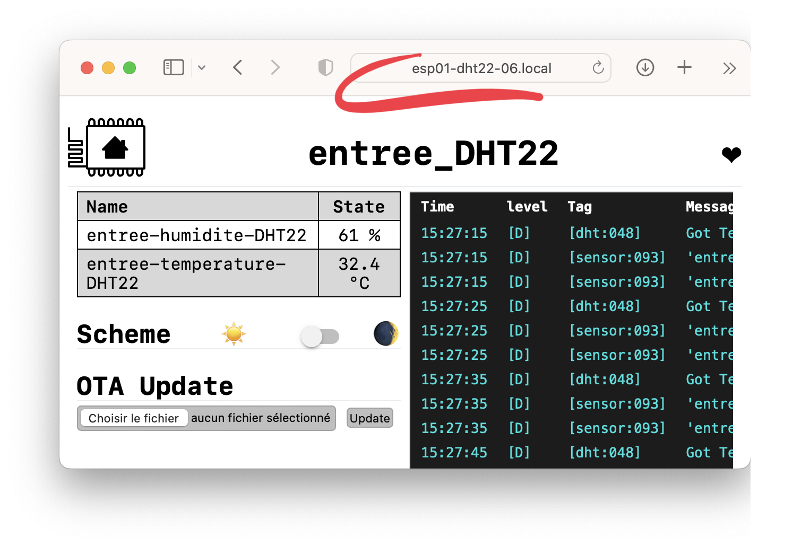{ width="500" }

Inside Home assistant :

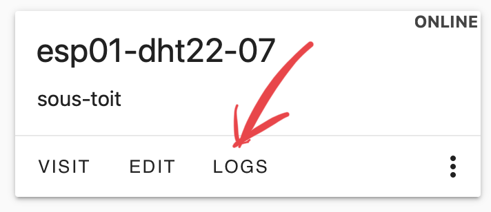{ width="300" }
{ width="300" }

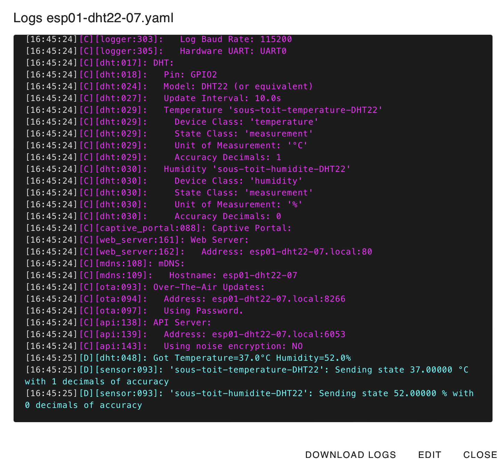{ width="400" }

Finish the installation in Home Assistant

{ width="250" }
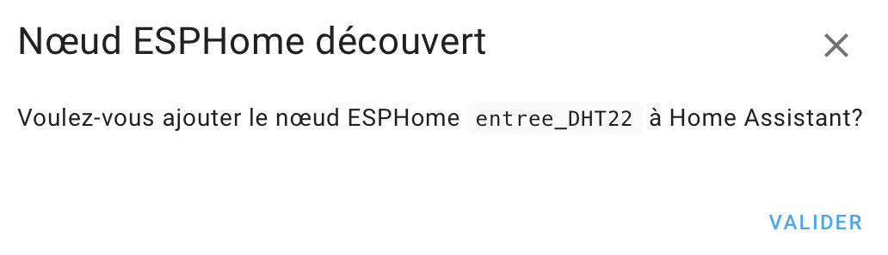{ width="350" }

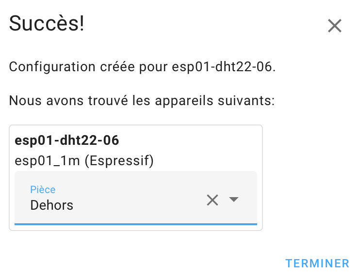{ width="250" }

