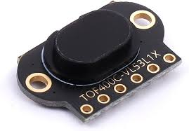

# Time Of Flight TOF400C-VL53L1X

{ width="200" }

## Water level

```
esphome:
  name: esp8266-d1-mini-v2-72
friendly_name: Water level
comment: 'Tank water level'

includes:
    - tof_vl53l1x.h
libraries:
    - "Wire"
    - "VL53L1x"

esp8266:
board: esp01_1m


# to access via web client
web_server:
port: 80


# Enable logging
logger:

# Enable Home Assistant API
api:
encryption:
    key: "SMrDZh99VVEXfRfS7NoNykdc0WTPUV8krV8JUV0wVdQ="

ota:
password: "cb3f49f6a47cdc0b761141653e546f19"

wifi:
ssid: !secret wifi_ssid
password: !secret wifi_password

# Enable fallback hotspot (captive portal) in case wifi connection fails
ap:
    ssid: "Esp8266-D1-Mini-V2-72"
    password: "6hGar0WOd0UK"

captive_portal:

# the vl53l0x is i2c
#i2c:
#  scan: true

# Muliple VL53L0X sensors on same i2c bus
# Example configuration entry
#sensor:
#  - platform: vl53l0x
#    name: "distance1"
#    id: distance1
#    address: 0x41
#    enable_pin: GPIO0
#    timeout: 200us
#    update_interval: 1s
#    unit_of_measurement: "m"
#  - platform: wifi_signal
#    name: "WiFi Signal Sensor"
#    update_interval: 5s

# https://esphome.io/components/i2c.html
i2c:  # example for Wemos LOLIN D2 mini
sda:  GPIO4
scl:  GPIO5
scan: False
#address: 0x29
frequency: 400kHz

sensor:

- platform: wifi_signal
name: "WiFi Signal Sensor"
update_interval: 60s

- platform: custom
lambda: |-
    auto my_VL53L1X_sensor = new VL53L1XCustomSensor();
    my_VL53L1X_sensor->set_update_interval(2000); // define update interval
    App.register_component(my_VL53L1X_sensor);
    return {my_VL53L1X_sensor};
sensors:
    name: "Distance"
    accuracy_decimals: 0
    unit_of_measurement: "mm"

```
