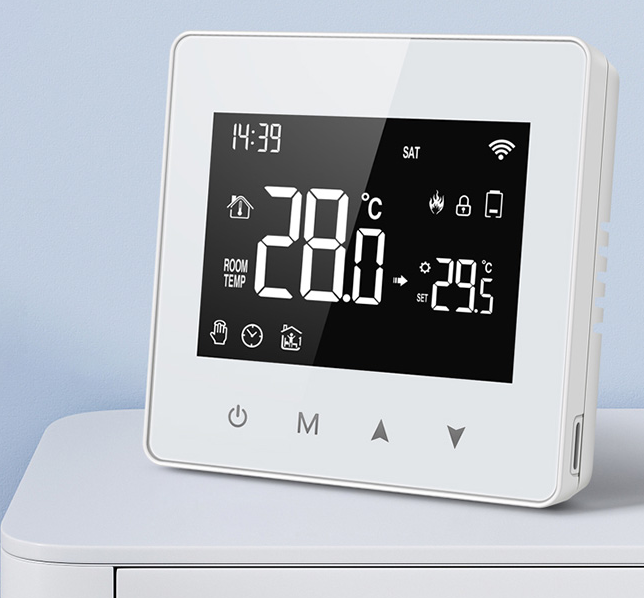
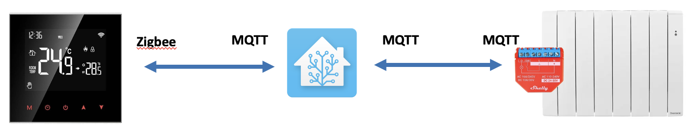
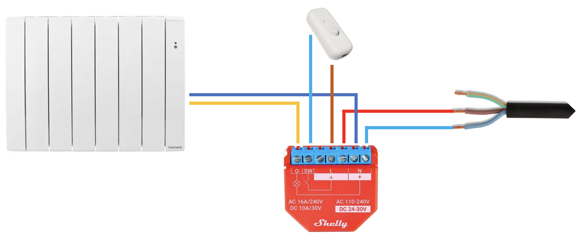
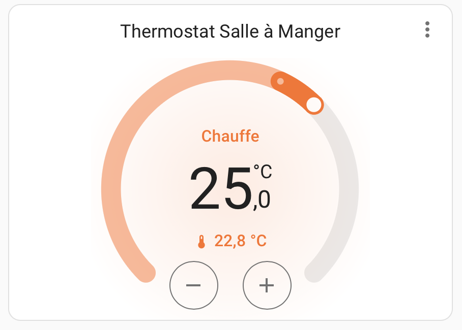
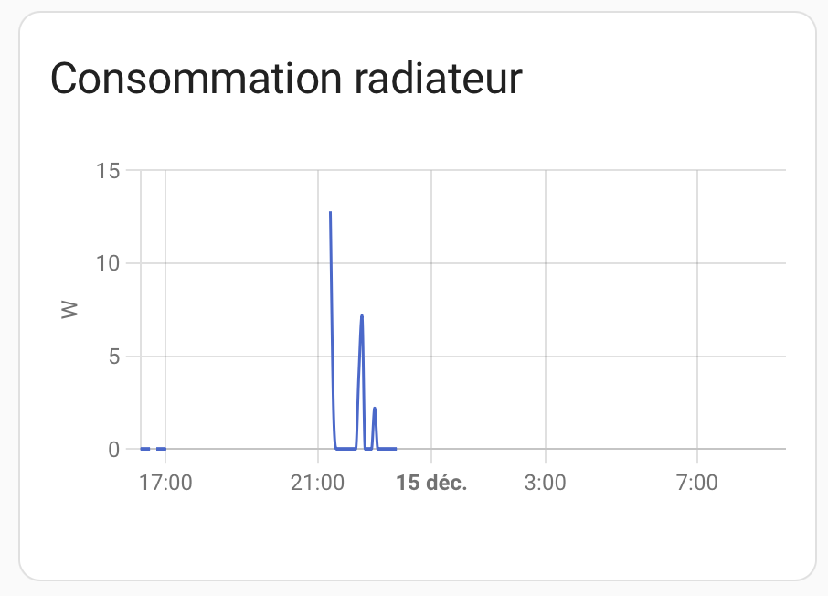
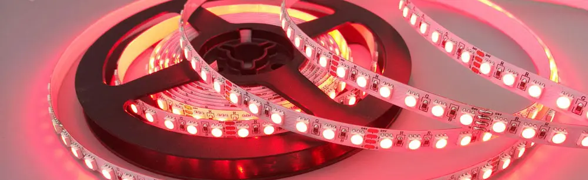

# Heating Management with Home Assistant, Shelly Plus 1PM, and ZWT198 Thermostat

{ width="150" }
{ width="150" }
{ width="200" }

## Introduction

This project details the integration and automation of a heating system using:

- **Home Assistant (HA)** as the central platform.
- A **Zigbee Thermostat (ZWT198)** for temperature measurement and setpoint management.
- A **Shelly Plus 1PM** to control the electric radiator.

The goal is to enable bidirectional management between the thermostat and Home Assistant while automating radiator control.

{ width="500" }

---

## Key Features

1. **Bidirectional Management:**
    - Modify the setpoint directly on the thermostat or via Home Assistant.
    - Automatic adaptation and state synchronization.

2. **Automation:**
    - The radiator is controlled based on the thermostat's state (active heating or not).

3. **Energy Monitoring:**
    - Monitor radiator consumption through the integrated Shelly Plus 1PM.

---

## Wiring Between the Radiator and Shelly Plus 1PM


The Shelly Plus 1PM is used to control the power supply to the radiator. Here are the steps to correctly connect the radiator:

1. **Wiring Diagram:**

    { width="500" }

3. **Detailed Instructions:**
    - Connect the **phase** wire from the main power supply to the Shelly's input terminal (labeled `L`).
    - Connect the Shelly's output terminal (labeled `O`) to the **phase** wire of the radiator.
    - Directly connect the **neutral** wire from the main power supply to the radiator.
    - If required, connect the **ground** wire directly to the radiator (the Shelly does not have a ground terminal).

---

### Radiator Control Automation

This automation links the thermostat to the Shelly.

#### `automations.yaml` File:

``` yaml
alias: Radiator Control via ZWT198 Thermostat
description: >
  Synchronizes the radiator connected to the Shelly with the Zigbee thermostat.
  When the thermostat requests heating, the Shelly turns on.
  Otherwise, it turns off automatically.

triggers:
  - entity_id: climate.zigbee_thermostat
    attribute: hvac_action
    trigger: state
conditions: []
actions:
  - choose:
      - conditions:
          - condition: state
            entity_id: climate.zigbee_thermostat
            attribute: hvac_action
            state: heating
        sequence:
          - target:
              entity_id: switch.salle_a_manger_radiateur_shelly_1pm_switch_0
            action: switch.turn_on
            data: {}
      - conditions:
          - condition: state
            entity_id: climate.zigbee_thermostat
            attribute: hvac_action
            state: idle
        sequence:
          - target:
              entity_id: switch.salle_a_manger_radiateur_shelly_1pm_switch_0
            action: switch.turn_off
            data: {}
mode: single
```

---

## Configuration in Home Assistant

### Zigbee Thermostat (ZWT198)

The thermostat is added to Home Assistant via a Zigbee gateway. The entity is detected as `climate.zigbee_thermostat`.

#### Example Lovelace Card:

```yaml
- type: thermostat
  entity: climate.zigbee_thermostat
  name: Dining Room Thermostat
```
{ width="200" }

---

### Energy Consumption Monitoring

The Shelly Plus 1PM measures the radiator's electrical consumption. Activate the `sensor.power` entity in Home Assistant to monitor power usage.

#### Example Lovelace Graph:

```yaml
chart_type: line
period: 5minute
type: statistics-graph
entities:
  - sensor.salle_a_manger_radiateur_shelly_1pm_switch_0_power
stat_types:
  - mean
title: Consommation radiateur
hide_legend: true
grid_options:
  columns: 12
  rows: 5
days_to_show: 1
```

{ width="200" }

## Visual Feedback with WLED

{ width="300" }

To enhance the usability of the heating system, a WLED addressable LED strip has been integrated to act as a visual indicator of the radiator’s state. This feature ensures that the heating status is always visible, even at a glance, reducing the risk of leaving the radiator on unintentionally.

The WLED integration serves multiple purposes. First, it allows for a quick status check:

- Red Light: Indicates that the radiator is actively heating.

- Off: Confirms that the radiator has been manually or automatically turned off.

```yaml
alias: "ZWT198-SALON : Change WLED color based on ZWT198 thermostat"
description: >-
  Turns the WLED red when the thermostat is heating and either turns it blue
  or off when the thermostat is idle.

triggers:
  # Trigger: Detect changes in the hvac_action attribute of the ZWT198 thermostat.
  # This automation reacts when the thermostat switches between "heating"
  # (active heating) and "idle" (not heating).
  - entity_id: climate.zigbee_thermostat
    attribute: hvac_action
    trigger: state  # Trigger whenever hvac_action changes state.

actions:
  - choose:
      # Action 1: Turn the WLED red when the thermostat is heating.
      - conditions:
          # Condition: Check if the ZWT198 thermostat's hvac_action is set to "heating".
          - condition: state
            entity_id: climate.zigbee_thermostat
            attribute: hvac_action
            state: heating
        sequence:
          # Sequence: Turn the WLED red at maximum brightness.
          - target:
              entity_id: light.salon_wled_2  # Target the WLED light entity.
            data:
              color_name: red  # Set the WLED color to red.
              brightness: 255  # Set brightness to maximum.
            action: light.turn_on  # Turn on the WLED.

      # Action 2: Change the WLED behavior when the thermostat is idle.
      - conditions:
          # Condition: Check if the ZWT198 thermostat's hvac_action is set to "idle".
          - condition: state
            entity_id: climate.zigbee_thermostat
            attribute: hvac_action
            state: idle
        sequence:
          # Option 1: Turn the WLED blue at maximum brightness.
          # Uncomment the following lines to make the WLED blue instead of turning it off.
          # - target:
          #     entity_id: light.salon_wled_2  # Target the WLED light entity.
          #   data:
          #     color_name: blue  # Set the WLED color to blue.
          #     brightness: 255  # Set brightness to maximum.
          #   action: light.turn_on  # Turn on the WLED.

          # Option 2: Turn off the WLED entirely.
          # By default, this option is enabled.
          - service: light.turn_off
            target:
              entity_id: light.salon_wled_2  # Turn off the WLED.

mode: single  # Ensure only one instance of the automation runs at a time.
```
