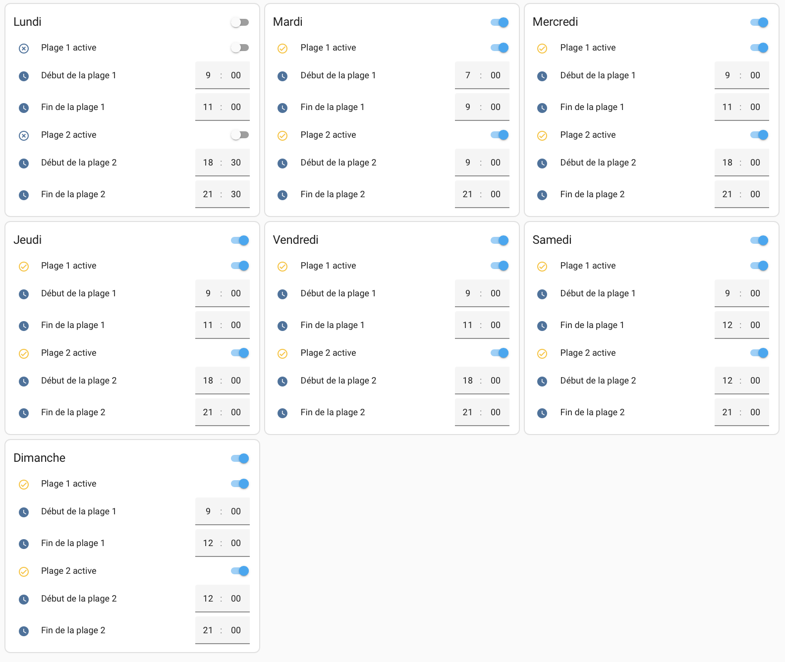

# Thermostat Automation with Custom Daily Schedules

This mini-project aims to configure an intelligent system in Home Assistant to manage a thermostat located in a kitchen. The objective is to enable automatic control based on customized time slots while providing manual management through a user-friendly interface. The project is structured into several steps to ensure a flexible and intuitive setup.

The first step is to define the time slots for each day of the week using `input_datetime` entities. Each day is assigned two time slots with specified start and end times. These entities allow for easy and precise customization of the periods during which the thermostat should be active, such as morning and afternoon.

Next, `input_boolean` entities are associated with each time slot to enable or disable them. These switches allow flexible management directly from the Home Assistant user interface, without requiring modifications to the YAML configuration. They make it easy to temporarily or permanently deactivate a time slot based on specific needs.

The third step involves automating the thermostat’s actions. These automations monitor the defined schedules and manage the thermostat's state autonomously. The thermostat automatically activates at the start of an active slot and deactivates at the end. If no slots are active, an automation ensures that the thermostat remains off, optimizing energy consumption.

Finally, a custom card is created in the Lovelace interface to combine the display of current time slots and an interactive thermostat control button. The day’s time slots are displayed on a single line, formatted clearly and separated by "and." The button allows users to easily toggle between the thermostat's "heating" and "off" modes while visually reflecting its current state. This compact and intuitive card provides quick access to essential information and commands while seamlessly integrating into the Home Assistant dashboard.

{ width="600" }


``` yaml
## This code configures two time slots per day for each day of the week.
# Each time slot has:
# - A switch (input_boolean) to enable or disable the time slot.
# - Two time fields (input_datetime) to define the start and end times
#   for the time slot.
#
# Goal:
# Manage two distinct periods per day during which specific actions can
# be performed. The schedules and activation of the time slots are
# configurable via the user interface (Lovelace) without modifying
# the YAML file.
#
# Usage example:
# - Turn on a light or device between 08:00 and 12:00 for the first
#   time slot and between 14:00 and 18:00 for the second time slot.
# - Different days can have independent time slots activated or
#   deactivated.
#
# This configuration is designed to be persistent (time schedules are
# retained after a Home Assistant restart).

input_boolean:
  # Monday
  monday_slot1_active:
    name: Activate Slot 1 - Monday
  monday_slot2_active:
    name: Activate Slot 2 - Monday

  # Tuesday
  tuesday_slot1_active:
    name: Activate Slot 1 - Tuesday
  tuesday_slot2_active:
    name: Activate Slot 2 - Tuesday

  # Wednesday
  wednesday_slot1_active:
    name: Activate Slot 1 - Wednesday
  wednesday_slot2_active:
    name: Activate Slot 2 - Wednesday

  # Thursday
  thursday_slot1_active:
    name: Activate Slot 1 - Thursday
  thursday_slot2_active:
    name: Activate Slot 2 - Thursday

  # Friday
  friday_slot1_active:
    name: Activate Slot 1 - Friday
  friday_slot2_active:
    name: Activate Slot 2 - Friday

  # Saturday
  saturday_slot1_active:
    name: Activate Slot 1 - Saturday
  saturday_slot2_active:
    name: Activate Slot 2 - Saturday

  # Sunday
  sunday_slot1_active:
    name: Activate Slot 1 - Sunday
  sunday_slot2_active:
    name: Activate Slot 2 - Sunday

input_datetime:
  # Monday
  monday_slot1_start:
    name: Start Slot 1 - Monday
    has_time: true
    has_date: false
  monday_slot1_end:
    name: End Slot 1 - Monday
    has_time: true
    has_date: false
  monday_slot2_start:
    name: Start Slot 2 - Monday
    has_time: true
    has_date: false
  monday_slot2_end:
    name: End Slot 2 - Monday
    has_time: true
    has_date: false

  # Tuesday
  tuesday_slot1_start:
    name: Start Slot 1 - Tuesday
    has_time: true
    has_date: false
  tuesday_slot1_end:
    name: End Slot 1 - Tuesday
    has_time: true
    has_date: false
  tuesday_slot2_start:
    name: Start Slot 2 - Tuesday
    has_time: true
    has_date: false
  tuesday_slot2_end:
    name: End Slot 2 - Tuesday
    has_time: true
    has_date: false

  # Wednesday
  wednesday_slot1_start:
    name: Start Slot 1 - Wednesday
    has_time: true
    has_date: false
  wednesday_slot1_end:
    name: End Slot 1 - Wednesday
    has_time: true
    has_date: false
  wednesday_slot2_start:
    name: Start Slot 2 - Wednesday
    has_time: true
    has_date: false
  wednesday_slot2_end:
    name: End Slot 2 - Wednesday
    has_time: true
    has_date: false

  # Thursday
  thursday_slot1_start:
    name: Start Slot 1 - Thursday
    has_time: true
    has_date: false
  thursday_slot1_end:
    name: End Slot 1 - Thursday
    has_time: true
    has_date: false
  thursday_slot2_start:
    name: Start Slot 2 - Thursday
    has_time: true
    has_date: false
  thursday_slot2_end:
    name: End Slot 2 - Thursday
    has_time: true
    has_date: false

  # Friday
  friday_slot1_start:
    name: Start Slot 1 - Friday
    has_time: true
    has_date: false
  friday_slot1_end:
    name: End Slot 1 - Friday
    has_time: true
    has_date: false
  friday_slot2_start:
    name: Start Slot 2 - Friday
    has_time: true
    has_date: false
  friday_slot2_end:
    name: End Slot 2 - Friday
    has_time: true
    has_date: false

  # Saturday
  saturday_slot1_start:
    name: Start Slot 1 - Saturday
    has_time: true
    has_date: false
  saturday_slot1_end:
    name: End Slot 1 - Saturday
    has_time: true
    has_date: false
  saturday_slot2_start:
    name: Start Slot 2 - Saturday
    has_time: true
    has_date: false
  saturday_slot2_end:
    name: End Slot 2 - Saturday
    has_time: true
    has_date: false

  # Sunday
  sunday_slot1_start:
    name: Start Slot 1 - Sunday
    has_time: true
    has_date: false
  sunday_slot1_end:
    name: End Slot 1 - Sunday
    has_time: true
    has_date: false
  sunday_slot2_start:
    name: Start Slot 2 - Sunday
    has_time: true
    has_date: false
  sunday_slot2_end:
    name: End Slot 2 - Sunday
    has_time: true
    has_date: false
```

``` yaml
alias: Manage LED Strip and Thermostat - Time Slots
description: Turn the LED strip and thermostat on or off based on time slots
mode: single
trigger:
  # Check every minute
  - platform: time_pattern
    minutes: "/1"

condition: []

action:
  - choose:
      # Monday - Slot 1
      - conditions:
          - condition: state
            entity_id: input_boolean.monday_slot1_active
            state: "on"
          - condition: template
            value_template: >
              {{ states('input_datetime.monday_slot1_start') <= now().strftime('%H:%M') <= states('input_datetime.monday_slot1_end') }}
        sequence:
          - service: light.turn_on
            target:
              entity_id: light.salon_wled_2
          - service: climate.turn_on
            target:
              entity_id: climate.thermostat_amelie

      # Monday - Slot 2
      - conditions:
          - condition: state
            entity_id: input_boolean.monday_slot2_active
            state: "on"
          - condition: template
            value_template: >
              {{ states('input_datetime.monday_slot2_start') <= now().strftime('%H:%M') <= states('input_datetime.monday_slot2_end') }}
        sequence:
          - service: light.turn_on
            target:
              entity_id: light.salon_wled_2
          - service: climate.turn_on
            target:
              entity_id: climate.thermostat_amelie

      # Tuesday - Slot 1
      - conditions:
          - condition: state
            entity_id: input_boolean.tuesday_slot1_active
            state: "on"
          - condition: template
            value_template: >
              {{ states('input_datetime.tuesday_slot1_start') <= now().strftime('%H:%M') <= states('input_datetime.tuesday_slot1_end') }}
        sequence:
          - service: light.turn_on
            target:
              entity_id: light.salon_wled_2
          - service: climate.turn_on
            target:
              entity_id: climate.thermostat_amelie

      # Tuesday - Slot 2
      - conditions:
          - condition: state
            entity_id: input_boolean.tuesday_slot2_active
            state: "on"
          - condition: template
            value_template: >
              {{ states('input_datetime.tuesday_slot2_start') <= now().strftime('%H:%M') <= states('input_datetime.tuesday_slot2_end') }}
        sequence:
          - service: light.turn_on
            target:
              entity_id: light.salon_wled_2
          - service: climate.turn_on
            target:
              entity_id: climate.thermostat_amelie

      # Wednesday - Slot 1
      - conditions:
          - condition: state
            entity_id: input_boolean.wednesday_slot1_active
            state: "on"
          - condition: template
            value_template: >
              {{ states('input_datetime.wednesday_slot1_start') <= now().strftime('%H:%M') <= states('input_datetime.wednesday_slot1_end') }}
        sequence:
          - service: light.turn_on
            target:
              entity_id: light.salon_wled_2
          - service: climate.turn_on
            target:
              entity_id: climate.thermostat_amelie

      # Wednesday - Slot 2
      - conditions:
          - condition: state
            entity_id: input_boolean.wednesday_slot2_active
            state: "on"
          - condition: template
            value_template: >
              {{ states('input_datetime.wednesday_slot2_start') <= now().strftime('%H:%M') <= states('input_datetime.wednesday_slot2_end') }}
        sequence:
          - service: light.turn_on
            target:
              entity_id: light.salon_wled_2
          - service: climate.turn_on
            target:
              entity_id: climate.thermostat_amelie

      # Thursday - Slot 1
      - conditions:
          - condition: state
            entity_id: input_boolean.thursday_slot1_active
            state: "on"
          - condition: template
            value_template: >
              {{ states('input_datetime.thursday_slot1_start') <= now().strftime('%H:%M') <= states('input_datetime.thursday_slot1_end') }}
        sequence:
          - service: light.turn_on
            target:
              entity_id: light.salon_wled_2
          - service: climate.turn_on
            target:
              entity_id: climate.thermostat_amelie

      # Thursday - Slot 2
      - conditions:
          - condition: state
            entity_id: input_boolean.thursday_slot2_active
            state: "on"
          - condition: template
            value_template: >
              {{ states('input_datetime.thursday_slot2_start') <= now().strftime('%H:%M') <= states('input_datetime.thursday_slot2_end') }}
        sequence:
          - service: light.turn_on
            target:
              entity_id: light.salon_wled_2
          - service: climate.turn_on
            target:
              entity_id: climate.thermostat_amelie

      # Friday - Slot 1
      - conditions:
          - condition: state
            entity_id: input_boolean.friday_slot1_active
            state: "on"
          - condition: template
            value_template: >
              {{ states('input_datetime.friday_slot1_start') <= now().strftime('%H:%M') <= states('input_datetime.friday_slot1_end') }}
        sequence:
          - service: light.turn_on
            target:
              entity_id: light.salon_wled_2
          - service: climate.turn_on
            target:
              entity_id: climate.thermostat_amelie

      # Friday - Slot 2
      - conditions:
          - condition: state
            entity_id: input_boolean.friday_slot2_active
            state: "on"
          - condition: template
            value_template: >
              {{ states('input_datetime.friday_slot2_start') <= now().strftime('%H:%M') <= states('input_datetime.friday_slot2_end') }}
        sequence:
          - service: light.turn_on
            target:
              entity_id: light.salon_wled_2
          - service: climate.turn_on
            target:
              entity_id: climate.thermostat_amelie

      # Saturday - Slot 1
      - conditions:
          - condition: state
            entity_id: input_boolean.saturday_slot1_active
            state: "on"
          - condition: template
            value_template: >
              {{ states('input_datetime.saturday_slot1_start') <= now().strftime('%H:%M') <= states('input_datetime.saturday_slot1_end') }}
        sequence:
          - service: light.turn_on
            target:
              entity_id: light.salon_wled_2
          - service: climate.turn_on
            target:
              entity_id: climate.thermostat_amelie

      # Saturday - Slot 2
      - conditions:
          - condition: state
            entity_id: input_boolean.saturday_slot2_active
            state: "on"
          - condition: template
            value_template: >
              {{ states('input_datetime.saturday_slot2_start') <= now().strftime('%H:%M') <= states('input_datetime.saturday_slot2_end') }}
        sequence:
          - service: light.turn_on
            target:
              entity_id: light.salon_wled_2
          - service: climate.turn_on
            target:
              entity_id: climate.thermostat_amelie

      # Sunday - Slot 1
      - conditions:
          - condition: state
            entity_id: input_boolean.sunday_slot1_active
            state: "on"
          - condition: template
            value_template: >
              {{ states('input_datetime.sunday_slot1_start') <= now().strftime('%H:%M') <= states('input_datetime.sunday_slot1_end') }}
        sequence:
          - service: light.turn_on
            target:
              entity_id: light.salon_wled_2
          - service: climate.turn_on
            target:
              entity_id: climate.thermostat_amelie

      # Sunday - Slot 2
      - conditions:
          - condition: state
            entity_id: input_boolean.sunday_slot2_active
            state: "on"
          - condition: template
            value_template: >
              {{ states('input_datetime.sunday_slot2_start') <= now().strftime('%H:%M') <= states('input_datetime.sunday_slot2_end') }}
        sequence:
          - service: light.turn_on
            target:
              entity_id: light.salon_wled_2
          - service: climate.turn_on
            target:
              entity_id: climate.thermostat_amelie

    # Default action: Turn off LED and thermostat
    default:
      - service: light.turn_off
        target:
          entity_id: light.salon_wled_2
    default:
      - target:
          entity_id: light.salon_wled_2
        action: light.turn_off
        data: {}
      - service: climate.set_hvac_mode
        target:
          entity_id: climate.thermostat_cuisine
        data:
          hvac_mode: "off"  # Éteint le thermostat
```


``` yaml
square: false
type: grid
columns: 1
cards:
  - type: markdown
    content: |
      ## Time Slot Management
      Activate and configure two time slots for each day of the week.
  - square: false
    type: grid
    columns: 3
    cards:
      - type: entities
        title: Monday
        entities:
          - entity: input_boolean.monday_slot1_active
            name: Activate Slot 1
          - entity: input_datetime.monday_slot1_start
            name: Start Slot 1
          - entity: input_datetime.monday_slot1_end
            name: End Slot 1
          - entity: input_boolean.monday_slot2_active
            name: Activate Slot 2
          - entity: input_datetime.monday_slot2_start
            name: Start Slot 2
          - entity: input_datetime.monday_slot2_end
            name: End Slot 2
      - type: entities
        title: Tuesday
        entities:
          - entity: input_boolean.tuesday_slot1_active
            name: Activate Slot 1
          - entity: input_datetime.tuesday_slot1_start
            name: Start Slot 1
          - entity: input_datetime.tuesday_slot1_end
            name: End Slot 1
          - entity: input_boolean.tuesday_slot2_active
            name: Activate Slot 2
          - entity: input_datetime.tuesday_slot2_start
            name: Start Slot 2
          - entity: input_datetime.tuesday_slot2_end
            name: End Slot 2
      - type: entities
        title: Wednesday
        entities:
          - entity: input_boolean.wednesday_slot1_active
            name: Activate Slot 1
          - entity: input_datetime.wednesday_slot1_start
            name: Start Slot 1
          - entity: input_datetime.wednesday_slot1_end
            name: End Slot 1
          - entity: input_boolean.wednesday_slot2_active
            name: Activate Slot 2
          - entity: input_datetime.wednesday_slot2_start
            name: Start Slot 2
          - entity: input_datetime.wednesday_slot2_end
            name: End Slot 2
      - type: entities
        title: Thursday
        entities:
          - entity: input_boolean.thursday_slot1_active
            name: Activate Slot 1
          - entity: input_datetime.thursday_slot1_start
            name: Start Slot 1
          - entity: input_datetime.thursday_slot1_end
            name: End Slot 1
          - entity: input_boolean.thursday_slot2_active
            name: Activate Slot 2
          - entity: input_datetime.thursday_slot2_start
            name: Start Slot 2
          - entity: input_datetime.thursday_slot2_end
            name: End Slot 2
      - type: entities
        title: Friday
        entities:
          - entity: input_boolean.friday_slot1_active
            name: Activate Slot 1
          - entity: input_datetime.friday_slot1_start
            name: Start Slot 1
          - entity: input_datetime.friday_slot1_end
            name: End Slot 1
          - entity: input_boolean.friday_slot2_active
            name: Activate Slot 2
          - entity: input_datetime.friday_slot2_start
            name: Start Slot 2
          - entity: input_datetime.friday_slot2_end
            name: End Slot 2
      - type: entities
        title: Saturday
        entities:
          - entity: input_boolean.saturday_slot1_active
            name: Activate Slot 1
          - entity: input_datetime.saturday_slot1_start
            name: Start Slot 1
          - entity: input_datetime.saturday_slot1_end
            name: End Slot 1
          - entity: input_boolean.saturday_slot2_active
            name: Activate Slot 2
          - entity: input_datetime.saturday_slot2_start
            name: Start Slot 2
          - entity: input_datetime.saturday_slot2_end
            name: End Slot 2
      - type: entities
        title: Sunday
        entities:
          - entity: input_boolean.sunday_slot1_active
            name: Activate Slot 1
          - entity: input_datetime.sunday_slot1_start
            name: Start Slot 1
          - entity: input_datetime.sunday_slot1_end
            name: End Slot 1
          - entity: input_boolean.sunday_slot2_active
            name: Activate Slot 2
          - entity: input_datetime.sunday_slot2_start
            name: Start Slot 2
          - entity: input_datetime.sunday_slot2_end
            name: End Slot 2
grid_options:
  columns: full
```
