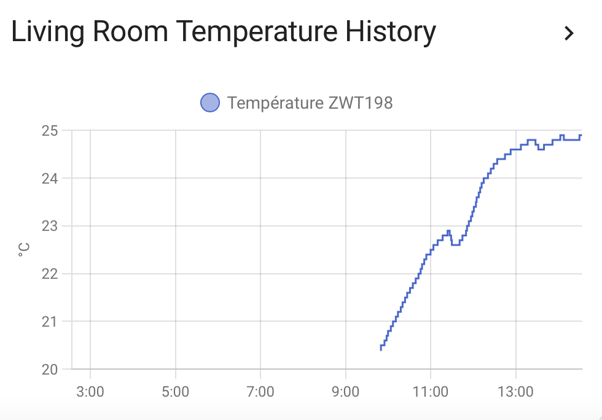

# ZWT198 Temperature into HAS via MQTT

## Introduction

The **ZWT198** thermostat does not directly transmit its temperature to **Home Assistant**. To access this information, we need to retrieve it through the **MQTT** protocol. This guide explains how to integrate this data into Home Assistant, enabling us to monitor and utilize our thermostat's temperature within Home Assistant.

## Integration Steps

### Verify MQTT Messages with MQTT Explorer

   To confirm that the thermostat is publishing temperature data to the MQTT broker, we use **MQTT Explorer**. Connect to your broker and navigate to the topic corresponding to your thermostat, for example: `zigbee2mqtt/Zigbee Thermostat Living Room ZWT198`. Ensure that the message contains the key `local_temperature` with a numeric value.

{ width="500" }<br>
   *Image of the **MQTT Explorer** interface displaying the relevant topic and the message containing the `local_temperature` key.*

### Add MQTT Sensor Configuration in Home Assistant

   To have Home Assistant create a sensor that retrieves the temperature from the MQTT message published by the thermostat, access the `configuration.yaml` file and add the following configuration:

   ```yaml
   mqtt:
     sensor:
       - name: "Living Room Temperature"
         state_topic: "zigbee2mqtt/Zigbee Thermostat Living Room ZWT198"
         unit_of_measurement: "°C"
         value_template: "{{ value_json.local_temperature }}"
         device_class: temperature
   ```

   Save the file and restart Home Assistant to apply the changes.

### Verify Sensor Availability in Home Assistant

   After restarting Home Assistant, go to **Developer Tools** > **States**. Search for the sensor named `sensor.living_room_temperature` and verify that its value matches the current temperature measured by the thermostat.

   { width="600" }<br>

## Integrating the Temperature into a Home Assistant Card

To display the temperature on your Home Assistant dashboard, you can add an appropriate card. For instance, to show the current temperature, you might use the **Sensor Card**:

```yaml
type: sensor
entity: sensor.living_room_temperature
name: Living Room Temperature
```

{ width="200" }

For a graphical representation of temperature trends, the **History Graph Card** is suitable:

```yaml
type: history-graph
entities:
  - sensor.living_room_temperature
title: Living Room Temperature History
hours_to_show: 24
refresh_interval: 60
```

{ width="500" }

