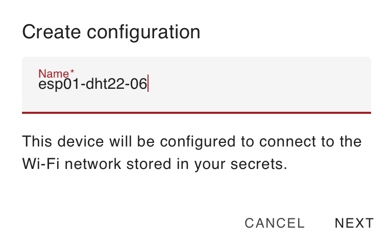
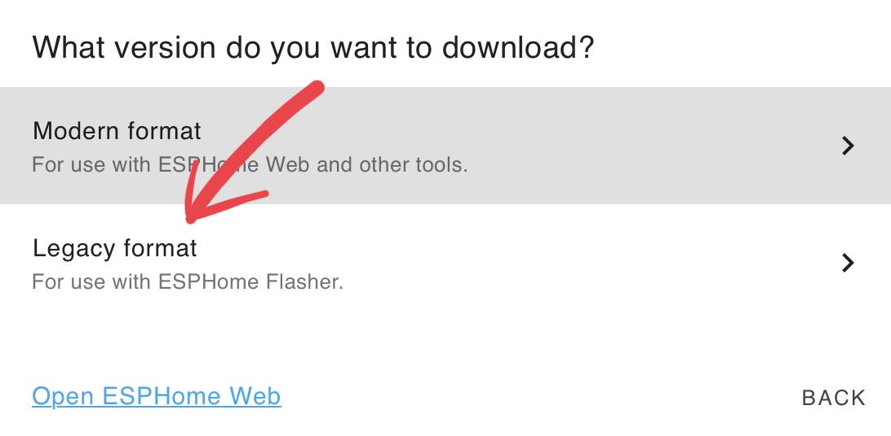
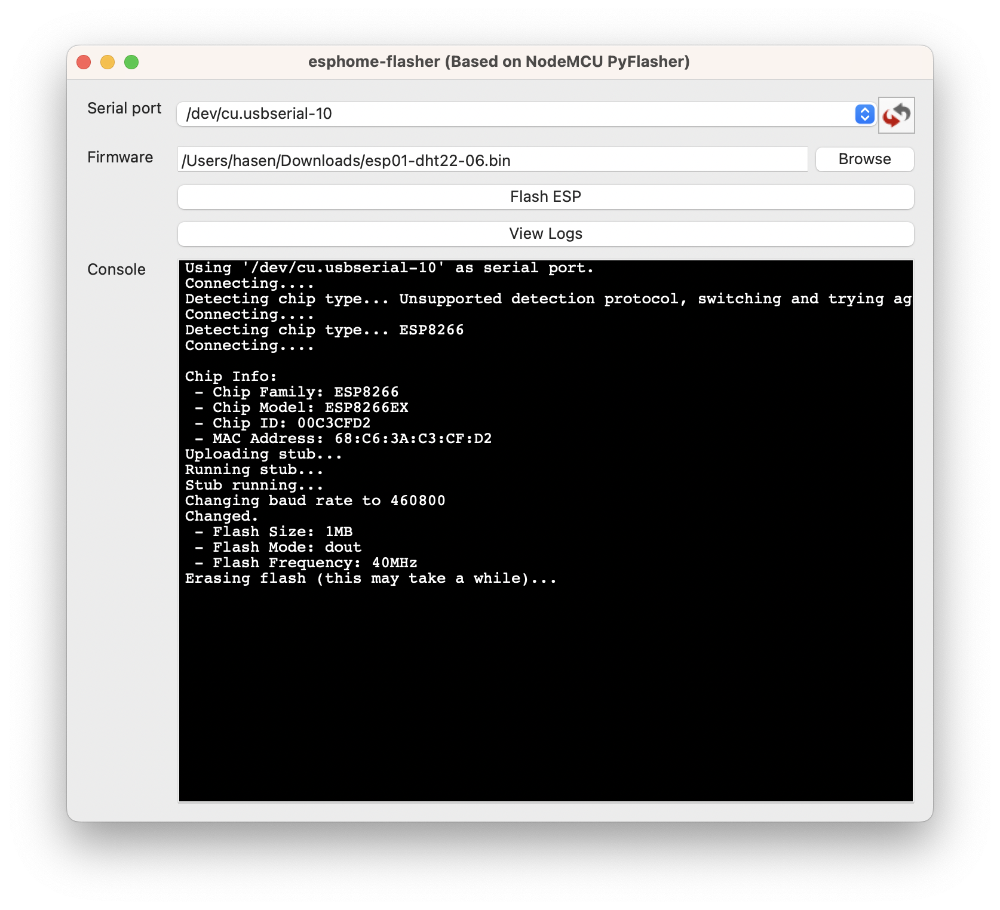

# ESP8266 ESP-01S DHT22

{ width="300" }
{ width="213" }

## Add to home assistant via ESPHome
{ width="213" }

{ width="300" }

{ width="213" }
{ width="300" }
{ width="213" }

{ width="213" }
{ width="300" }

``` yaml

esphome:
  name: esp01-dht22-06
  comment: entree

esp8266:
  board: esp01_1m

# to access via web client
web_server:
  port: 80

# Enable logging
logger:

# Enable Home Assistant API
api:

ota:
  password: "fe5bdec0ad718dcdc24d7cbcb96ee0ae"

wifi:
  ssid: !secret wifi_ssid
  password: !secret wifi_password

  # Enable fallback hotspot (captive portal) in case wifi connection fails
  ap:
    ssid: "Esp01-Dht22-06 Fallback Hotspot"
    password: "FmsCHnjpuR5g"

captive_portal:
sensor:
  - platform: dht
    # model: DHT22 don't work with the ESP-01S
    model: AM2302
    pin: GPIO02
    temperature:
      name: "entree-temperature-DHT22"
      filters:
        - offset: 0.0
    humidity:
      name: "entree-humidite-DHT22"
      filters:
        - offset: 0.0
    update_interval: 600s

```
## Full code

``` yaml
substitutions:
  friendly_name: DHT22-Cuisine  # A user-friendly name for the device and sensors

esphome:
  name: esp01-dht22-03             # Unique identifier for the device
  # friendly_name: "$friendly_name"  # removed because name is to long : sensor.esp01_dht22_03_dht22_cuisine_temperature_dht22
  comment: "DHT22 Cuisine"          # Description of the device's location or purpose

esp8266:
  board: esp01_1m                  # Specifies the ESP8266 board type (ESP01 with 1MB flash memory)

web_server:
  port: 80                         # Enables a web server for device monitoring on port 80

# Enable logging for debugging and monitoring
logger:

# Enable Home Assistant API to allow communication with Home Assistant
api:

# Enable Over-The-Air (OTA) updates
ota:
  - platform: esphome
    password: "239393caf760cc3701647ab7f66e5041"  # Password for OTA updates to secure the device

wifi:
  ssid: !secret wifi_ssid           # Wi-Fi network name stored securely in secrets
  password: !secret wifi_password   # Wi-Fi password stored securely in secrets

  # Configuration for fallback hotspot if the device fails to connect to Wi-Fi
  ap:
    ssid: "Esp01-Dht22-03 Fallback Hotspot"  # Name of the fallback network
    password: "Y6OoAFtSy4uD"                 # Password for the fallback network

captive_portal:                     # Enables a captive portal for reconfiguration when needed

sensor:
  # Configuration for the DHT22 (AM2302) temperature and humidity sensor
  - platform: dht
    # Note: The DHT22 model is referred to as AM2302 when used with ESP-01S.
    model: AM2302  # Specifies the sensor model
    pin: GPIO02    # GPIO pin to which the sensor is connected
    temperature:
      name: "${friendly_name} temperature"  # Sensor name for temperature readings
      id: temperature_sensor   # Adds an ID for reference in the template
      filters:
        - offset: -1.7  # Calibration offset for temperature
    humidity:
      name: "${friendly_name} humidite"  # Sensor name for humidity readings
      id: humidity_sensor  # Adds an ID for reference in the template
      filters:
        - offset: 0.0  # Calibration offset for humidity
    update_interval: 600s  # Time interval (600 seconds) for sensor readings

  # Sensor for Wi-Fi signal strength (RSSI) in dB
  - platform: wifi_signal
    name: "${friendly_name} WiFi Signal dB"  # Sensor name for Wi-Fi signal in dB
    id: wifi_signal_db  # Unique ID for this sensor
    update_interval: 60s  # Updates every 60 seconds
    entity_category: "diagnostic"  # Marked as diagnostic in Home Assistant

  # Sensor for Wi-Fi signal strength as a percentage
  - platform: copy
    source_id: "wifi_signal_db"  # Uses data from the Wi-Fi signal sensor
    name: "${friendly_name} WiFi Signal Percent"  # Name of the percentage sensor
    filters:
      - lambda: return min(max(2 * (x + 100.0), 0.0), 100.0);  # Formula to calculate percentage from dB
    unit_of_measurement: "Signal %"  # Measurement unit displayed as percentage
    entity_category: "diagnostic"   # Marked as diagnostic
    device_class: ""                # No specific device class

  # Uptime sensor to monitor how long the device has been running
  - platform: uptime
    name: "${friendly_name} Uptime"  # Name of the uptime sensor

  # Heat Index Calculation Using Temperature and Humidity
  - platform: template
    name: "${friendly_name} Heat Index"  # Name for the calculated heat index
    unit_of_measurement: "°C"  # Unit of measurement for the heat index
    lambda: |-
      if (!isnan(id(temperature_sensor).state) && !isnan(id(humidity_sensor).state)) {
        float T = id(temperature_sensor).state;  // Current temperature
        float H = id(humidity_sensor).state;    // Current humidity
        // Formula to calculate the heat index
        return -8.78469475556 + 1.61139411 * T + 2.33854883889 * H
               - 0.14611605 * T * H
               - 0.012308094 * pow(T, 2)
               - 0.0164248277778 * pow(H, 2)
               + 0.002211732 * pow(T, 2) * H
               + 0.00072546 * T * pow(H, 2)
               - 0.000003582 * pow(T, 2) * pow(H, 2);
      } else {
        return NAN;  // Return NAN if data is invalid
      }

text_sensor:
  # Sensor for the ESPHome version running on the device
  - platform: version
    name: "${friendly_name} ESPHome Version"  # Name of the version sensor

  # Sensor for the Wi-Fi SSID the device is connected to
  - platform: wifi_info
    ssid:
      name: "${friendly_name} WiFi"  # Name of the Wi-Fi SSID sensor

```

{ width="320" }

{ width="320" }

{ width="320" }

{ width="320" }

Use ESPHome-flasher to flash ESP01S entity

{ width="320" }

## Test the device

UNPLUG it!!!

Try http://esp01-dht22-06.local

{ width="500" }

Inside Home assistant :

{ width="300" }
{ width="300" }

{ width="400" }

Finish the installation in Home Assistant

{ width="250" }
{ width="350" }

{ width="250" }

