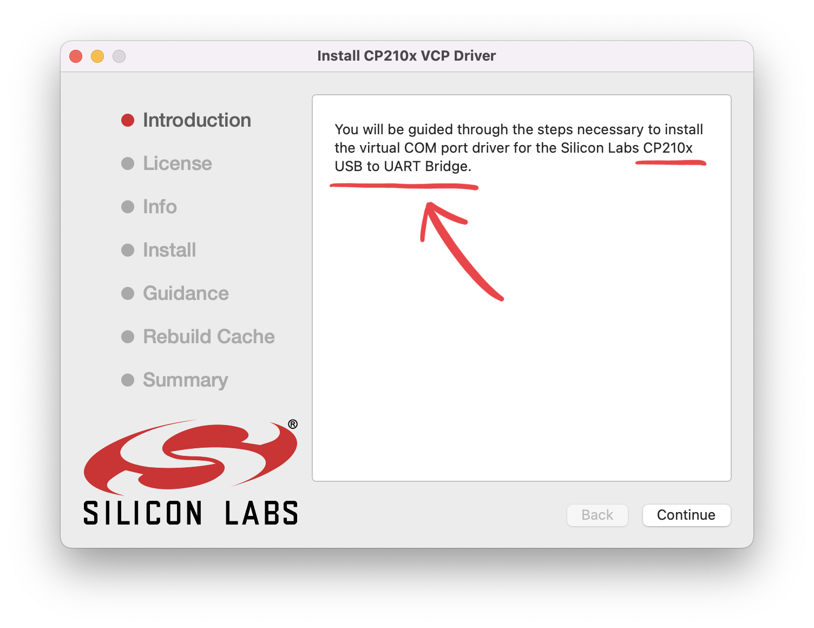
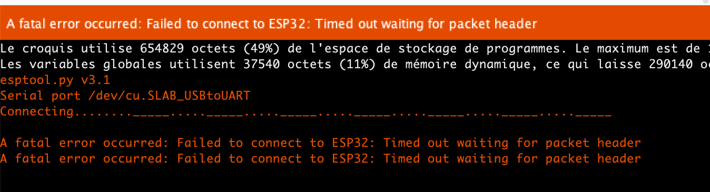
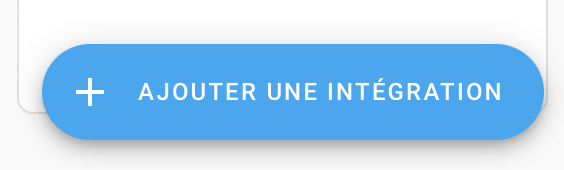
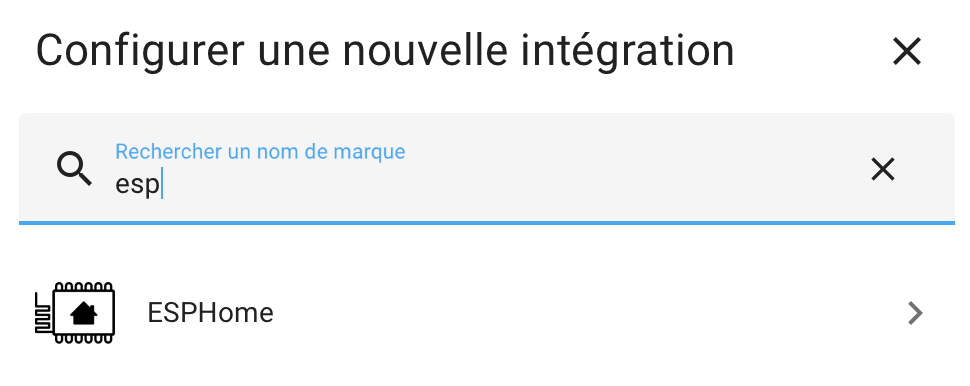
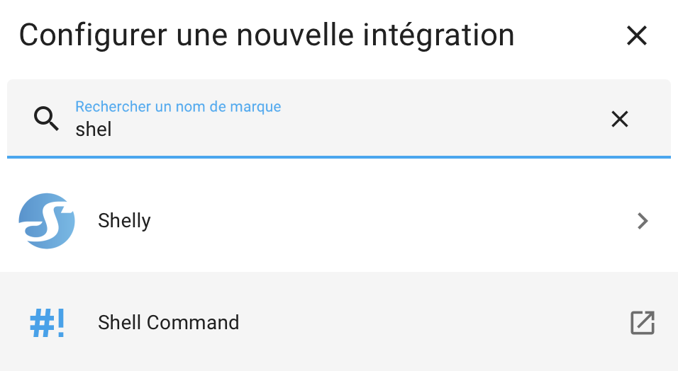
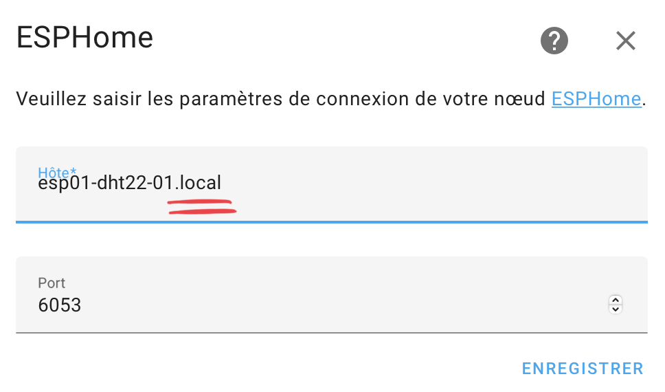
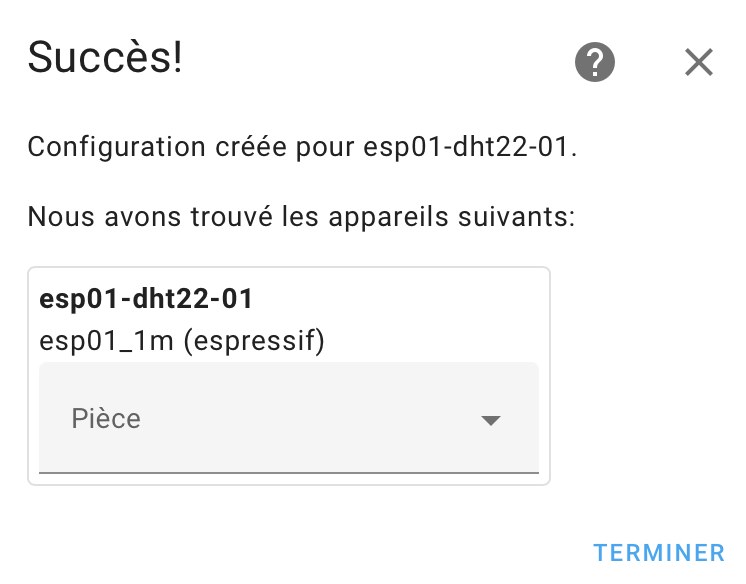

# General FAQ

## Si l'esp n'ai pas reconnu
- change USB Cable
- Change d'adaptateur { width="400" }
- installer le driver associé à l'esp (voir model sur le microprocesseur)  
{width="300"} 
{width="300"}
- vérifier dans /dev si le port existe bien  
{width="300"}

## Impossibible de téléverser le code

{width="400"}

Il faut presser sur RESET + GPIO0 au moment du téléchargement.
Attention il y a 3 boutons sur certain modèl ! Utiliser celui sous l’ESP et le GPIO0 du support.

ATTENTION : Il faut ensuite débrancher puis rebrancher l’ESP

Vidéo : https://youtu.be/v8s-UMqcTJs

Si cela ne fonctionne toujours pas
- débrancher l'alim. de l'esp (pin 5v ou 3.3v)
- débrancher toutes les pin et recommencer.

## Corespondance Dx -> GPIOx
{width="400"}

## Re-discover / manually add Integration

!!! note
    You can just add the integration via the Add Integration button, use the device name with "**.local**" at the end for the host name.

{ width="200" }

{ width="380" } or
{ width="280" }

{ width="400" }

{ width="400" }

## Reset Shelly 1PM
Reset the device : https://www.youtube.com/watch?v=dz7Aq4mGnQc
Reset : On - 5 times off - On http://192.168.33.1