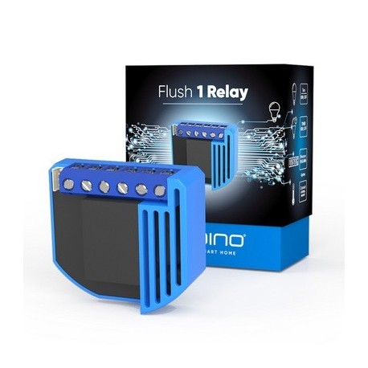
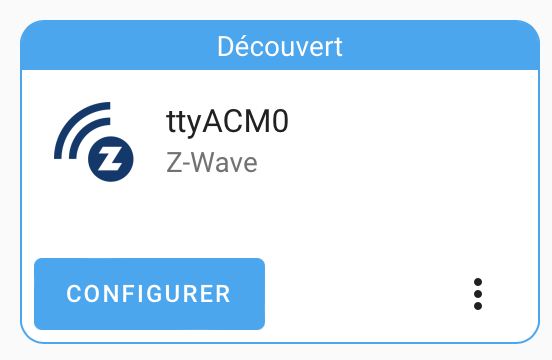
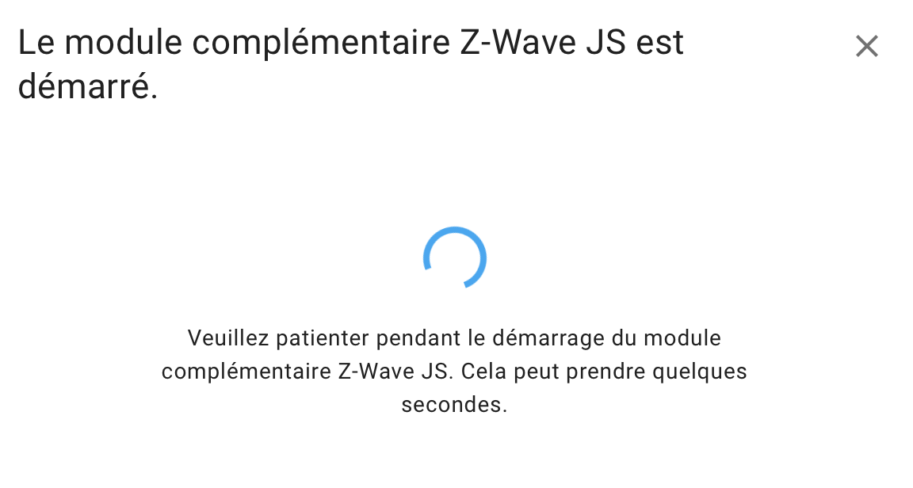
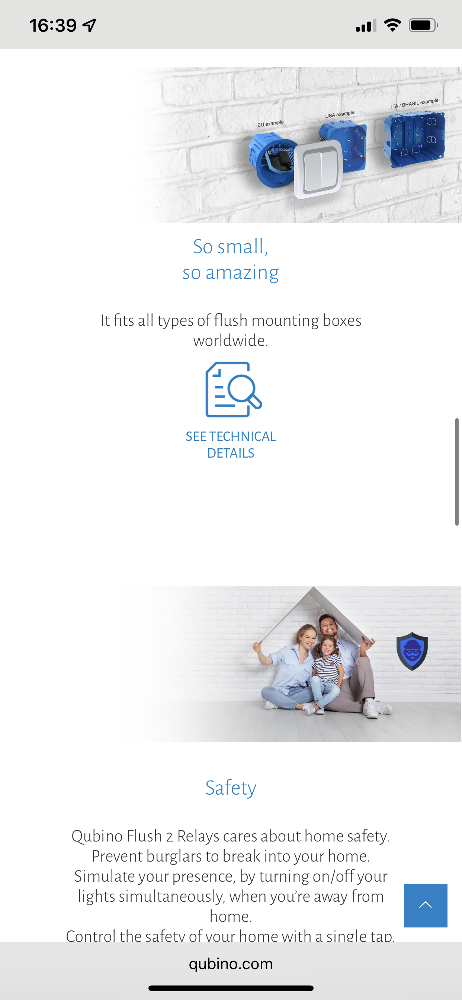
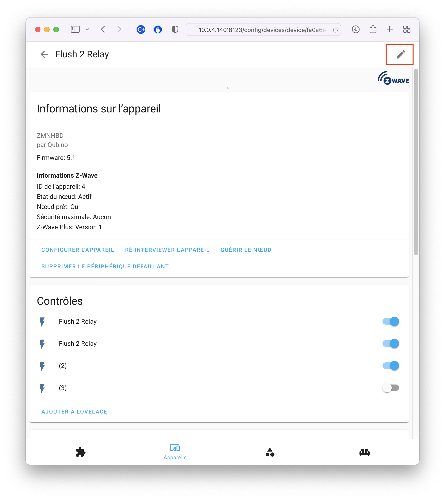

# Installation of Z-Wave and Qubino entities

{ width="200" }
{ width="200" }

Plug the Z-Wave usb dongle on your Home Assistant server

The dongle is automaticaly reconnized

{ width="300" }
{ width="300" }

{ width="300" }
{ width="300" }

{ width="300" }

That's all!

# Old instructions

## Qubino Flush 2 relay on an electric radiator
### Model
{ width="200" }

!!! info
    Site de Qubino : [https://qubino.com/products/flush-2-relays/](https://qubino.com/products/flush-2-relays/)

{ width="200" }
{ width="200" }
{ width="200" }
{ width="200" }
{ width="200" }
{ width="200" }
{ width="200" }

### Wire
Replace the bulb with the radiator!!!

{ width="300" }
{ width="300" }

### Home Assistant Config

{ width="450" }

{ width="450" }

{ width="450" }

{ width="350" }

### Rename relay
{ width="450" }

{ width="450" }

{ width="450" }

{ width="450" }

{ width="450" }

### If the relay is no longer accessible

!!! note
    Read [documentation](Docs/Qubino_Flush-2-Relay-PLUS-extended-manual_eng_2.3.pdf ).

Do a factory reset :
Unplug - replug 5 times in less than 3 seconds in the first minute of operation!

!!! info
    FACTORY RESET
        1. Connect the device to the power supply
        2. Within the first minute (60 seconds) the device is connected to the >power supply, toggle the switch connected to the I1 terminal 5 times >within 3 seconds (5 times change switch state).