# Lovelace alignement with "lovelace-layout-card"
See [lovelace-layout-card](https://github.com/thomasloven/lovelace-layout-card) documentation

## Two entities with % width
{ width="700" }

### Insert new card "Layout Card"
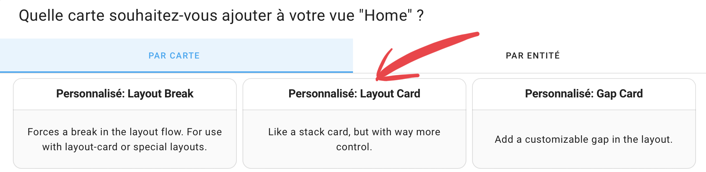{ width="700" }

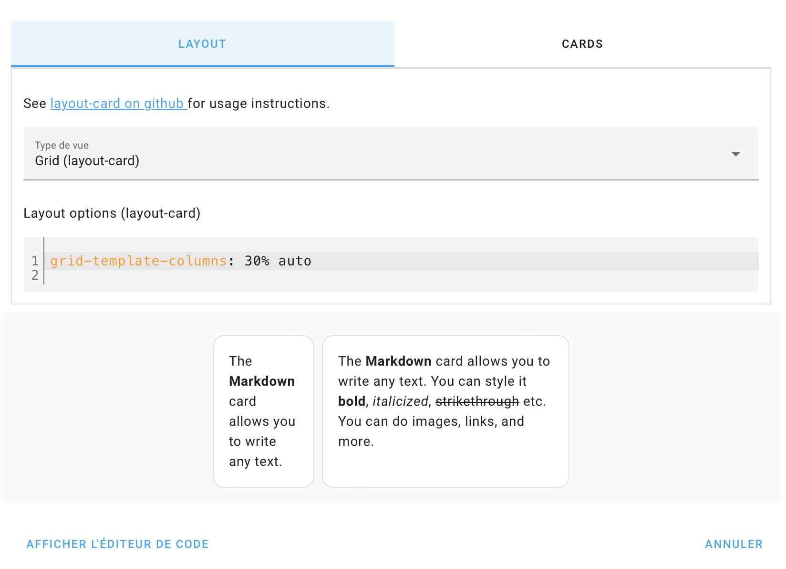{ width="700" }

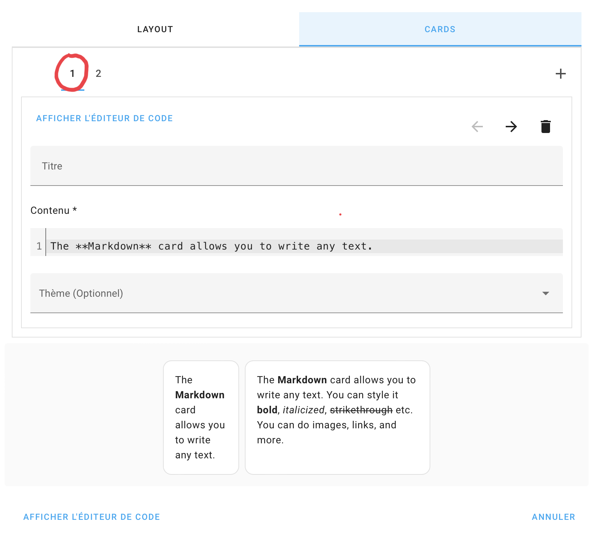{ width="350" }
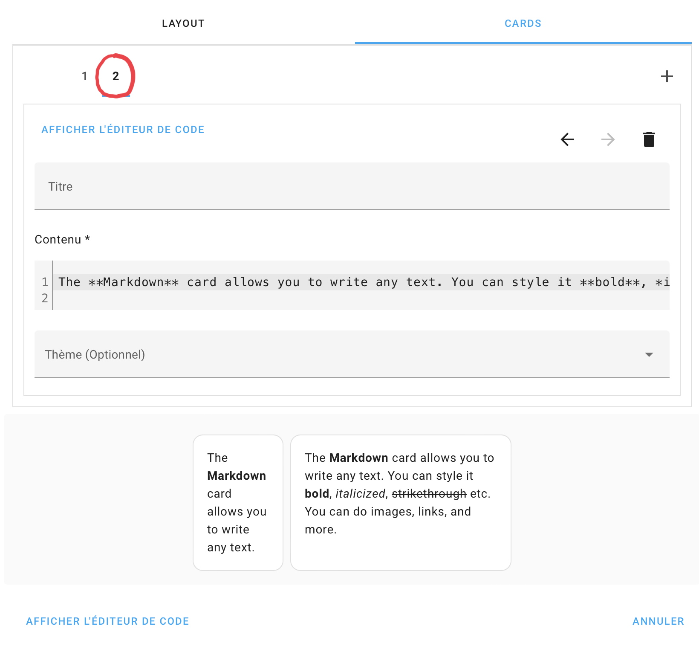{ width="350" }

``` yaml title="Layout options (layout-card)"
grid-template-columns: 30% auto
```
``` yaml title="Editor code"
type: custom:layout-card
layout_type: custom:grid-layout
layout:
    grid-template-columns: 30% auto
cards:
  - type: markdown
    content: 'The **Markdown** card allows you to write any text. '
  - type: markdown
    content: >
      The **Markdown** card allows you to write any text. You can style it
      **bold**, *italicized*, ~strikethrough~ etc. You can do images, links, and
      more.
```


## Three entities with % width
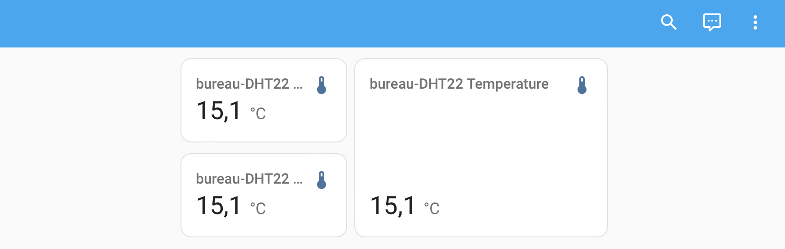{ width="700" }

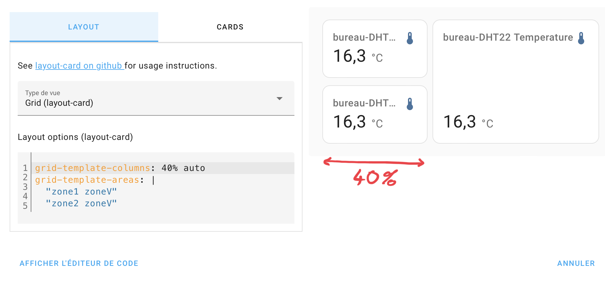{ width="800" }
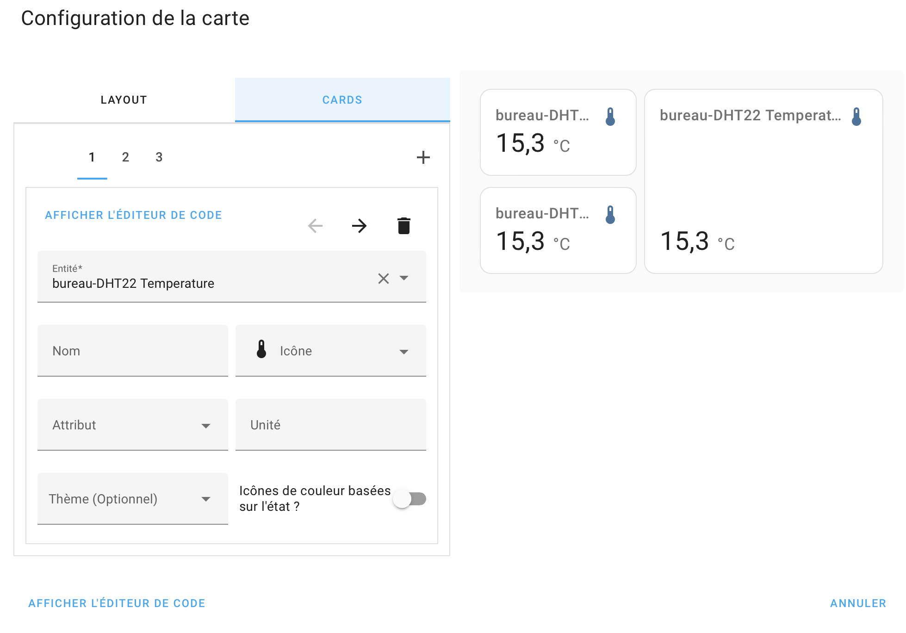{ width="400" }
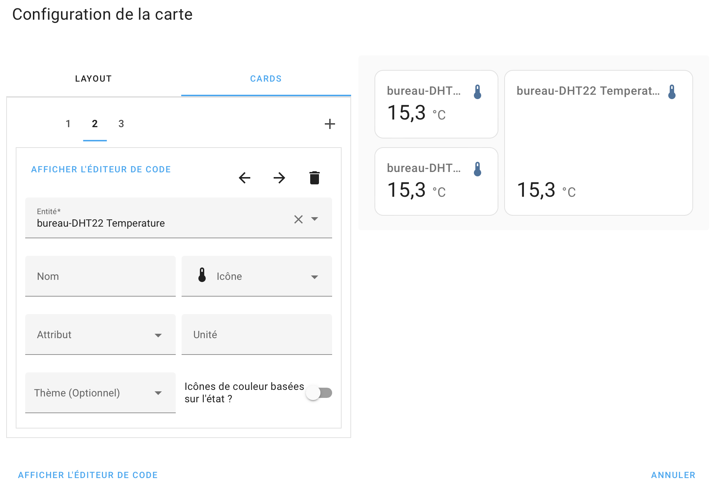{ width="400" }

{ width="400" }

``` yaml title="Layout options (layout-card)"
grid-template-columns: 40% auto
grid-template-areas: /
    "zonel zoneV"
    "zone2 zoneV"
```

``` yaml title="Editor code"
type: custom:layout-card
layout_type: custom:grid-layout
layout:
  grid-template-columns: 40% auto
  grid-template-areas: / "zone1 zoneV" "zone2 zoneV"
cards:
  - type: entity
    entity: sensor.bureau_dht22_temperature
    view_layout:
       grid-area: zone1
  - type: entity
    entity: sensor.bureau_dht22_temperature
    view_layout:
        grid-area: zoneV
  - type: entity
    entity: sensor.bureau_dht22_temperature
    view_layout:
        grid-area: zone2

```

### Fixed height
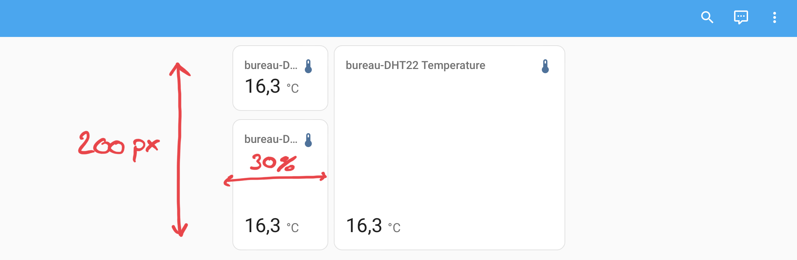{ width="700" }

``` yaml title="Layout options (layout-card)"
grid-template-columns: 30% auto
grid-template-rows: auto 200px
grid-template-areas: |
  "zone1 zoneV"
  "zone2 zoneV"
```

### Width 100% of the window
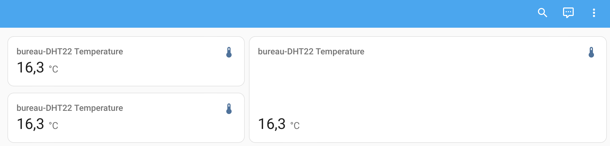{ width="700" }

- Go to your lovelace views and select "Edit Dashboard"
- Click the pencil symbol next to the view name to open up the view properties
- Select "Side bar" from the "View type" dropdown list
- Click "Save"

{ width="500" }

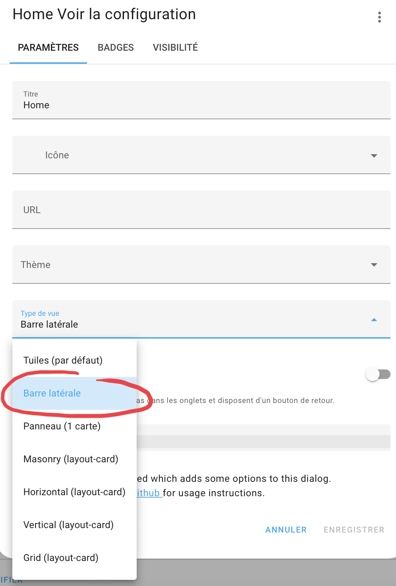{ width="300" }
