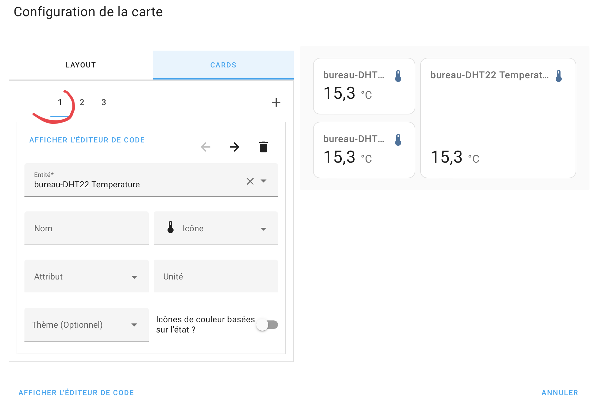
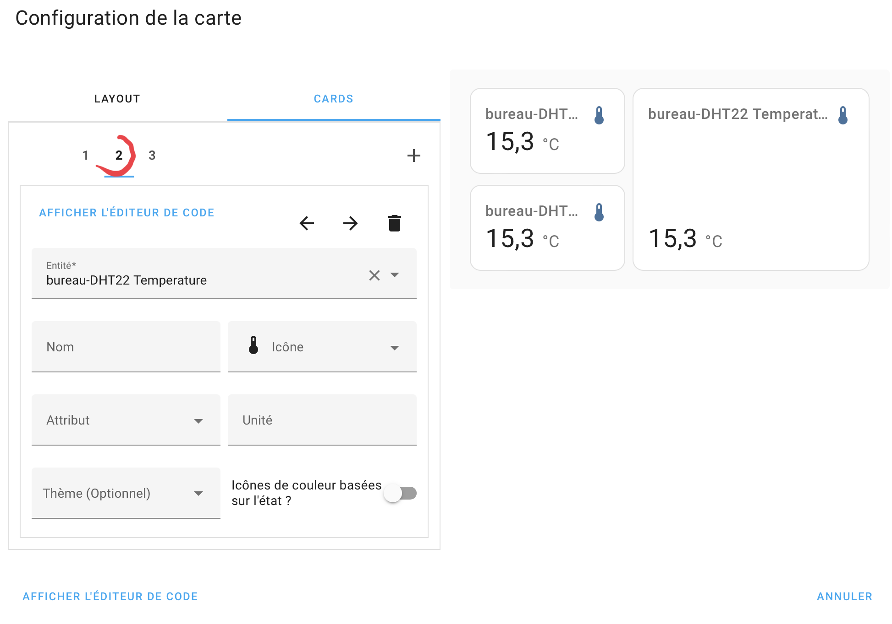
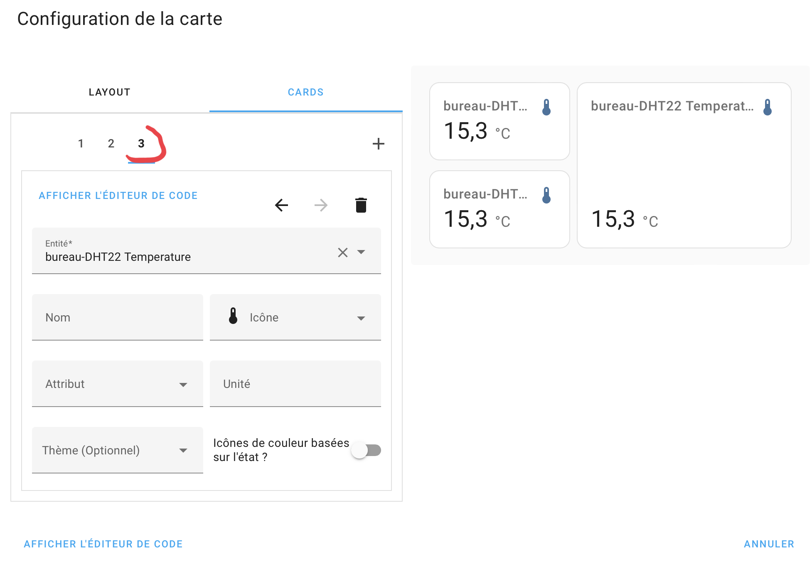

# Lovelace alignement

{ width="700" }

{ width="700" }

{ width="300" }
{ width="300" }
{ width="300" }

``` yaml
type: custom:layout-card
layout_type: grid
layout:
    grid-template-columns: 40% 60%
    grid-template-areas: |
    "zone1 zoneV"
    "zone2 zoneV"
cards:
  - type: entity
    entity: sensor.bureau_dht22_temperature
    view_layout:
       grid-area: zone1
  - type: entity
    entity: sensor.bureau_dht22_temperature
    view_layout:
        grid-area: zoneV
  - type: entity
    entity: sensor.bureau_dht22_temperature
    view_layout:
        grid-area: zone2

```