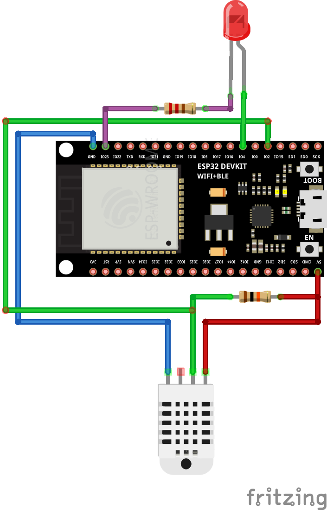
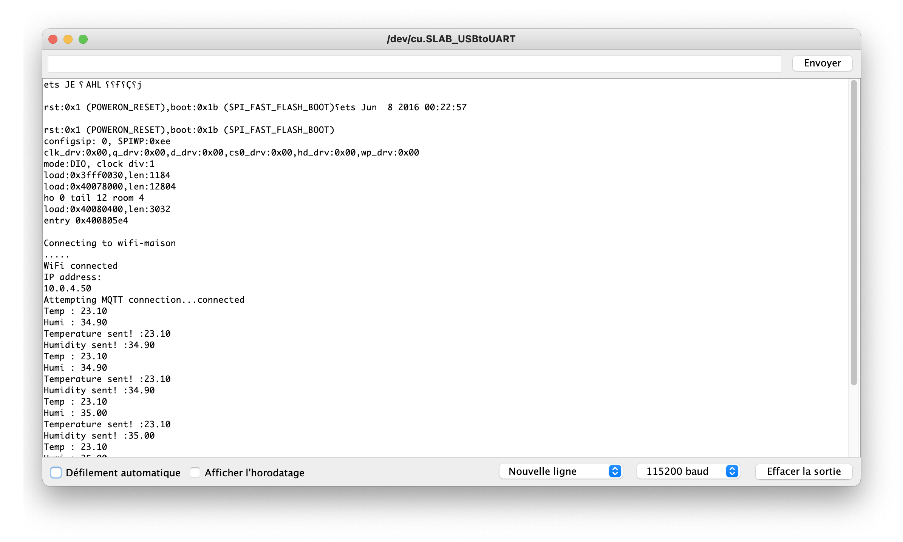
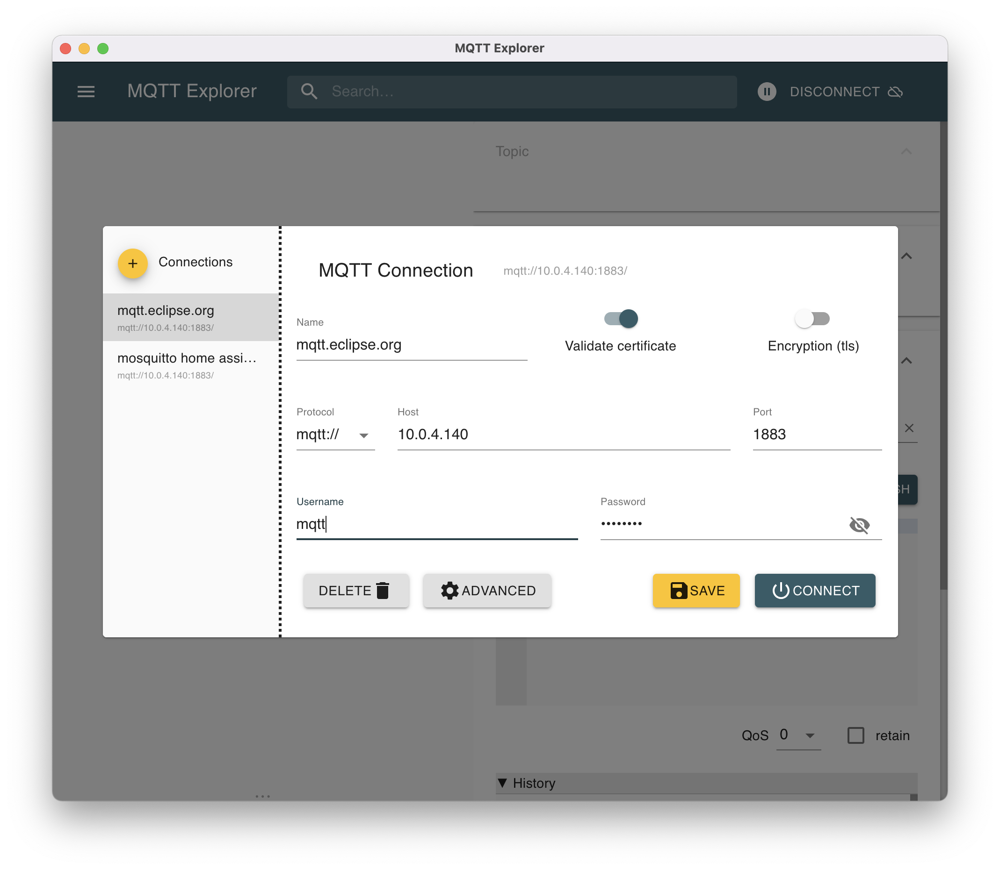
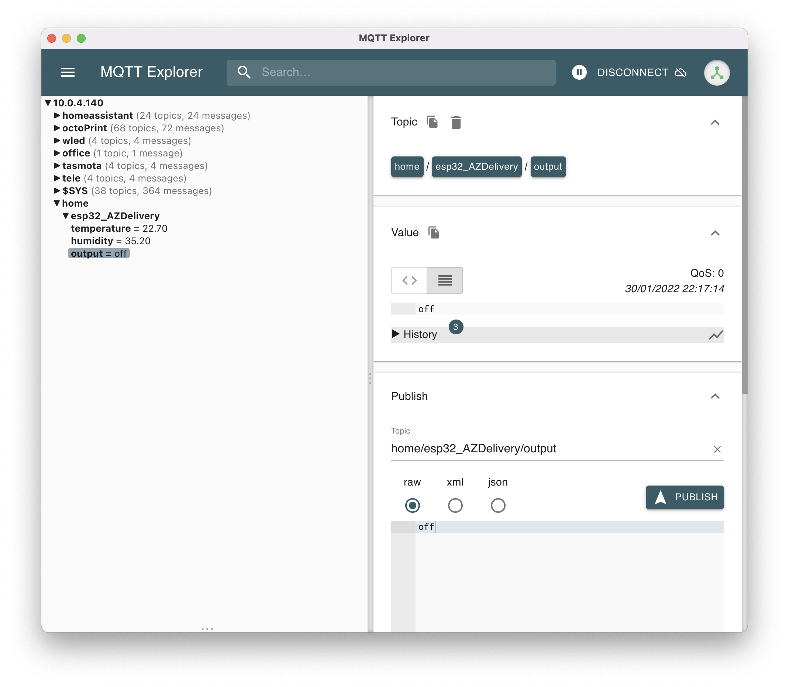
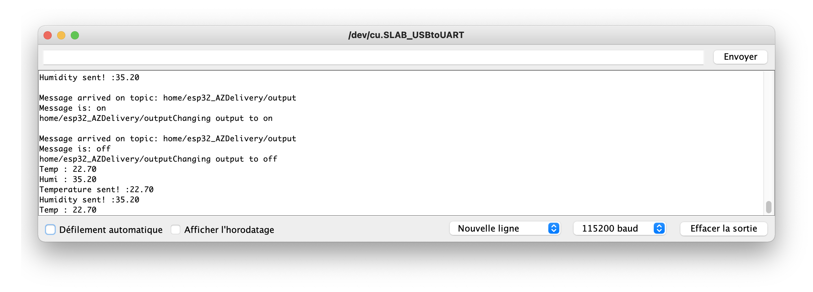
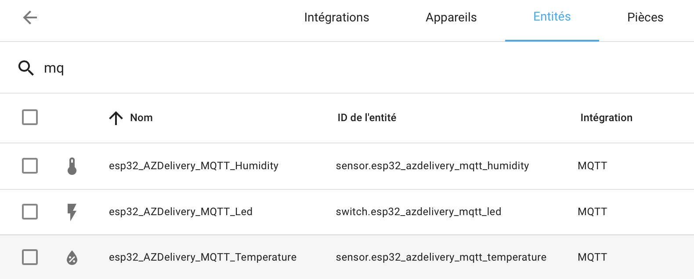
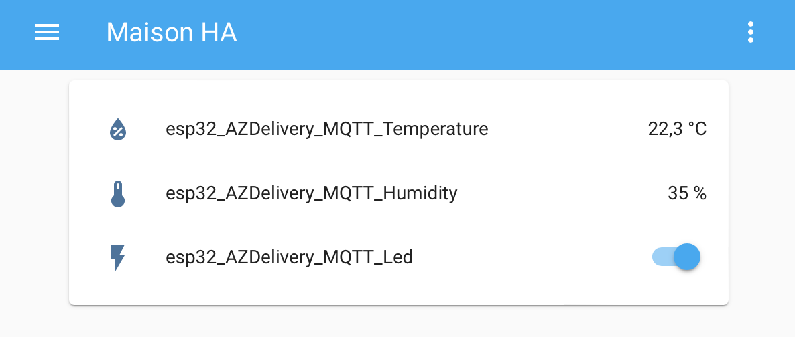
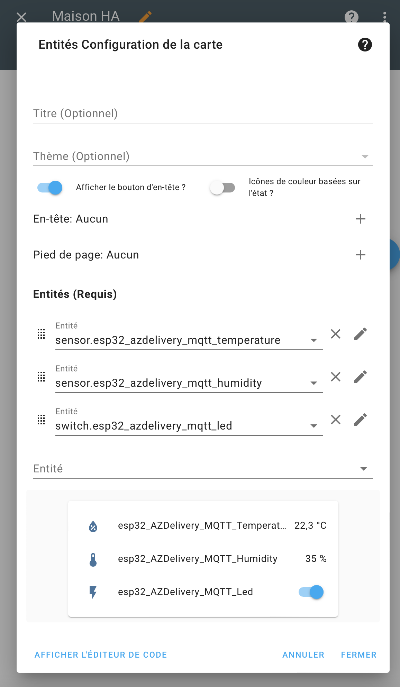

# ESP32 + DHT22 + LED +  MQTT + Home Assistant

## Extension with a Led

You can find the same project without Led [here](esp32-DHT22.md)
## USB port connection
See (FAQ)[../FAQ] if any problem

{ width="230" }

## Wire DHT22

{ width="230" }

## Code

{ width="800" }

**Attention: to upload the code you MUST deconnect the 'vin' pin.**

```
#include <WiFi.h>
#include <PubSubClient.h>
#include "DHT.h"

// Replace the next variables with your SSID/Password combination
const char* ssid = "wifi-maison";
const char* password = "wifipapge";

// Add your MQTT Broker IP address, example:
const char* mqtt_server = "xxx.xxx.xxx.xxx";
const char* mqtt_username = "xxx"; // MQTT 
const char* mqtt_password = "xxx"; // MQTT password
const char* temperature_topic = "home/esp32_AZDelivery/temperature";
const char* humidity_topic = "home/esp32_AZDelivery/humidity";
const char* led_topic = "home/esp32_AZDelivery/output";
const char* clientID = "test-C8:C9:A3:D2:BA:EC"; // MQTT client ID - I but the Mac adresse

int Sleep_time = 60*1000; // 60s

WiFiClient espClient;
PubSubClient client(espClient);
long lastMsg = 0;
char msg[50];
int value = 0;

//float temperature = 0;
//float humidity = 0;

// LED Pin
const int ledPin = 16;

// DHT22
#define DHTPIN 2  // Pin connected to the DHT sensor
#define DHTTYPE DHT22  // DHT11 or DHT22
DHT dht(DHTPIN, DHTTYPE);


void setup() {
  Serial.begin(115200);

  setup_wifi();
  client.setServer(mqtt_server, 1883);
  client.setCallback(callback);

  pinMode(ledPin, OUTPUT);
  digitalWrite(ledPin, HIGH);
  delay(500);
  digitalWrite(ledPin, LOW);
  
  dht.begin();
}

void setup_wifi() {
  delay(10);
  // We start by connecting to a WiFi network
  Serial.println();
  Serial.print("Connecting to ");
  Serial.println(ssid);

  WiFi.begin(ssid, password);

  while (WiFi.status() != WL_CONNECTED) {
    delay(500);
    Serial.print(".");
  }

  Serial.println("");
  Serial.println("WiFi connected");
  Serial.println("IP address: ");
  Serial.println(WiFi.localIP());
}

void callback(char* topic, byte* message, unsigned int length) {
  Serial.print("\nMessage arrived on topic: ");
  Serial.println(topic);
  Serial.print("Message is: ");
  String messageTemp;
  
  for (int i = 0; i < length; i++) {
    Serial.print((char)message[i]);
    messageTemp += (char)message[i];
  }
  Serial.println();

  // Feel free to add more if statements to control more GPIOs with MQTT

  // If a message is received on the topic xxx/output, you check if the message is either "on" or "off". 
  // Changes the output state according to the message
    Serial.print(topic);
  if (String(topic) == led_topic) {
    Serial.print("Changing output to ");
    if(messageTemp == "on"){
      Serial.println("on");
      digitalWrite(ledPin, HIGH);
    }
    else if(messageTemp == "off"){
      Serial.println("off");
      digitalWrite(ledPin, LOW);
    }
  }
}

void reconnect() {
  // Loop until we're reconnected
  while (!client.connected()) {
    Serial.print("Attempting MQTT connection...");
    // Attempt to connect
    if (client.connect(clientID, mqtt_username, mqtt_password)) {
      Serial.println("connected");
      // Subscribe
      client.subscribe(led_topic);
    } else {
      Serial.print("failed, rc=");
      Serial.print(client.state());
      Serial.println(" try again in 5 seconds");
      // Wait 5 seconds before retrying
      delay(5000);
    }
  }
}
void loop() {
  if (!client.connected()) {
    reconnect();
  }
  client.loop();

  long now = millis();
  if (now - lastMsg > Sleep_time) {
    lastMsg = now;

    float t = dht.readTemperature();
    float h = dht.readHumidity();
    Serial.print("Temp : ");
    Serial.println(t);
    Serial.print("Humi : ");
    Serial.println(h);

    // PUBLISH to the MQTT Broker (topic = Temperature, defined at the beginning)
    if (client.publish(temperature_topic, String(t).c_str())) {
      Serial.print("Temperature sent! :" );
      Serial.println(String(t).c_str());
    }
    // Again, client.publish will return a boolean value depending on whether it succeded or not.
    // If the message failed to send, we will try again, as the connection may have broken.
    else {
      Serial.println("Temperature failed to send. Reconnecting to MQTT Broker and trying again");
      client.connect(clientID, mqtt_username, mqtt_password);
      delay(10); // This delay ensures that client.publish doesn't clash with the client.connect call
      client.publish(temperature_topic, String(t).c_str());
    }
  
    // PUBLISH to the MQTT Broker (topic = Humidity, defined at the beginning)
    if (client.publish(humidity_topic, String(h).c_str())) {
      Serial.print("Humidity sent! :");
      Serial.println(String(h).c_str());
    }
    // Again, client.publish will return a boolean value depending on whether it succeded or not.
    // If the message failed to send, we will try again, as the connection may have broken.
    else {
      Serial.println("Humidity failed to send. Reconnecting to MQTT Broker and trying again");
      client.connect(clientID, mqtt_username, mqtt_password);
      delay(10); // This delay ensures that client.publish doesn't clash with the client.connect call
      client.publish(humidity_topic, String(h).c_str());
    }
  } 
}
```

Terminal output

{ width="800" }

Test with MQTT Explorer

{ width="800" }

{ width="800" }

{ width="800" }

## Home Assistant

configutation.yaml
```
sensor:
  - platform: mqtt  
    unique_id: "C8:C9:A3:D2:BA:EC_temp"
    state_topic: "home/esp32_AZDelivery/temperature"  
    name: "esp32_AZDelivery_MQTT_Temperature"  
    unit_of_measurement: "°C"
    value_template: "{{  value | round(1) }}"
    icon: 'mdi:water-percent'
  - platform: mqtt  
    unique_id: "C8:C9:A3:D2:BA:EC_humi"
    state_topic: "home/esp32_AZDelivery/humidity"  
    name: "esp32_AZDelivery_MQTT_Humidity"  
    unit_of_measurement: "%"
    value_template: "{{  value | round(0) }}"
    icon: 'mdi:thermometer'

switch:
  - platform: mqtt
    name: "esp32_AZDelivery_MQTT_Led"
    state_topic: "home/esp32_AZDelivery/output"
    command_topic: "home/esp32_AZDelivery/output"
    payload_on: "on"
    payload_off: "off"
```
## Lovelace

New entitie

{ width="400" }

Lovelace

{ width="400" }

{ width="400" }

