# MQTT Installation
See https://www.youtube.com/watch?v=8ol5pO7ZZhk

## Install Mosquitto broker
Go to add-ons and find MQTT

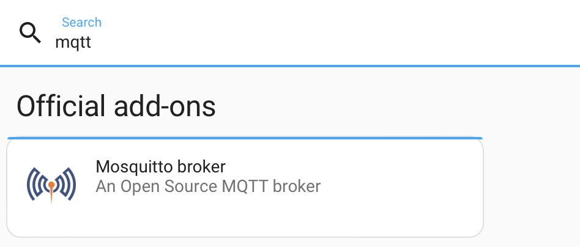{ width="400" }

Install and start

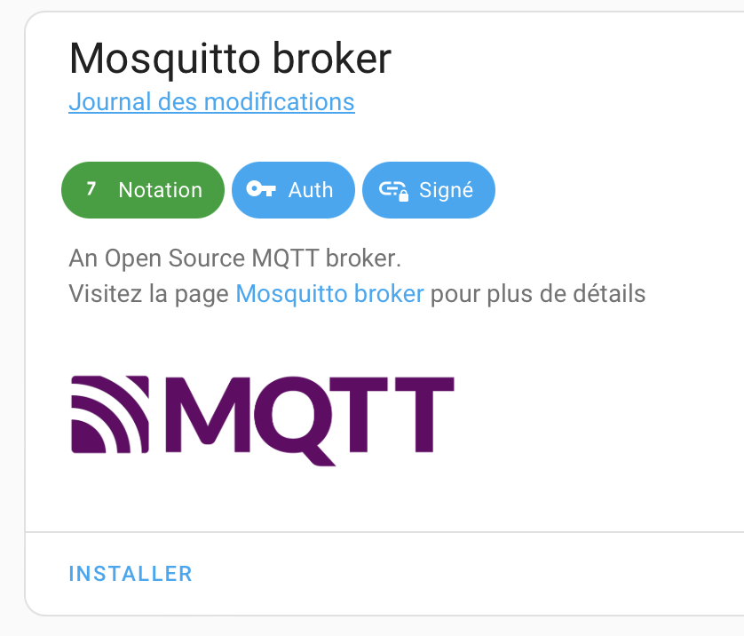{ width="200" }

Add a new user

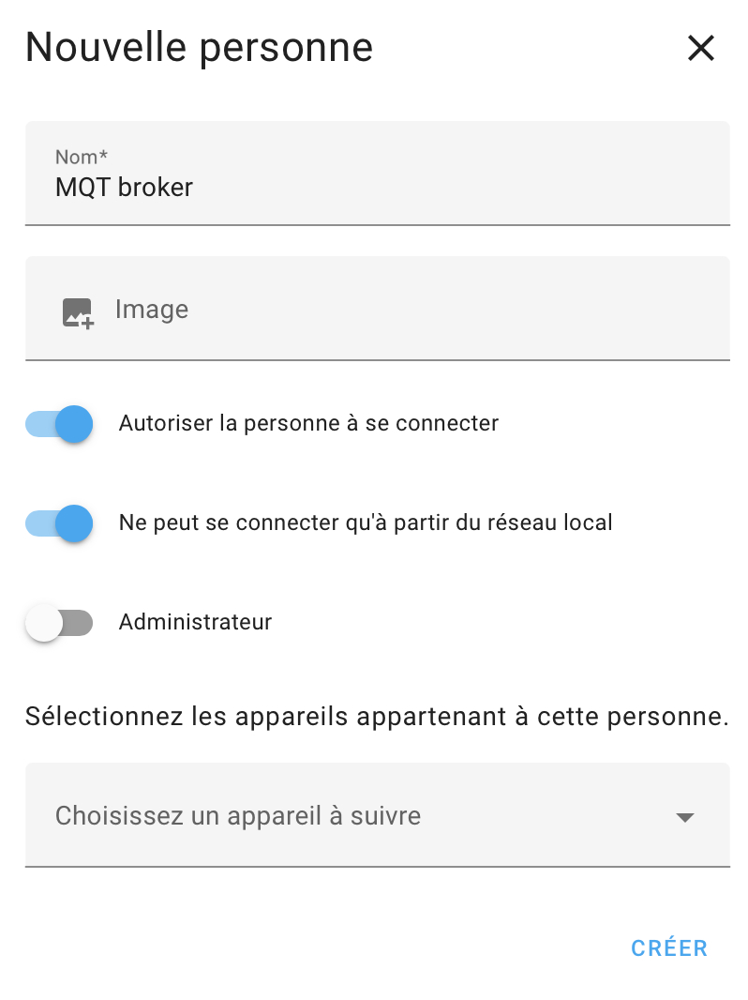{ width="300" }
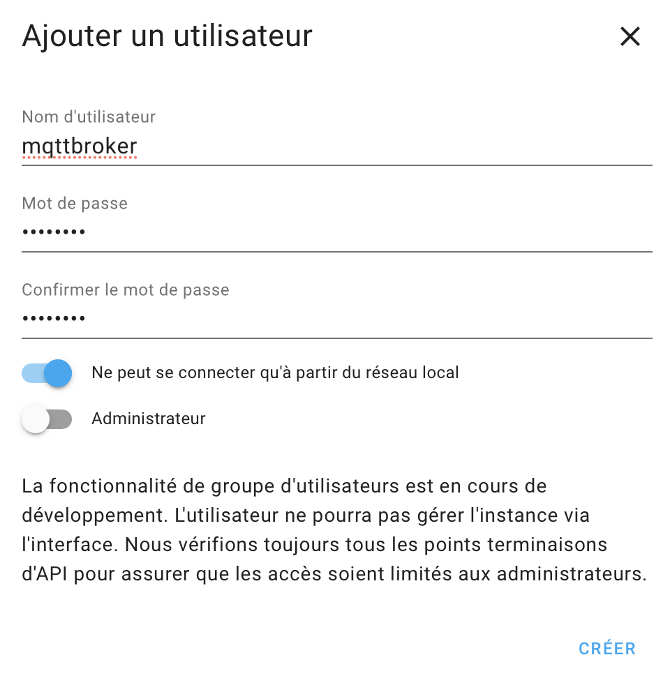{ width="390" }

MQTT integration is automaticaly proposed

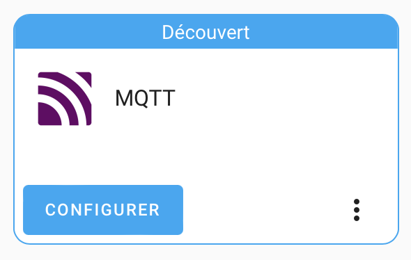{ width="300" }

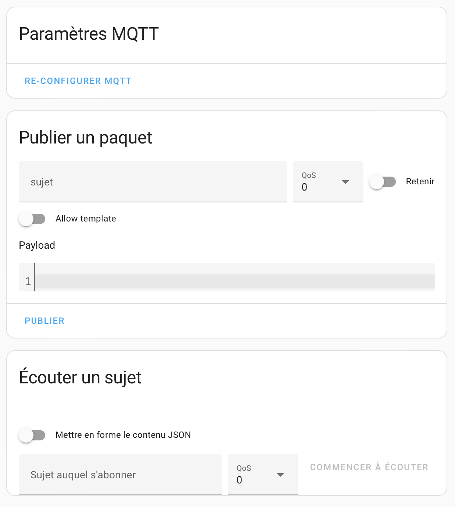{ width="300" }
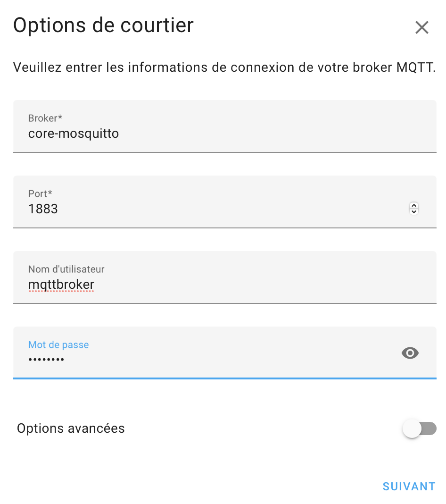{ width="300" }

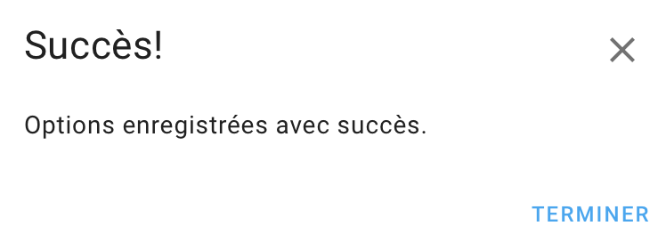{ width="300" }

Restart MQTT broker

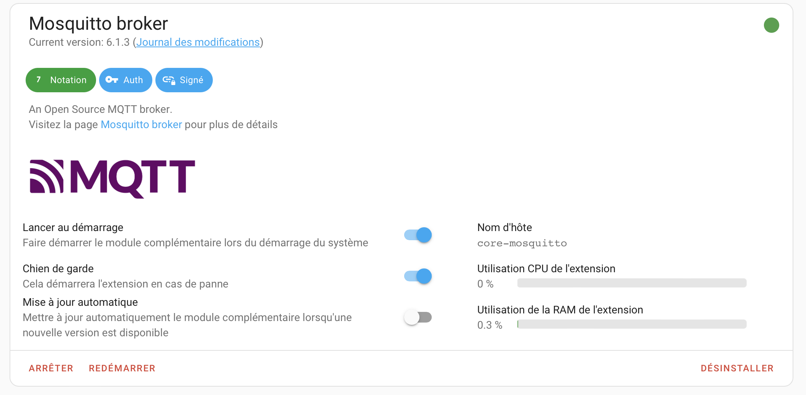{ width="300" }

If you have a Tasmota blug, configure it (use IP adress and not name like xxx.local)

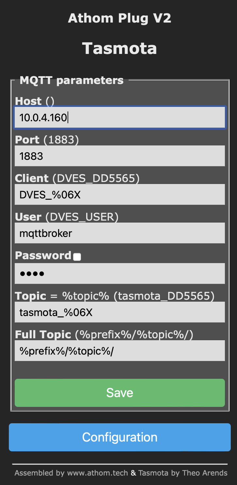{ width="250" }
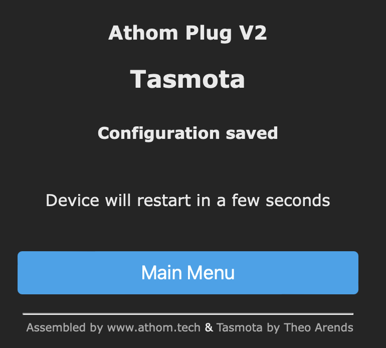{ width="250" }

