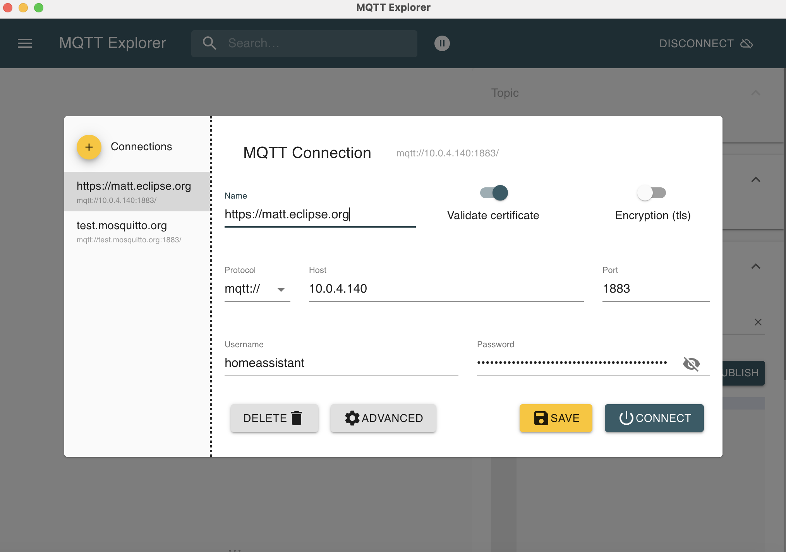
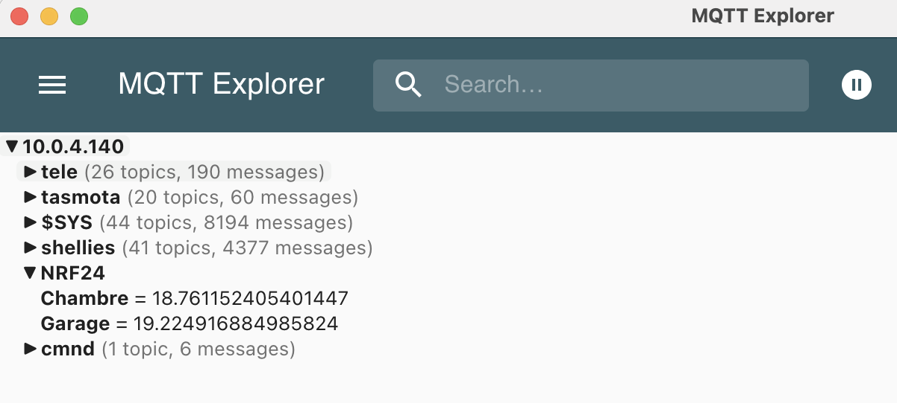

# MQTT with NRF24

``` perl
#!/usr/bin/perl

# sudo pmset -a disablesleep 1


# Set up the serial port
# Il FAUT INSTALLER
# sudo cpan Device::SerialPort

# Pour utiliser SerialPort, il faut dire où se trouve la lib
# pour trouver : cpan -D Device::SerialPort

#use lib "/usr/local/lib/arm-linux-gnueabihf/perl/5.28.1/Device/";
use lib "/usr/local/lib/aarch64-linux-gnu/perl/5.32.1/Device/";

use SerialPort; # sudo cpan Device::SerialPort
use LWP::Simple; # mini serveur web pour faire un get sur le NAS

use strict;
use warnings;
use Data::Dumper;

# Liason serie
my $port = Device::SerialPort->new("/dev/ttyUSB0"); # port le plus haut
my @fields; # Dernieres valeurs recuperees sur une ligne du port serie

# 19200, 81N on the USB ftdi driver
$port->baudrate(9600); # you may change this value
$port->databits(8); # but not this and the two following
$port->parity("none");
$port->stopbits(1);

sub main {
    while (1) {

my $aLine = ReadALine();

my $count = $fields[0];
my $id = $fields[1];
my $temp = $fields[2] / 10;
my $lumi = $fields[3] / 10;
my $humi = $fields[4];
print "count : ". $count . "\n";
print "id : ".  $id . "\n";
print "Temp : ".  $temp . "\n";
print "Lumi : ".  $lumi . "\n";
print "Humi : ".  $humi . "\n";
}
}

sub ReadALine {
    while (1) {
        my $currentLine = $port->lookfor();

if ($currentLine) {
    print $currentLine ."\n";
    @fields = split /;/, $currentLine;
    #print "Size : ". @fields ."\n";
    #print Dumper \@fields;
    if (@fields == 5) {
        return $currentLine;
    } else {
        print "Ligne pourrie : " . $currentLine . "\n";
    }
}
}
}


main;
```


## MQTT Submit

``` shell
pip install paho-mqtt
```

``` python
# python 3.6

import random
import time

from paho.mqtt import client as mqtt_client


broker = 'homeassistant.local'
port = 1883
#topic = "NRF24/cuisine"
# generate client ID with pub prefix randomly
client_id = f'RaspCuisine'
username = 'homeassistant'
password = 'weiyai1eFeidaeLithoom6go0OhThooz1IePhaiPh0thae5haephei5siele8aM2'

def connect_mqtt():
def on_connect(client, userdata, flags, rc):
if rc == 0:
print("Connected to MQTT Broker!")
else:
print("Failed to connect, return code %d\n", rc)

client = mqtt_client.Client(client_id)
client.username_pw_set(username, password)
client.on_connect = on_connect
client.connect(broker, port)
return client


def publish(client):
while True:
time.sleep(1)
## Chambre
topic = "NRF24/Chambre"
msg = f'{random.uniform(10.0, 20.0)}'
result = client.publish(topic, msg)
# result: [0, 1]
status = result[0]
if status == 0:
print(f"Send `{msg}` to topic `{topic}`")
else:
print(f"Failed to send message to topic {topic}")

## Garage
topic = "NRF24/Garage"
msg = f'{random.uniform(10.0, 20.0)}'
result = client.publish(topic, msg)
# result: [0, 1]
status = result[0]
if status == 0:
print(f"Send `{msg}` to topic `{topic}`")
else:
print(f"Failed to send message to topic {topic}")

def run():
client = connect_mqtt()
client.loop_start()
publish(client)

if __name__ == '__main__':
run()
```

{ width="500" }

{ width="500" }
