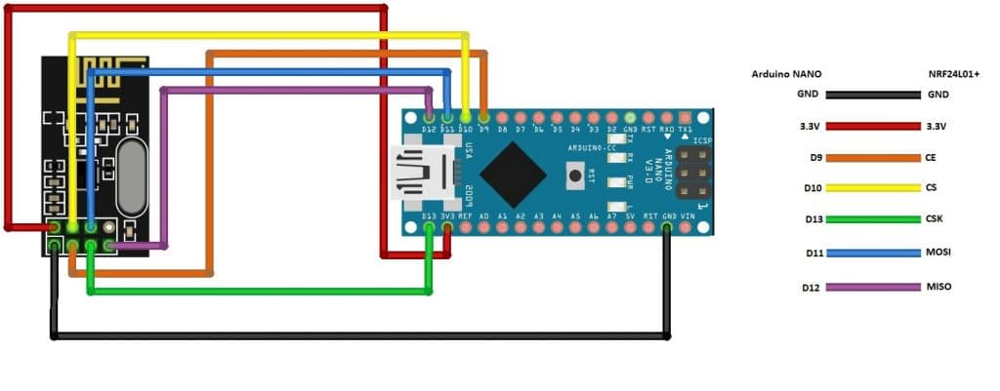
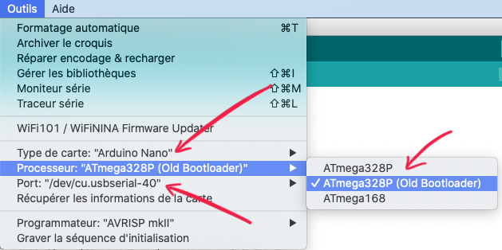
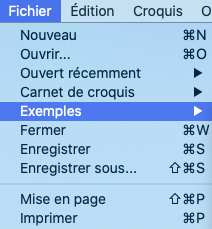
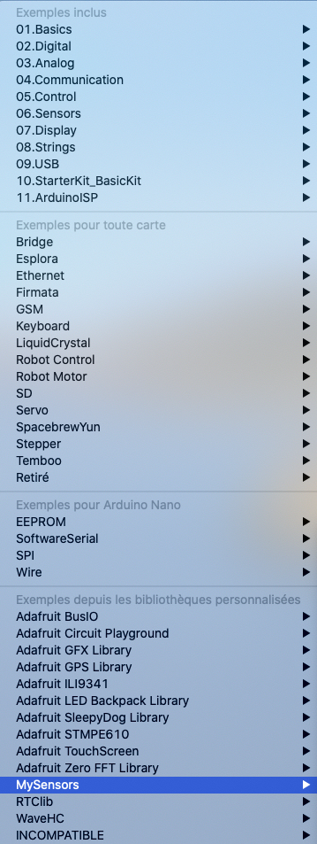
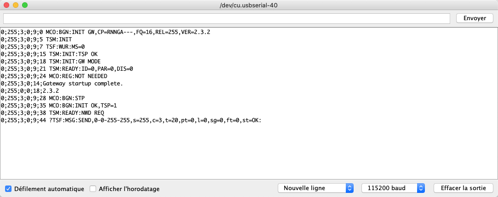
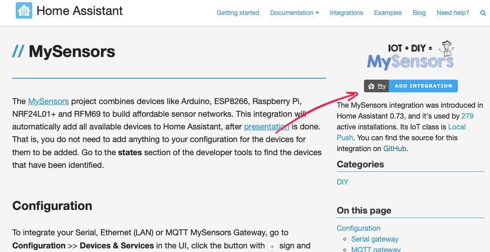
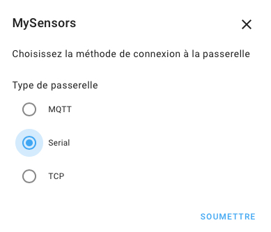
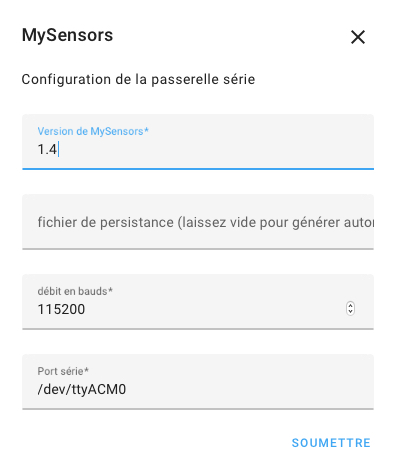
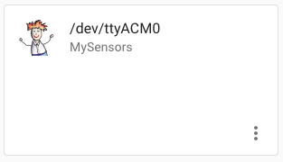

# MySensors integration

{ width="200" }

[https://www.home-assistant.io/integrations/mysensors/](https://www.home-assistant.io/integrations/mysensors/°)

## Resources

[https://forum.jeedom.com/viewtopic.php?t=5381](https://forum.jeedom.com/viewtopic.php?t=5381)

[https://opendomotech.com/mysensors-gateway-wifi-jeedom-domoticz/](https://opendomotech.com/mysensors-gateway-wifi-jeedom-domoticz/)

Log parser: [https://www.mysensors.org/build/parser](https://www.mysensors.org/build/parser])


## Build the Gateway

Go to : https://opendomotech.com/mysensors-gateway-wifi-jeedom-domoticz/

{ width="600" }

### Add to the Arduino IDE MySensor

The CH240 driver for generic Arduino Nano is also installed in OS X Catalina

{ width="600" }

{ width="600" }

### First sketch

Go to /Files/Examples/MySensors/GatewaySerial

{ width="200" }
{ width="200" }
{ width="200" }

Get arduino code (see end of page)

Carrefull : 
- baud: 115200

{ width="700" }

## Add DHT22 sensor
### Temparature and Humidity DHT22

https://www.mysensors.org/build/humidity


DHT Lib is here ../DHT22/Lib-Code

Example is https://github.com/mysensors/MySensorsArduinoExamples/blob/master/examples/DhtTemperatureAndHumiditySensor/DhtTemperatureAndHumiditySensor.ino

Intrepretation of logs : https://www.mysensors.org/build/parser


## Add Mysensor to Home Assistant

Example (Capteur de luminosité): https://opendomotech.com/creer-capteurs-mysensors-exemples-de-multi-sensors/

Aller sur : https://www.home-assistant.io/integrations/mysensors/

{ width="300" }

{ width="300" }

{ width="300" }

You must find a new integration

{ width="300" }


----

``` C
/**
* The MySensors Arduino library handles the wireless radio link and protocol
* between your home built sensors/actuators and HA controller of choice.
* The sensors forms a self healing radio network with optional repeaters. Each
* repeater and gateway builds a routing tables in EEPROM which keeps track of the
* network topology allowing messages to be routed to nodes.
*
* Created by Henrik Ekblad <henrik.ekblad@mysensors.org>
* Copyright (C) 2013-2019 Sensnology AB
* Full contributor list: https://github.com/mysensors/MySensors/graphs/contributors
*
* Documentation: http://www.mysensors.org
* Support Forum: http://forum.mysensors.org
*
* This program is free software; you can redistribute it and/or
* modify it under the terms of the GNU General Public License
* version 2 as published by the Free Software Foundation.
*
*******************************
*
* DESCRIPTION
* The ArduinoGateway prints data received from sensors on the serial link.
* The gateway accepts input on serial which will be sent out on radio network.
*
* The GW code is designed for Arduino Nano 328p / 16MHz
*
* Wire connections (OPTIONAL):
* - Inclusion button should be connected between digital pin 3 and GND
* - RX/TX/ERR leds need to be connected between +5V (anode) and digital pin 6/5/4 with resistor 270-330R in a series
*
* LEDs (OPTIONAL):
* - To use the feature, uncomment any of the MY_DEFAULT_xx_LED_PINs
* - RX (green) - blink fast on radio message received. In inclusion mode will blink fast only on presentation received
* - TX (yellow) - blink fast on radio message transmitted. In inclusion mode will blink slowly
* - ERR (red) - fast blink on error during transmission error or receive crc error
*
*/

// Enable debug prints to serial monitor
#define MY_DEBUG


// Enable and select radio type attached
#define MY_RADIO_RF24
//#define MY_RADIO_NRF5_ESB
//#define MY_RADIO_RFM69
//#define MY_RADIO_RFM95

// Set LOW transmit power level as default, if you have an amplified NRF-module and
// power your radio separately with a good regulator you can turn up PA level.
#define MY_RF24_PA_LEVEL RF24_PA_LOW

// Enable serial gateway
#define MY_GATEWAY_SERIAL

// Define a lower baud rate for Arduinos running on 8 MHz (Arduino Pro Mini 3.3V & SenseBender)
#if F_CPU == 8000000L
#define MY_BAUD_RATE 38400
#endif

// Enable inclusion mode
#define MY_INCLUSION_MODE_FEATURE
// Enable Inclusion mode button on gateway
//#define MY_INCLUSION_BUTTON_FEATURE

// Inverses behavior of inclusion button (if using external pullup)
//#define MY_INCLUSION_BUTTON_EXTERNAL_PULLUP

// Set inclusion mode duration (in seconds)
#define MY_INCLUSION_MODE_DURATION 60
// Digital pin used for inclusion mode button
//#define MY_INCLUSION_MODE_BUTTON_PIN  3

// Set blinking period
#define MY_DEFAULT_LED_BLINK_PERIOD 300

// Inverses the behavior of leds
//#define MY_WITH_LEDS_BLINKING_INVERSE

// Flash leds on rx/tx/err
// Uncomment to override default HW configurations
//#define MY_DEFAULT_ERR_LED_PIN 4  // Error led pin
//#define MY_DEFAULT_RX_LED_PIN  6  // Receive led pin
//#define MY_DEFAULT_TX_LED_PIN  5  // the PCB, on board LED

#include <MySensors.h>

void setup()
{
	// Setup locally attached sensors
}

void presentation()
{
	// Present locally attached sensors
}

void loop()
{
	// Send locally attached sensor data here
}
```