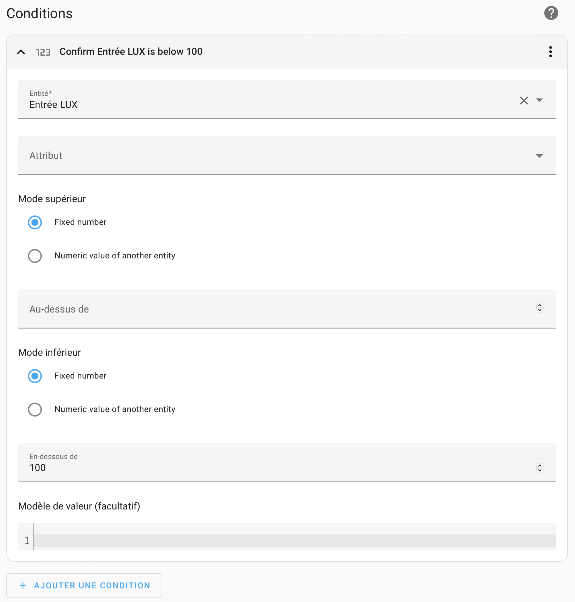

# ESPHome PIR and Light sensor to light up a LED ribbon plugged into a Tasmota Smart Plug

See [Instructables pages](https://www.instructables.com/ESPHome-Wireless-PIR-and-Light-Sensor/)

## PIR sensor

{ width="190" }
{ width="140" }

### Time Delay Adjustment
{ width="180" }
{ width="190" }
{ width="180" }

Delay is (from left to right) 10s, 1000s (1'30'') and 2100s (3'30'')

## Wire

{ width="400" }

{ width="400" }
{ width="295" }

{ width="400" }
{ width="300" }

{ width="350" }
{ width="350" }

!!! warning
    Be careful to put the led ribbon in the right direction. The current only flows in one direction.

## ESPHome configuration
```yaml
esphome:
    name: esp8266-d1-mini-3
    comment: 'PIR entrée'

esp8266:
    board: esp01_1m

web_server:
    port: 80

# Enable logging
logger:

# Enable Home Assistant API
api:

ota:
    password: "----------------------"

wifi:
    ssid: !secret wifi_ssid
    password: !secret wifi_password

    # Enable fallback hotspot (captive portal) in case wifi connection fails
    ap:
        ssid: "Esp8266-D1-Mini-3"
        password: "Q1iAmSDiMXdt"

captive_portal:
sensor:
    - platform: adc
      pin: A0
      name: "Entrée LUX"
      update_interval: '5s'
      unit_of_measurement: lux
      filters:
          - lambda: |-
          return (x / 10000.0) * 2000000.0;

binary_sensor:
    - platform: gpio
      pin: GPIO2
      name: "Entrée PIR"
      device_class: motion
```

## Automations
{ width="800" }

## Turn ON when motion is detected

{ width="400" }
{ width="400" }

{ width="400" }

```yaml
alias: Extérieur PIR détection -> ON
description: ""
trigger:
    - platform: state
      entity_id:
          - binary_sensor.entree_pir
      to: "on"
      for:
          hours: 0
          minutes: 0
          seconds: 0
condition:
    - condition: numeric_state
      entity_id: sensor.lux_sensor
      below: 100
action:
    - type: turn_on
      device_id: f531fa200093b0b1467237c61076a741
      entity_id: switch.exterieur_tasmota
      domain: switch
mode: single
```

## Turn OFF when motion is not detected

{ width="400" }
{ width="400" }

```yaml
alias: Extérieur PIR non détecté -> OFF
description: ""
trigger:
    - platform: state
      entity_id:
          - binary_sensor.entree_pir
      to: "off"
condition: []
action:
    - type: turn_off
      device_id: f531fa200093b0b1467237c61076a741
      entity_id: switch.exterieur_tasmota
      domain: switch
mode: single
```
## Chart to see what's going on

{ width="400" }

In this chart, I use three series

- lumonosity
- is motion detection (orange column)
- is switch (Tasmota) is on (blue column)

Motion detection and switch are binary sensor, they can't be draw in the chart.
To display them, the trick is to create two entities with values 0 or 100
for the detection and 0 or 50 for the switch.

!!! warning
    To avoid displaying 'off' values for both binary sensors, I set the value to 'null' (not '0')

This entities are created in the configuration.yaml file as folloxs :

``` yaml title="configuration.yaml code"
sensor:
    - platform: template
      sensors:
          entree_pir_x_100:
              unique_id : "20230314-pir-entree"
              friendly_name: "Détecteur de présence de l'entrée * 100"
              value_template: >-
          
            100
          
            null
          
  - platform: template
    sensors:
        entree_tasmota_switch_x_50:
            unique_id : "20230314-tasmota-entree"
            friendly_name: "Prise tasmota de l'entrée * 50"
            value_template: >-
          
            50
          
            null
          
```


```yaml title="Lovelace code"
type: custom:apexcharts-card
header:
    show: true
    title: Éclairage porte d'entrée
    show_states: true
    colorize_states: true
graph_span: 24h
span:
    end: day
apex_config:
    legend:
        show: false
now:
    show: true
    color: grey
    label: Now
series:
    - entity: sensor.entree_pir_x_100
      type: column
      stroke_width: 2
  - entity: sensor.entree_tasmota_switch_x_50
    type: column
    stroke_width: 3
  - entity: sensor.lux_sensor
    group_by:
        func: avg
        duration: 10min
    stroke_width: 2
    extend_to: now
```
