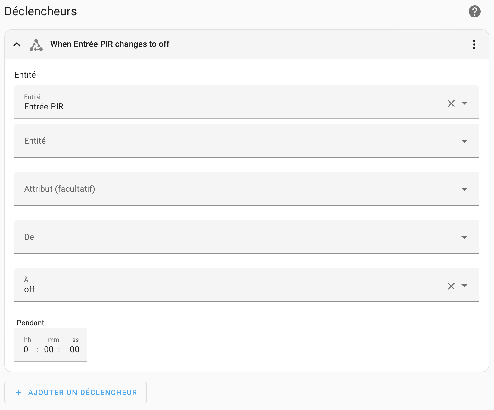

# PIR and Light Sensor

see [Instructables pages](https://www.instructables.com/ESPHome-Wireless-PIR-and-Light-Sensor/)

## Wire

{ width="400" }
{ width="295" }

{ width="400" }
{ width="300" }

{ width="350" }
{ width="350" }

!!! warning
    Be careful to put the led ribbon in the right direction. The current only flows in one direction.

## Automations
{ width="800" }

## Turn ON

{ width="400" }
{ width="400" }

{ width="400" }

```yaml
alias: Extérieur PIR détection -> ON
description: ""
trigger:
    - platform: state
      entity_id:
          - binary_sensor.entree_pir
      to: "on"
      for:
          hours: 0
          minutes: 0
          seconds: 0
condition:
    - condition: numeric_state
      entity_id: sensor.lux_sensor
      below: 100
action:
    - type: turn_on
      device_id: f531fa200093b0b1467237c61076a741
      entity_id: switch.exterieur_tasmota
      domain: switch
mode: single
```

## Turn OFF

{ width="400" }
{ width="400" }

```yaml
alias: Extérieur PIR non détecté -> OFF
description: ""
trigger:
    - platform: state
      entity_id:
          - binary_sensor.entree_pir
      to: "off"
condition: []
action:
    - type: turn_off
      device_id: f531fa200093b0b1467237c61076a741
      entity_id: switch.exterieur_tasmota
      domain: switch
mode: single
```
