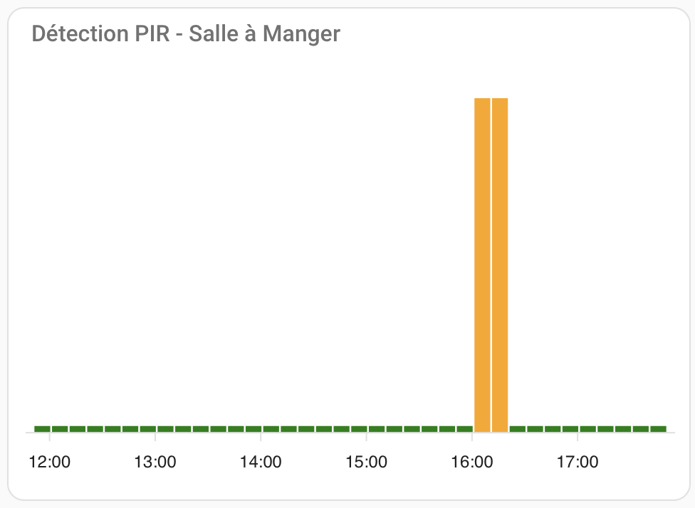

# Creating a Motion Detection Graph with PIR

## Introduction
This guide explains how to create a motion detection graph using **ApexCharts Card** in Home Assistant. The graph will visually display motion detected by your PIR sensor, with bars that change color based on the detection state.

To proceed, you must have the **ApexCharts Card** installed via HACS and a functional PIR sensor integrated into Home Assistant.

The configuration will use:
- `type: custom:apexcharts-card` for the graph.
- Grouping detections into 10-minute intervals.
- Color-coded bars: red for motion detected, green for no motion.

---

## Adding the Graph
### Access Your Dashboard:
1. Navigate to your Home Assistant dashboard.
2. Click the three dots at the top-right → **Edit Dashboard** →
   **Add Card** → **Manual**.

### Add This YAML Configuration:
```yaml
type: custom:apexcharts-card
experimental:
  color_threshold: true
graph_span: 12h
header:
  title: PIR Motion Detection
  show: true
series:
  - entity: binary_sensor.your_pir_sensor
    type: column
    name: Detections
    group_by:
      func: max
      duration: 10min
    transform: 'return x === "on" ? 1 : 0;'
    color_threshold:
      - value: 0
        color: "#00FF00"  # Green for no motion
      - value: 1
        color: "#FF0000"  # Red for motion
apex_config:
  chart:
    type: bar
  plotOptions:
    bar:
      columnWidth: "80%"  # Wider bars
  xaxis:
    type: datetime
    labels:
      show: true
      format: "HH:mm"
  yaxis:
    show: false
  grid:
    show: false
  tooltip:
    enabled: true
    x:
      format: "HH:mm"
```

---

## Expected Result
Once configured, your graph will look like this:

{ width="250" }

- **Red bars** indicate motion detected.
- **Green bars** indicate no motion.
- Data is grouped into 10-minute intervals for clarity.
- Time is displayed on the X-axis.

---

## Customization and Troubleshooting
### Customizing Colors or Grouping Intervals:
- To change bar colors, modify the `color_threshold` values in the
  YAML.
- To adjust grouping, change `duration: 10min` to a different value
  (e.g., `5min` or `30min`).
