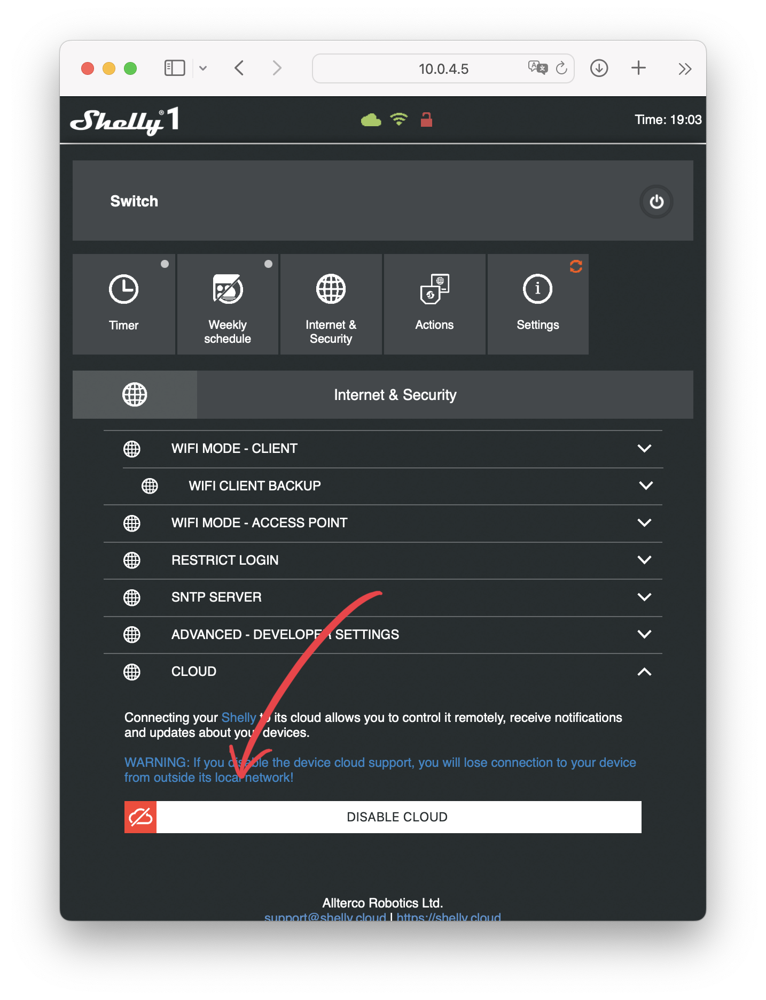
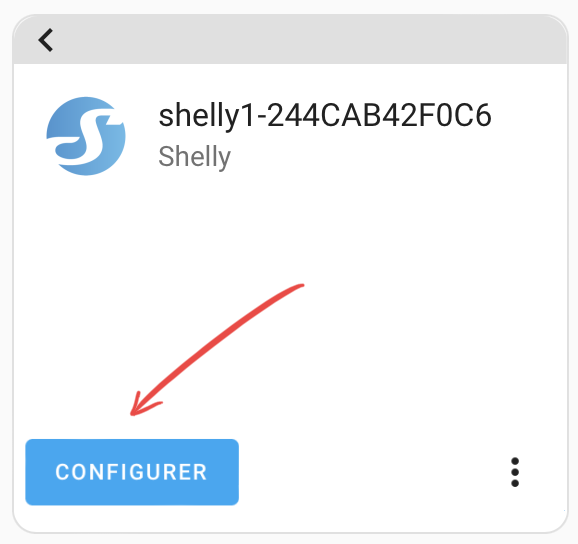

# Shelly 1 with MQTT

**How to use Shelly 1 & Shelly 1PM with Home Assistant**
!!! info
    An other interested page is https://sequr.be/blog/2020/10/getting-started-with-mqtt-and-home-assistant-and-shelly/

### Shelly 1 & Shelly 1PM

{ width="320" }
{ width="290" }

## Wire
### Shelly 1PM
{ width="260" }
{ width="420" }

{ width="280" }

{ width="240" }
{ width="330" }

!!! danger "Do not use with a ceramic hob, it can consume more than 3500 W (Shelly 1PM limit)"
    { width="280" }

### How to reset Shelly 1PM
- video : Reset the device : [youtube video](https://www.youtube.com/watch?v=dz7Aq4mGnQc)
- Reset : On - 5 times off - On
- go to http://192.168.33.1

### Configuration Shelly device : Solution 1 (with the Web browse)

Configuration method with the Web browser. We do not use the Shelly application.

!!! info
    This is the best solution. In fact app. Shelly v.1.35.22 doesn't work.

1. plug the Shelly device.
2. connect to the Shelly network
3. In a browser, go to http://192.168.33.1 (see below)
4. Configure the Shelly device

Find the Shelly network

{ width="300" }

Connect to [http://192.168.33.1](http://192.168.33.1)

{ width="300" }

Configure the network

{ width="300" }
{ width="300" }

Change your wi-fi network back to your home network.
Find the new device on your wifi network.
You can use [LanScan app.](https://www.iwaxx.com/lanscan/) (on [App Store](https://apps.apple.com/fr/app/lanscan/id472226235?mt=12) )

Update the firmware

{ width="300" }

Remove the cloud

{ width="300" }

Configure MQTT. See below

### Solution 2
Plug in the Shelly. It does not appear on the network.
You have to go on the Shelly app first to declare it.
It's not necessary to go to the end of the installation.
We can stop when we ask for the name of the device.

{ width="150" }
{ width="150" }
{ width="150" }
{ width="150" }

You can now find the device on the networker. In my example the IP of the device is 10.0.4.
Go to the web interface of the Shelly and **remove the connection to the cloud**.

{ width="500" }

!!! warning
    **Update** the device. It's necessery to have **CoIot** protocol.

    { width="500" }

## Configure MQTT

To configure MQTT protocol, fill in the fields with values defined in Home Assistant.

{ width="400" }

!!! info "Username and password are in the Mosquitto configuration. Password is a very long string"
    { width="200" }
    { width="300" }
    { width="400" }

Set "Restore Last Mode - Configure Shelly device to Restore the last mode it was in, when it has power."

{ width="380" }

Now, you can reboot the Shelly.

{ width="400" }

### Home Assistant configuration

The configuration of the Shelly device is now finished. Go to Home Assistant for the last step.

{ width="200" }
{ width="400" }

{ width="300" }
{ width="300" }

### Static IP

Now you can change the IP on your router to have a static IP

### Rename entitie

Go to web interface and rename the Shelly

Go to Shelly configaration parameters on Home Assistant. Rename by clicking on the three dots menu

{ width="300" }
{ width="300" }

