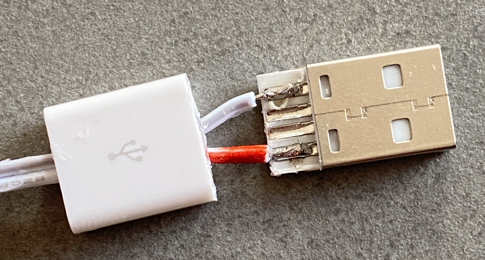
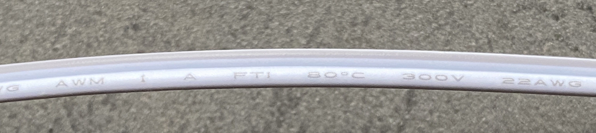
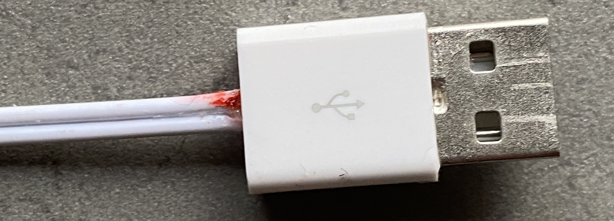
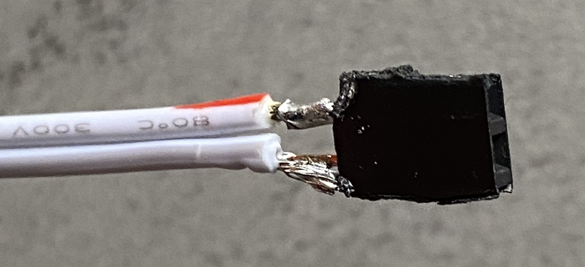

# USB cable construction

Solder the wire to the USB plug

{ width="300" }

Mark the corresponding strand at the other end of
the thread also in red. You can tell by the text
written on one of the two strands. You can also use an ohmmeter.

{ width="600" }

Put super glue and plug the cover

{ width="300" }

Solder the other end of the wire

{ width="300" }
