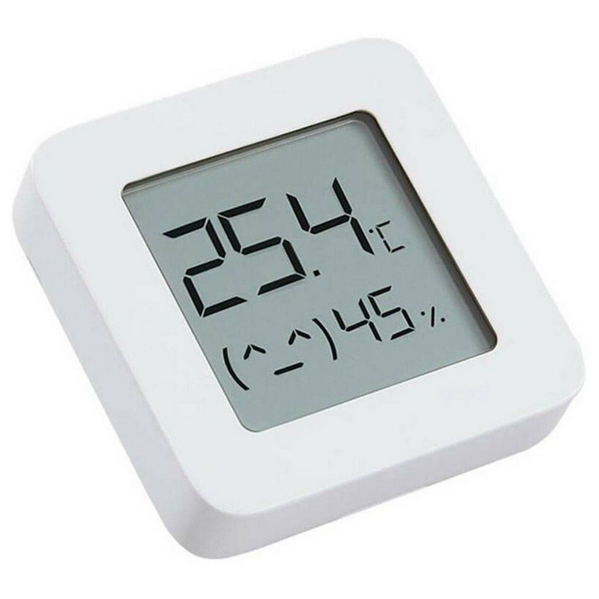
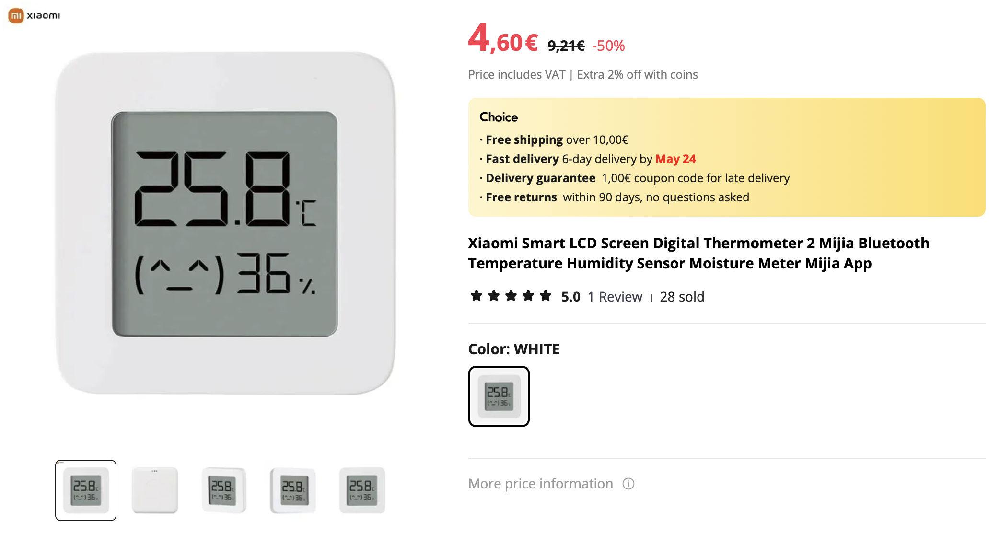
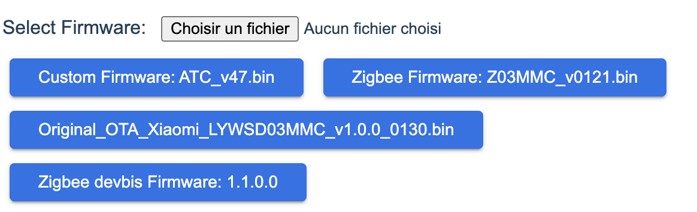
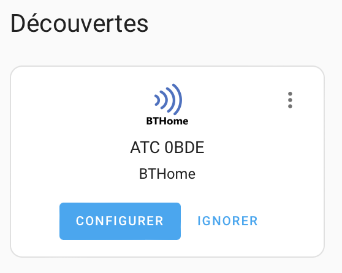
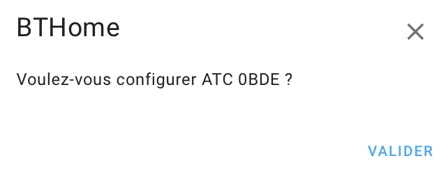
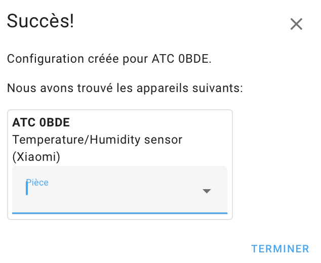
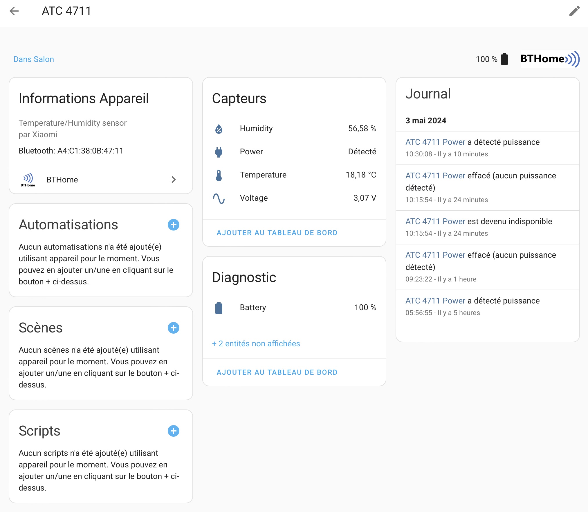

# Xiaomi Mi Temperature et Humidity

{ width="200" }
{ width="400" }

Purchase on Aliexpress (02/05/2024):

```
Features:
1. Home hygrometer, data can be clearly read in various brightness and angle.
2. High sensitivity and accurate sensirion from Switzerland, sense subtle change of temperature and humidity a breath away.
3. An expression to spell over comfort level, cute and simple.
4. Low consumption screen, a CR2032 button battery for one-year.
5. Built-in advanced Sensirion temperature and humidity sensor, temperature accuracy: 0.1 degrees, humidity accuracy: 0.1 percent RH
6. Via Mi app to switch on humidifier when indoor humidity is too low and air-conditioner when indoors temperature is too high
LED digital display, you can get temperature, humidity easily

Specifications:
Product Model: LYWSD03MMC
Material: ABS, PMMA
Battery Model: CR2032 (pre-installed)
Temperature Measurement Range: 0°C-60°C
Humidity Measurement Range: 0% to 99% RH
Humidity Display Resolution: 1% RH
CMIIT ID: 2019DP8115
Product Dimensions: 43 x 43 x 12.5mm
Operating Voltage: DC 2.5V-3V
Wireless Connection: Bluetooth 4.2 (Low Energy)
Temperature Display Resolution: 0.1°C
```

## Installation
It's very easy, follow instruction by : [Simply Smart House](https://www.simplysmart.house/blog/xiaomi-temprature-home-asssistant-integration)

Click on Custom Firmware: ATC_v47.bin

{ width="400" }

{ width="200" }
{ width="200" }

{ width="400" }

{ width="600" }
