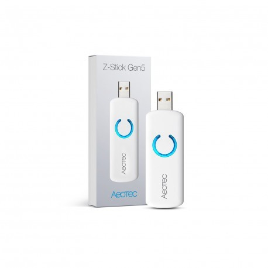
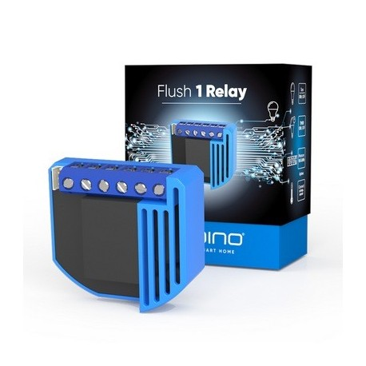
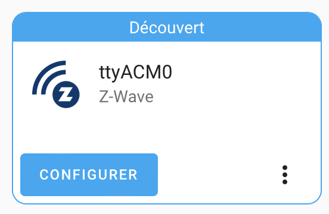
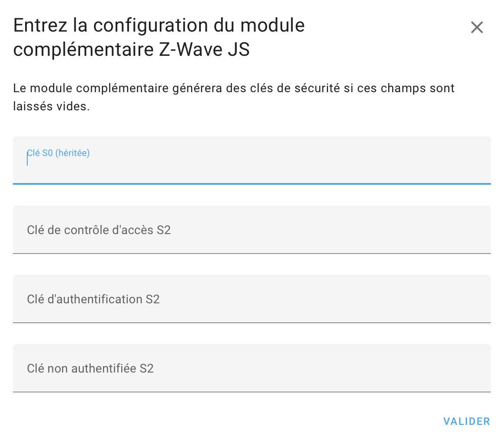
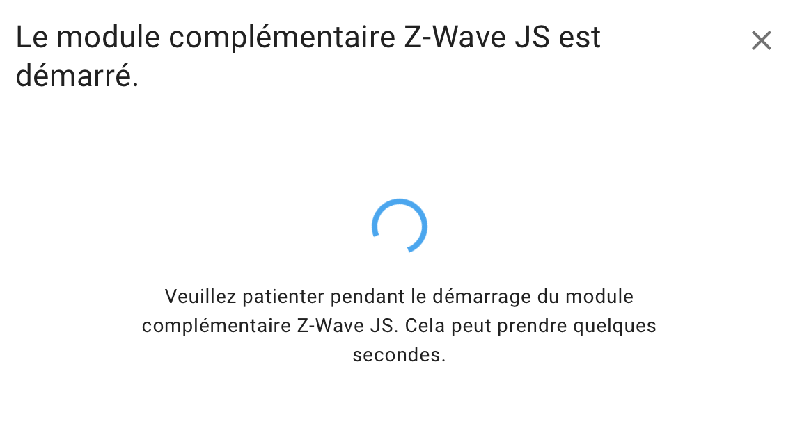
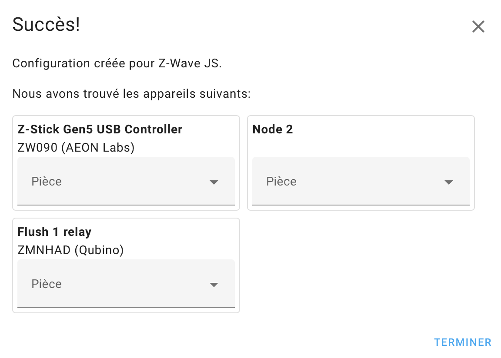
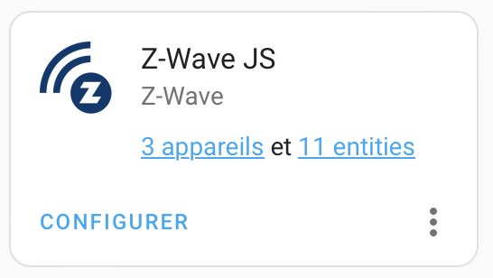

# Installation of Z-Wave and Qubino entities

{ width="200" }
{ width="200" }

Plug the Z-Wave usb dongle on your Home Assistant server

The dongle is automaticaly reconnized

{ width="300" }
{ width="300" }

{ width="300" }
{ width="300" }

{ width="300" }

That's all!

