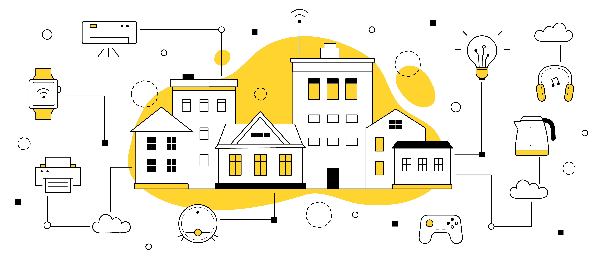

# My Home Assistant tricks!
**Keywords**: Home Assitant, Lovelace, Tasmota, Shelly, Qubino, ESP8268, ESP01, PZEM 004T, DHT22, PIR, MQTT, Intel NUC
Try

       
    
    <a href="https://www.freepik.com/free-vector/smart-home-technology-iot-system-doodle-concept_29984199.htm">Image by upklyak</a> on Freepik

